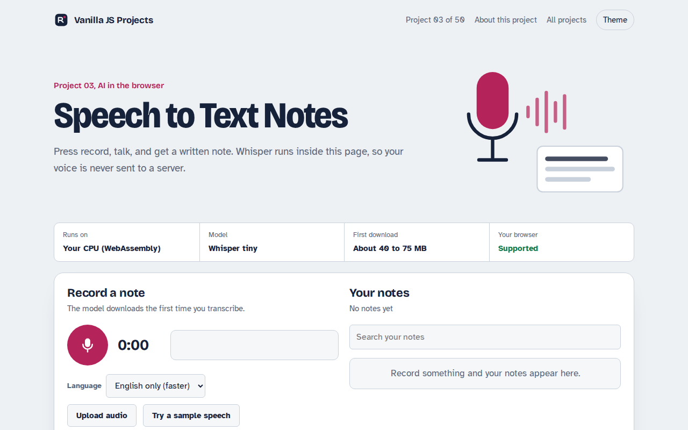

# Speech to Text Notes in JavaScript (Free Project)



**Live demo:** https://mmrahmanbappi.github.io/vanilla-javascript-projects/01-ai-in-the-browser/003-speech-to-text-notes/demo.html
**Details and code:** https://mmrahmanbappi.github.io/vanilla-javascript-projects/01-ai-in-the-browser/003-speech-to-text-notes/

Free speech to text notes app in plain JavaScript. Record your voice or upload audio and OpenAI Whisper turns it into text, right in the browser. No server, no API key.

## What is the Speech to Text Notes?

This project is a notes app you can talk to. Press record, say what is on your mind, and the words appear as a saved note. You can also drop in an audio file, like a voice memo or a short interview, and get a written copy.

The transcription comes from Whisper, the open speech model from OpenAI, running in the browser with Transformers.js. The page records audio with the MediaRecorder API, converts it to the format Whisper expects, and saves every note in your browser.

## What it does

- Record from the microphone with a live level meter
- Upload an audio file or try a sample speech
- English model or multilingual model
- Notes saved in your browser with search
- Copy a note or download it as a text file

## How it works

1. **Record.** MediaRecorder captures your microphone while an AnalyserNode drives the level meter.
2. **Resample.** The recording is decoded with the Web Audio API at 16 kHz, the rate Whisper expects.
3. **Transcribe.** Whisper turns the audio into text in 30 second chunks, then the note is saved locally.

## The key JavaScript

```js
import { pipeline } from "https://cdn.jsdelivr.net/npm/@huggingface/transformers@3.8.1";

const transcribe = await pipeline("automatic-speech-recognition", "Xenova/whisper-tiny.en");

// Whisper needs mono audio at 16 kHz as a Float32Array
const ctx = new AudioContext({ sampleRate: 16000 });
const buffer = await ctx.decodeAudioData(await blob.arrayBuffer());
const audio = buffer.getChannelData(0);

const { text } = await transcribe(audio, { chunk_length_s: 30, stride_length_s: 5 });
console.log(text);
```

## Browser support

Chrome, Edge, Firefox and Safari. Microphone access needs HTTPS or localhost.

## How to use

1. Download `demo.html` from this folder.
2. Serve the folder with `npx serve .` or `python -m http.server`, then open it in your browser.
3. Change the text and colors, and upload it anywhere. One file, no build step.

## Questions

**Is Whisper in the browser as good as the paid API?**

This project uses Whisper tiny so it loads fast. It is very good for clear English and decent for other languages. The paid API uses bigger models, which handle noise and accents better.

**Does it work offline?**

Yes, after the first visit. The model is cached in the browser, so recording and transcribing work without internet.

**Which languages does it support?**

The English model is the most accurate. The multilingual option understands about 100 languages, including Bengali, Hindi, Spanish and Arabic, with lower accuracy on short clips.

## License

MIT. Free for personal and commercial use.
