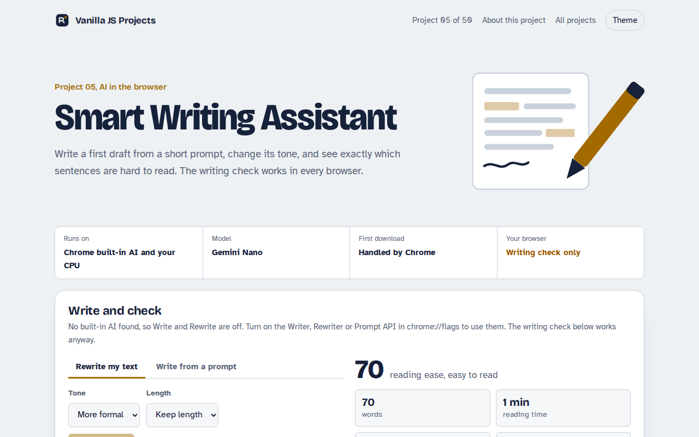

# Smart Writing Assistant in JavaScript (Free Project)



**Live demo:** https://mmrahmanbappi.github.io/vanilla-javascript-projects/01-ai-in-the-browser/005-smart-writing-assistant/demo.html
**Details and code:** https://mmrahmanbappi.github.io/vanilla-javascript-projects/01-ai-in-the-browser/005-smart-writing-assistant/

Free AI writing assistant in plain JavaScript. Draft text, rewrite it more formal or casual, and get a live readability check for long sentences and passive voice.

## What is the Smart Writing Assistant?

This is a small writing tool for everyday text like emails, posts and product pages. It can write a first draft from a short prompt, rewrite what you have in a different tone, and check how easy your text is to read.

The drafting and rewriting use Chrome's new built-in Writer and Rewriter APIs, which run on the device. The writing check works in every browser. It scores reading ease and highlights long sentences, passive voice and filler words right in your text.

## What it does

- Write a draft from a prompt with tone and length options
- Rewrite text more formal, more casual, shorter or longer
- Live writing check: reading ease score, reading time, long sentences, passive voice and filler words
- Highlights problems right in your text
- Falls back to the Prompt API when Writer or Rewriter are missing

## How it works

1. **Pick the best engine.** The page checks for the Writer and Rewriter APIs first, then the general Prompt API, and says which one it found.
2. **Generate or rewrite.** Your text and options go to the on-device model. Nothing is sent to a server.
3. **Check the result.** Every edit runs the local writing check, so you see the reading score change as you type.

## The key JavaScript

```js
// Draft new text
const writer = await Writer.create({ tone: "neutral", length: "short", format: "plain-text" });
const draft = await writer.write("An email moving the launch to Wednesday");

// Change the tone of existing text
const rewriter = await Rewriter.create({ tone: "more-formal", length: "as-is" });
const formal = await rewriter.rewrite(draft);

// No Writer or Rewriter? The general Prompt API can do both
const session = await LanguageModel.create();
const reply = await session.prompt("Rewrite this more formally: " + draft);
```

## Browser support

AI writing: Chrome 138 or newer with the Writer, Rewriter or Prompt API turned on (chrome://flags or an origin trial). Writing check: every modern browser.

## How to use

1. Download `demo.html` from this folder.
2. Serve the folder with `npx serve .` or `python -m http.server`, then open it in your browser.
3. Change the text and colors, and upload it anywhere. One file, no build step.

## Questions

**What is a good reading ease score?**

Most readers are comfortable with a score of 60 or higher. News sites aim for 60 to 70. If your score is under 50, try shorter sentences and simpler words.

**Does the writing check send my text anywhere?**

No. The readability check is plain JavaScript on the page, and the AI features run on the device through Chrome.

**Why is the AI part not working in my browser?**

The Writer and Rewriter APIs are new and only in recent Chrome versions, sometimes behind a flag. The writing check still works everywhere.

## License

MIT. Free for personal and commercial use.
