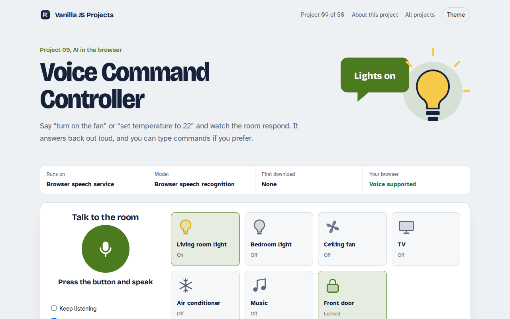

# Voice Command Controller in JavaScript (Free Project)



**Live demo:** https://mmrahmanbappi.github.io/vanilla-javascript-projects/01-ai-in-the-browser/009-voice-command-controller/demo.html
**Details and code:** https://mmrahmanbappi.github.io/vanilla-javascript-projects/01-ai-in-the-browser/009-voice-command-controller/

Free voice command project in plain JavaScript. Control lights, fan, TV and a door lock by speaking, with spoken replies, using the Web Speech API. Live demo included.

## What is the Voice Command Controller?

This demo is a smart home dashboard you control by talking. Say turn on the kitchen light, make it cooler, or switch off everything, and the dashboard updates and answers you out loud.

It uses the Web Speech API, which has two parts. SpeechRecognition turns your voice into text, and speechSynthesis reads replies back. A small set of rules matches phrases to actions, so it understands natural wording, not just fixed commands.

## What it does

- Seven devices: two lights, fan, TV, air conditioner, music and door lock
- Natural phrases like “switch off everything” or “make it cooler”
- Spoken replies with speech synthesis, which you can mute
- Keep listening mode for hands-free use
- Type a command when you cannot use the microphone
- Log of every command and whether it was understood

## How it works

1. **Listen.** SpeechRecognition streams words as you speak, and the final phrase is passed on when you pause.
2. **Understand.** A small parser finds the action (on, off, set, lock), the device and any number in the phrase.
3. **Act and reply.** The device card updates, the log records the command, and the page speaks a short confirmation.

## The key JavaScript

```js
const SR = window.SpeechRecognition || window.webkitSpeechRecognition;
const rec = new SR();
rec.lang = "en-US";
rec.interimResults = true;

rec.onresult = (e) => {
  const r = e.results[e.results.length - 1];
  if (r.isFinal) handle(r[0].transcript); // "turn on the fan"
};
rec.start();

// Talk back
speechSynthesis.speak(new SpeechSynthesisUtterance("Fan is on"));
```

## Browser support

Voice input: Chrome, Edge and Safari (Chrome sends audio to Google's speech service). Typed commands and spoken replies: every modern browser.

## How to use

1. Download `demo.html` from this folder.
2. Serve the folder with `npx serve .` or `python -m http.server`, then open it in your browser.
3. Change the text and colors, and upload it anywhere. One file, no build step.

## Questions

**Does the Web Speech API work in all browsers?**

Voice input works in Chrome, Edge and Safari. Firefox does not support it yet, so the demo also lets you type commands. Spoken replies work almost everywhere.

**Is my voice sent to a server?**

In Chrome, yes: the audio goes to Google's speech service to be turned into text. Safari can process it on the device. The spoken replies are made locally.

**Can I add my own commands?**

Yes. Commands are simple patterns in the code. Add a new pattern and the action it should run, and the controller picks it up.

## License

MIT. Free for personal and commercial use.
