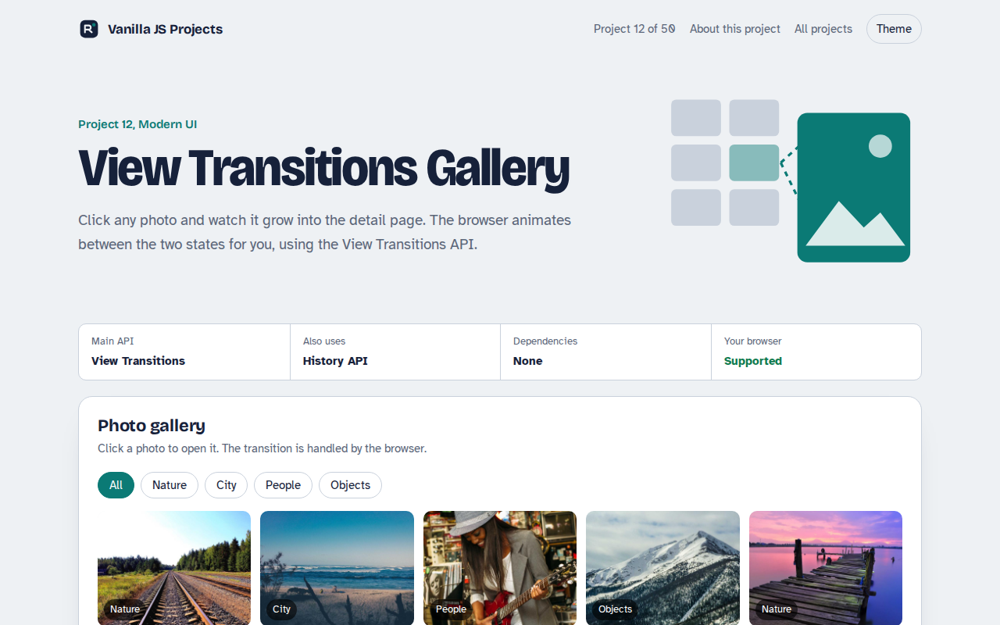

# View Transitions Gallery in JavaScript (Free Project)



**Live demo:** https://mmrahmanbappi.github.io/vanilla-javascript-projects/02-modern-ui/012-view-transitions-gallery/demo.html
**Details and code:** https://mmrahmanbappi.github.io/vanilla-javascript-projects/02-modern-ui/012-view-transitions-gallery/

Free View Transitions API gallery in plain JavaScript. Click a photo and it morphs into the detail view, with filters, back button support and a fallback.

## What is the View Transitions Gallery?

Click a photo in the grid and it grows into the big detail view instead of just popping in. Press back and it shrinks home again. This kind of animation used to need a heavy library, and now the browser does it with one function call.

The View Transitions API takes a picture of the page before and after a change, then animates between them. Give the small photo and the big photo the same view-transition-name and the browser moves one into the other.

## What it does

- Shared element morph from grid to detail
- Filter the grid by category with animated reflow
- Back button and deep links work
- Instant fallback in browsers without the API
- Respects reduced motion settings

## How it works

1. **Name the element.** The clicked photo gets view-transition-name: hero, and so does the big photo on the detail view.
2. **Swap the DOM.** The page calls startViewTransition and changes the DOM inside the callback. The browser snapshots before and after.
3. **Let CSS animate.** The browser morphs the named element between its two positions. Everything else cross-fades.

## The key JavaScript

```js
// Swap the view inside a transition
function open(photo) {
  const img = document.querySelector(`[data-id="${photo.id}"] img`);
  img.style.viewTransitionName = "hero"; // name it before

  document.startViewTransition(() => {
    img.style.viewTransitionName = "";
    renderDetail(photo); // big  also has view-transition-name: hero
  });
}
// CSS: ::view-transition-group(hero) { animation-duration: .45s; }
```

## Browser support

Chrome and Edge 111+, Safari 18+ and recent Firefox. Older browsers switch views instantly.

## How to use

1. Download `demo.html` from this folder.
2. Serve the folder with `npx serve .` or `python -m http.server`, then open it in your browser.
3. Change the text and colors, and upload it anywhere. One file, no build step.

## Questions

**What is the View Transitions API?**

It is a browser feature that animates between two states of a page. You call document.startViewTransition() and change the page inside it, and the browser handles the animation.

**Does it work in Firefox and Safari?**

Safari 18 and newer support it, and recent Firefox versions do too. In older browsers the page changes instantly, which is a safe fallback.

**Can I control the animation?**

Yes. Use the ::view-transition pseudo elements in CSS to change the timing, easing or effect, just like normal CSS animations.

## License

MIT. Free for personal and commercial use.
