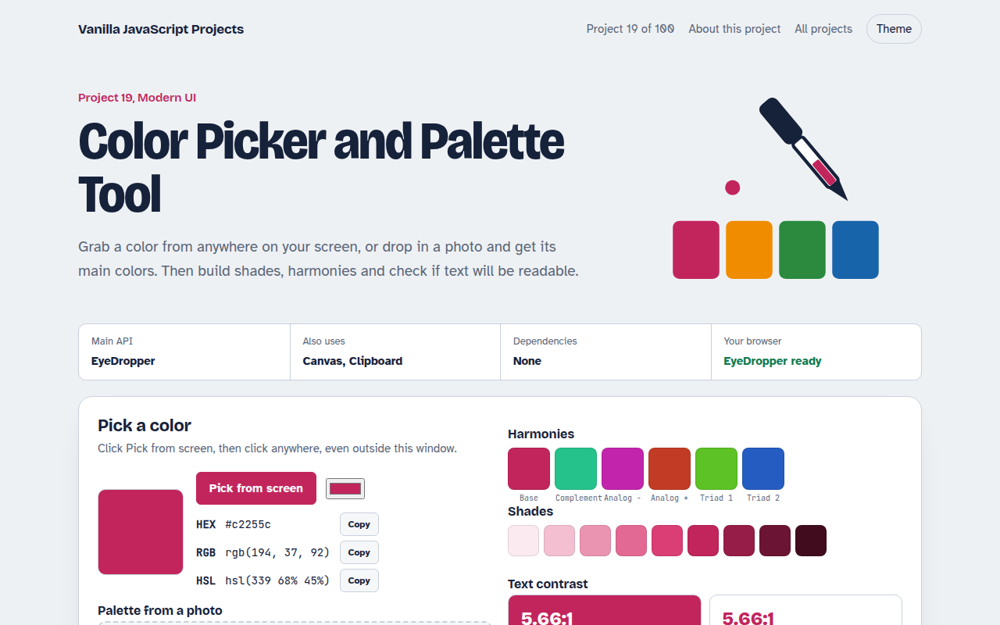

# Color Picker and Palette Tool in JavaScript (Free Project)



**Live demo:** https://mmrahmanbappi.github.io/100-vanilla-javascript-projects/02-modern-ui/019-color-picker-palette/demo.html
**Details and code:** https://mmrahmanbappi.github.io/100-vanilla-javascript-projects/02-modern-ui/019-color-picker-palette/

Free color tool in plain JavaScript. Pick any color on screen with the EyeDropper API, get a palette from a photo, make shades and check WCAG contrast.

## What is the Color Picker and Palette Tool?

This tool helps you choose colors that look good and stay readable. Pick a color from anywhere on your screen, pull the main colors out of a photo, make matching harmonies and shades, and check whether text on each color passes accessibility rules.

The screen picker uses the EyeDropper API. The photo palette shrinks the image on a canvas and groups similar pixels. The contrast check uses the same formula as the WCAG guidelines.

## What it does

- Screen color picker with the EyeDropper API
- Palette from any photo using color quantization
- Complementary, analogous and triadic harmonies plus 9 shades
- WCAG AA and AAA contrast check for text on any background
- Copy as HEX, RGB, HSL or a block of CSS variables

## How it works

1. **Pick a color.** The EyeDropper returns the hex value of any pixel on screen, even outside the browser window.
2. **Read a photo.** The photo is shrunk to 64 by 64 pixels, then the pixels are grouped into buckets to find the main colors.
3. **Check contrast.** Each color's luminance is compared with the text color to get a ratio, and the page marks AA and AAA passes.

## The key JavaScript

```js
// Pick any pixel on screen (Chrome, Edge)
const { sRGBHex } = await new EyeDropper().open(); // "#c2255c"

// WCAG contrast ratio between two colors
const lum = ([r, g, b]) => {
  const f = (c) => (c /= 255) <= 0.03928 ? c / 12.92 : ((c + 0.055) / 1.055) ** 2.4;
  return 0.2126 * f(r) + 0.7152 * f(g) + 0.0722 * f(b);
};
const ratio = (a, b) => (Math.max(lum(a), lum(b)) + 0.05) / (Math.min(lum(a), lum(b)) + 0.05);
// 4.5 or more passes AA for body text
```

## Browser support

EyeDropper: Chrome and Edge on desktop. Everything else works in every modern browser.

## How to use

1. Download `demo.html` from this folder.
2. Serve the folder with `npx serve .` or `python -m http.server`, then open it in your browser.
3. Change the text and colors, and upload it anywhere. One file, no build step.

## Questions

**What contrast ratio do I need?**

WCAG asks for at least 4.5 to 1 for normal text and 3 to 1 for large text. 7 to 1 meets the stricter AAA level.

**Which browsers have the EyeDropper API?**

Chrome and Edge on desktop. The other features work in every modern browser.

**How is the palette taken from a photo?**

The photo is drawn at 64 by 64 pixels, pixels are grouped into color buckets, and the most common distinct buckets become the palette.

## License

MIT. Free for personal and commercial use.
