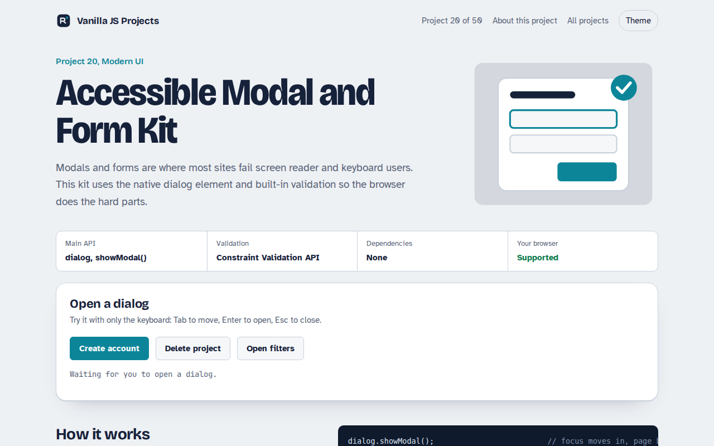

# Accessible Modal and Form Kit in JavaScript (Free Project)



**Live demo:** https://mmrahmanbappi.github.io/100-vanilla-javascript-projects/02-modern-ui/020-accessible-dialog-forms/demo.html
**Details and code:** https://mmrahmanbappi.github.io/100-vanilla-javascript-projects/02-modern-ui/020-accessible-dialog-forms/

Free accessible modal and form kit in plain JavaScript. Native dialog with focus handling, live error messages and custom validation with the Constraint Validation API.

## What is the Accessible Modal and Form Kit?

Pop up forms are where many sites fail keyboard and screen reader users. This kit shows a sign up form in a modal, a confirm dialog and a slide in drawer, all built on the native dialog element so the browser handles focus and the Esc key.

The form uses the built in Constraint Validation API with friendly messages under each field. Errors are announced by screen readers, the first bad field gets focus, and focus returns to the button that opened the dialog.

## What it does

- Sign-up form in a modal with focus trap and Esc to close
- Errors appear under each field and are read out by screen readers
- Custom rules: password strength and matching passwords
- Confirm dialog that returns the user's choice
- Slide-in drawer built on the same dialog element

## How it works

1. **Open as modal.** showModal() puts the dialog in the top layer, makes the page behind inert and moves focus inside.
2. **Validate on the fly.** Each field is checked on blur and on submit using the browser's own ValidityState, with friendly messages.
3. **Close and return focus.** When the dialog closes, focus goes back to the button that opened it, and returnValue says which button was used.

## The key JavaScript

```js
dialog.showModal();                         // focus moves in, page behind is inert

input.addEventListener("blur", () => {
  const v = input.validity;                 // built-in ValidityState
  const msg = v.valueMissing ? "Enter your email"
            : v.typeMismatch ? "That does not look like an email" : "";
  input.setAttribute("aria-invalid", !!msg);
  errorEl.textContent = msg;                // aria-live reads it out
});

dialog.addEventListener("close", () => {
  console.log(dialog.returnValue);          // "create" or "cancel"
  openButton.focus();                       // give focus back
});
```

## Browser support

Every modern browser.

## How to use

1. Download `demo.html` from this folder.
2. Serve the folder with `npx serve .` or `python -m http.server`, then open it in your browser.
3. Change the text and colors, and upload it anywhere. One file, no build step.

## Questions

**Why use the dialog element instead of a div?**

showModal() makes the rest of the page inert, puts the dialog on top and moves focus into it. With a div you have to build all of that yourself.

**How do I show custom error messages?**

Check the field's validity object, like validity.valueMissing, and write your own message into an element linked with aria-describedby.

**Is the form accessible for screen readers?**

Yes. Errors are in aria-live regions, invalid fields get aria-invalid, and every input has a real label.

## License

MIT. Free for personal and commercial use.
