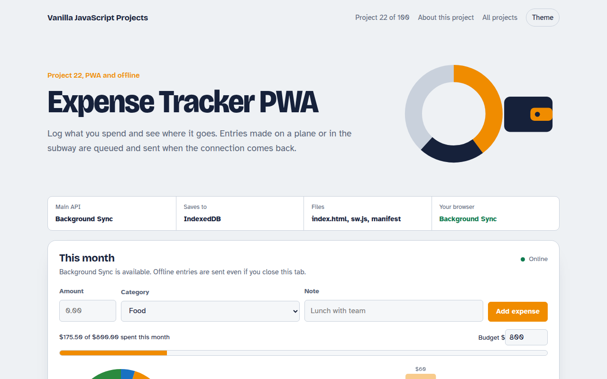

# Expense Tracker PWA in JavaScript (Free Project)



**Live demo:** https://mmrahmanbappi.github.io/100-vanilla-javascript-projects/03-pwa-and-offline/022-expense-tracker-pwa/demo.html
**Details and code:** https://mmrahmanbappi.github.io/100-vanilla-javascript-projects/03-pwa-and-offline/022-expense-tracker-pwa/

Free expense tracker PWA in plain JavaScript. Log spending, see a donut chart and a 7 day bar chart, set a budget and sync offline entries with Background Sync.

## What is the Expense Tracker PWA?

Log what you spend by category and see where the money goes, with a donut chart by category, a bar chart for the last seven days and a monthly budget bar. You can export everything to CSV.

Entries are saved in IndexedDB first. If you are offline, they are marked as waiting, and the Background Sync API wakes the service worker to send them once you are online, even if the tab is closed.

## What it does

- Add expenses with amount, category, note and date
- Donut chart by category and bar chart for the last 7 days
- Monthly budget with a progress bar
- Offline entries show as waiting, then sync automatically
- Export to CSV

## How it works

1. **Save locally first.** Every expense goes into IndexedDB right away, marked as not yet synced.
2. **Ask for a sync.** The page registers a sync tag. The browser wakes the service worker when it is online, even if the tab is closed.
3. **Flush the outbox.** The worker sends waiting entries to the server (simulated here) and tells the page, which marks them synced.

## The key JavaScript

```js
// Page: save locally, then ask the browser to sync when online
await db.put("expenses", { ...expense, synced: false });
const reg = await navigator.serviceWorker.ready;
await reg.sync.register("sync-expenses");

// sw.js: runs when the connection is back, even if the tab is closed
self.addEventListener("sync", (event) => {
  if (event.tag === "sync-expenses") event.waitUntil(sendUnsynced());
});
```

## Browser support

App and charts: every modern browser. Background Sync: Chrome, Edge and Samsung Internet. Other browsers sync when the page is open and online.

## How to use

1. Download `demo.html` from this folder.
2. Serve the folder with `npx serve .` or `python -m http.server`, then open it in your browser.
3. Change the text and colors, and upload it anywhere. One file, no build step.

## Questions

**What is the Background Sync API?**

It lets a web app ask the browser to run a task when the connection comes back. The service worker gets a sync event and can send saved data.

**Which browsers support Background Sync?**

Chrome, Edge and Samsung Internet. In other browsers this app syncs when the page is open and online.

**Are the charts made with a library?**

No. Both charts are drawn with the Canvas 2D API in about 20 lines each.

## License

MIT. Free for personal and commercial use.
