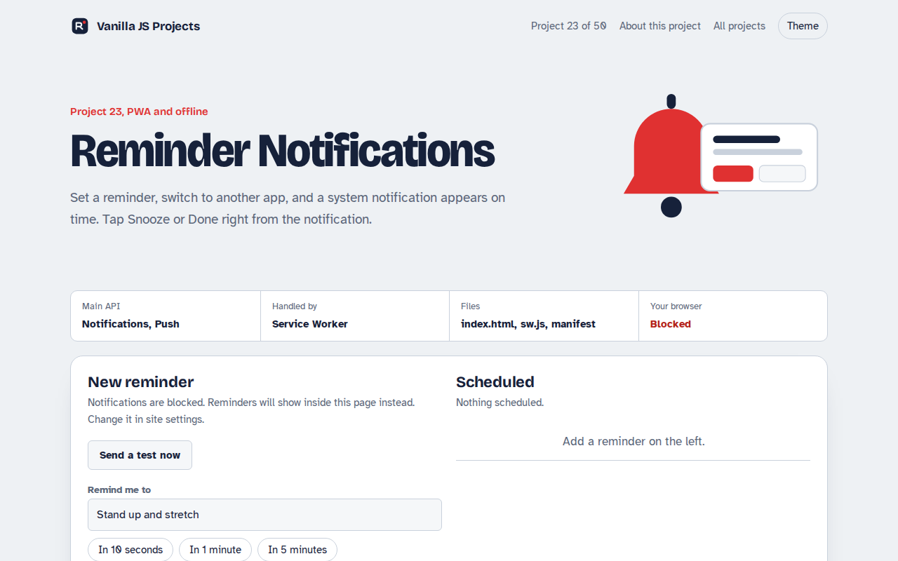

# Reminder Notifications in JavaScript (Free Project)



**Live demo:** https://mmrahmanbappi.github.io/vanilla-javascript-projects/03-pwa-and-offline/023-reminder-notifications/demo.html
**Details and code:** https://mmrahmanbappi.github.io/vanilla-javascript-projects/03-pwa-and-offline/023-reminder-notifications/

Free reminder app in plain JavaScript. Set reminders that show as system notifications with Done and Snooze buttons, handled by a service worker, plus push setup code.

## What is the Reminder Notifications?

Set a reminder, switch to another app, and a real system notification appears on time. You can tap Done or Snooze right inside the notification, and the page updates to match.

The page asks for notification permission, and the service worker shows the notification with action buttons and handles the tap. For reminders when the app is closed, the project includes the Push API subscription code your server would use.

## What it does

- Quick reminders: 10 seconds, 1 minute, 5 minutes or a custom time
- Done and Snooze 5 min buttons inside the notification
- Notification click brings this page to the front
- Push subscription button that prints the JSON your server needs
- Reminders are saved, so a reload keeps them

## How it works

1. **Ask permission.** The browser asks once. Without permission, reminders still show inside the page.
2. **Show from the worker.** registration.showNotification() creates a system notification with action buttons.
3. **Handle the tap.** The service worker gets notificationclick, snoozes or completes the reminder, and focuses the page.

## The key JavaScript

```js
const reg = await navigator.serviceWorker.register("sw.js");
await Notification.requestPermission();                // "granted"

reg.showNotification("Stand up and stretch", {
  body: "Reminder from your to-do app",
  actions: [{ action: "done", title: "Done" }, { action: "snooze", title: "Snooze 5 min" }],
  tag: "reminder-42", requireInteraction: true,
});

// sw.js
self.addEventListener("notificationclick", (e) => {
  e.notification.close();
  if (e.action === "snooze") { /* tell the page to reschedule */ }
});
```

## Browser support

Notifications: every modern desktop browser, Android, and iPhone once the app is added to the Home Screen. Timers only run while the page is open; use Push for closed apps.

## How to use

1. Download `demo.html` from this folder.
2. Serve the folder with `npx serve .` or `python -m http.server`, then open it in your browser.
3. Change the text and colors, and upload it anywhere. One file, no build step.

## Questions

**How do I show a notification from JavaScript?**

Ask with Notification.requestPermission(), then call registration.showNotification() on your service worker registration. That version supports action buttons.

**Do notifications work on iPhone?**

Yes, on iOS 16.4 and later, but only after the web app is added to the Home Screen.

**Why do timed reminders need the page open?**

Browsers do not let pages set timers that fire after they close. For that you need server push, which is why the Push API code is included.

## License

MIT. Free for personal and commercial use.
