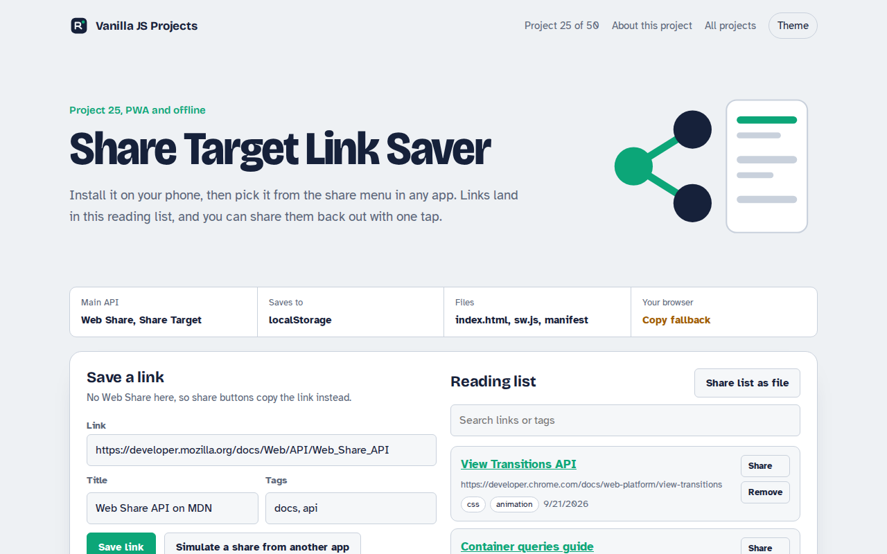

# Share Target Link Saver in JavaScript (Free Project)



**Live demo:** https://mmrahmanbappi.github.io/vanilla-javascript-projects/03-pwa-and-offline/025-share-target-link-saver/demo.html
**Details and code:** https://mmrahmanbappi.github.io/vanilla-javascript-projects/03-pwa-and-offline/025-share-target-link-saver/

Free link saver PWA in plain JavaScript. Install it and it appears in your phone's share menu, saving any link you share. Share links back out with the Web Share API.

## What is the Share Target Link Saver?

Install this app on Android and it shows up next to WhatsApp and email when you share a link from any app. Pick it, and the link lands in your reading list with its title.

The manifest declares a share_target, so the system opens the page with the shared title, text and URL in the address. The Web Share API sends saved links back out through the normal share sheet.

## What it does

- Appears in the system share sheet once installed
- Saves the title, text and URL that other apps share
- Share any saved link back out, or the whole list as a text file
- Tags and search
- Test the share target right here with the simulate button

## How it works

1. **Register as a target.** The manifest declares share_target with an action URL and the names of the title, text and url parameters.
2. **Receive a share.** When you share to the app, the OS opens index.html?title=...&text=...&url=... and the page saves it.
3. **Share back out.** navigator.share() opens the native share sheet with a saved link, or with a file when canShare allows it.

## The key JavaScript

```js
// manifest.webmanifest
"share_target": {
  "action": "./index.html",
  "method": "GET",
  "params": { "title": "title", "text": "text", "url": "url" }
}

// index.html: read what was shared
const p = new URLSearchParams(location.search);
if (p.has("url") || p.has("text")) saveLink(p.get("title"), p.get("url") || p.get("text"));

// Share back out
await navigator.share({ title: link.title, url: link.url });
```

## Browser support

Share target: installed PWA on Android (Chrome, Edge, Samsung Internet) and ChromeOS. Web Share: Android, iPhone, Safari, Edge and Chrome on Windows and ChromeOS.

## How to use

1. Download `demo.html` from this folder.
2. Serve the folder with `npx serve .` or `python -m http.server`, then open it in your browser.
3. Change the text and colors, and upload it anywhere. One file, no build step.

## Questions

**What is a Web Share Target?**

It is a manifest setting that lets an installed web app receive shares from other apps, the same way native apps do.

**Does it work on iPhone?**

The Web Share API for sending works in Safari. Receiving shares as a target is not supported on iOS yet.

**How do I test it without a phone?**

Use the Simulate a share button. It opens the page with the same address parameters the system would send.

## License

MIT. Free for personal and commercial use.
