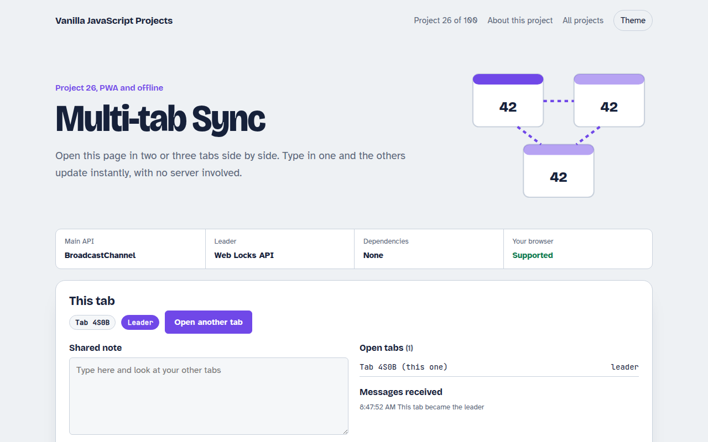

# Multi-tab Sync in JavaScript (Free Project)



**Live demo:** https://mmrahmanbappi.github.io/100-vanilla-javascript-projects/03-pwa-and-offline/026-multi-tab-sync/demo.html
**Details and code:** https://mmrahmanbappi.github.io/100-vanilla-javascript-projects/03-pwa-and-offline/026-multi-tab-sync/

Free multi-tab sync demo in plain JavaScript. A shared note, counter, theme and list of open tabs stay in sync with BroadcastChannel, with leader election by Web Locks.

## What is the Multi-tab Sync?

Open this page in two or three tabs and type in one. The others update right away: a shared note, a counter, the theme and a live list of open tabs. No server is involved.

Tabs talk through BroadcastChannel, which sends messages between pages from the same site. The Web Locks API picks one tab as the leader, which is useful when only one tab should poll a server or play a sound.

## What it does

- Shared note that updates in every tab as you type
- Shared counter with a history of who changed it
- Theme switch that applies to all tabs
- Live list of open tabs with a heartbeat
- Leader election: exactly one tab is the leader, and another takes over when it closes

## How it works

1. **Join the channel.** Every tab opens a BroadcastChannel with the same name and announces itself with a random id.
2. **Broadcast changes.** Edits are sent as small messages. Other tabs apply them and save the latest state to localStorage.
3. **Elect a leader.** Each tab asks for the same Web Lock. Only one gets it. When that tab closes, the lock passes to the next tab.

## The key JavaScript

```js
const channel = new BroadcastChannel("my-app");
channel.postMessage({ type: "note", text: "Hello from tab A" });
channel.onmessage = (e) => { if (e.data.type === "note") note.value = e.data.text; };

// Only one tab at a time holds this lock: that tab is the leader
navigator.locks.request("leader", () => {
  becomeLeader();
  return new Promise(() => {});   // hold the lock until the tab closes
});
```

## Browser support

Every modern browser.

## How to use

1. Download `demo.html` from this folder.
2. Serve the folder with `npx serve .` or `python -m http.server`, then open it in your browser.
3. Change the text and colors, and upload it anywhere. One file, no build step.

## Questions

**What is BroadcastChannel?**

It is a simple message channel between tabs, windows and workers from the same origin. You post a message and every other listener receives it.

**What does leader election mean?**

It means one tab is chosen to do a job for all of them. Here, each tab asks for the same Web Lock and only one gets it at a time.

**Does it work across different browsers?**

No. BroadcastChannel only connects tabs in the same browser profile. For different devices you need a server.

## License

MIT. Free for personal and commercial use.
