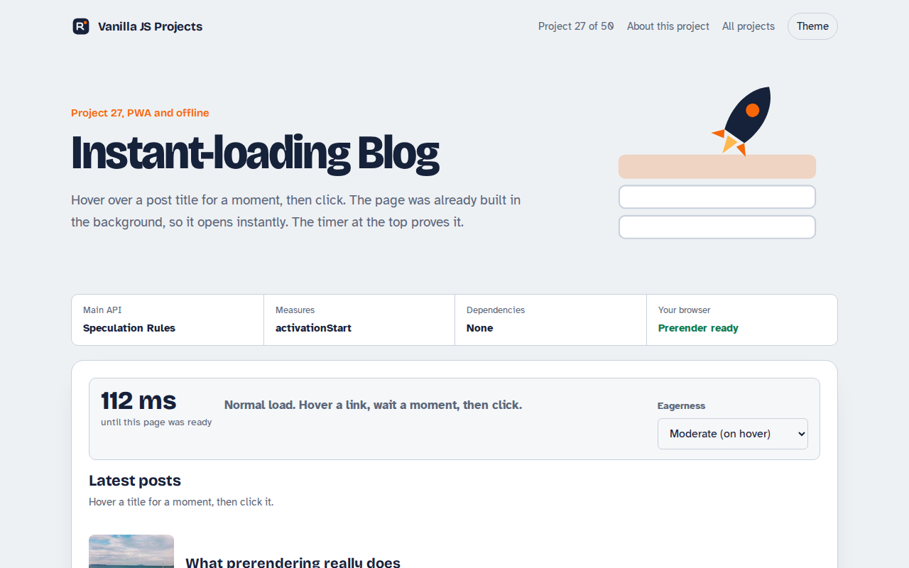

# Instant-loading Blog in JavaScript (Free Project)



**Live demo:** https://mmrahmanbappi.github.io/vanilla-javascript-projects/03-pwa-and-offline/027-instant-blog-speculation-rules/demo.html
**Details and code:** https://mmrahmanbappi.github.io/vanilla-javascript-projects/03-pwa-and-offline/027-instant-blog-speculation-rules/

Free instant-loading blog in plain JavaScript. The Speculation Rules API prerenders posts while you hover, so they open almost instantly. Timing shows the difference.

## What is the Instant-loading Blog?

Hover over a post title for a moment, then click. The page opens almost instantly because the browser already built it in the background. A timer at the top shows how fast the page appeared and whether it was prerendered.

This uses the Speculation Rules API, a small JSON block that tells the browser which links it may prerender and how eager to be. You can switch between eager, moderate and conservative to see the trade off.

## What it does

- Prerenders post pages when you hover or press on a link
- Timer shows how fast this page appeared and whether it was prerendered
- Choose eagerness: conservative, moderate or eager
- Works on static hosting, posts live in the query string
- No effect in browsers without support, links work as normal

## How it works

1. **Declare the rules.** A JSON script tag says which links may be prerendered and how eager the browser should be.
2. **Prerender on hover.** With moderate eagerness, holding the pointer on a link for about 200 ms starts building that page in a hidden tab.
3. **Swap on click.** Clicking activates the finished page. activationStart shows it was prerendered and how much time was saved.

## The key JavaScript

```js
<script type="speculationrules">
{
  "prerender": [{
    "where": { "href_matches": "/*\\?post=*" },
    "eagerness": "moderate"
  }]
}
</script>
<script>
  const nav = performance.getEntriesByType("navigation")[0];
  const wasPrerendered = nav.activationStart > 0;
</script>
```

## Browser support

Prerendering: Chrome and Edge 109+. Other browsers load pages normally.

## How to use

1. Download `demo.html` from this folder.
2. Serve the folder with `npx serve .` or `python -m http.server`, then open it in your browser.
3. Change the text and colors, and upload it anywhere. One file, no build step.

## Questions

**What are speculation rules?**

A script tag of type speculationrules with JSON inside. It lists URLs the browser may prefetch or prerender before the user clicks.

**Does prerendering waste data?**

It can, which is why moderate eagerness waits for a short hover. Only pages people are likely to open get prerendered.

**Which browsers support it?**

Chrome and Edge. Other browsers ignore the rules and load pages normally, so nothing breaks.

## License

MIT. Free for personal and commercial use.
