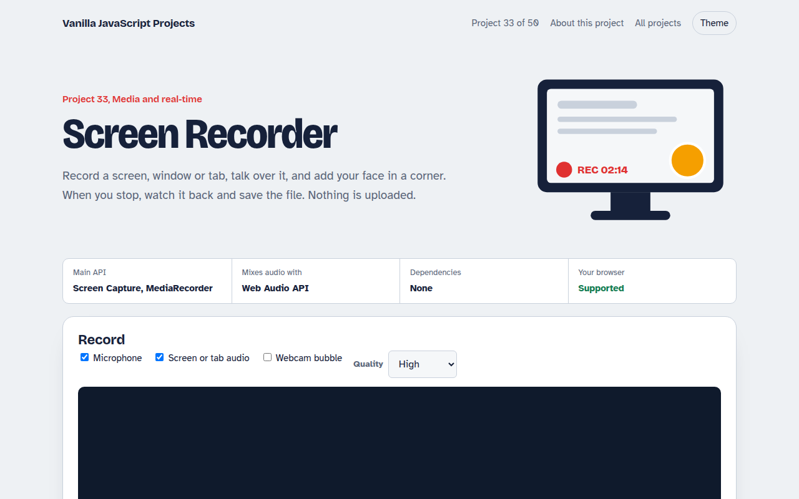

# Screen Recorder in JavaScript (Free Project)



**Live demo:** https://mmrahmanbappi.github.io/100-vanilla-javascript-projects/05-media-and-realtime/033-screen-recorder/demo.html
**Details and code:** https://mmrahmanbappi.github.io/100-vanilla-javascript-projects/05-media-and-realtime/033-screen-recorder/

Free screen recorder in plain JavaScript. Record a screen, window or tab with your microphone and a webcam bubble, then preview and download the video.

## What is the Screen Recorder?

Record your whole screen, one window or one tab, talk over it and add your face in a round bubble in the corner. When you stop, watch it back and save the file. Nothing is uploaded.

getDisplayMedia opens the browser's own picker for what to share. The screen and webcam are drawn onto one canvas, the microphone and screen audio are mixed with Web Audio, and MediaRecorder turns it all into a video file.

## What it does

- Record the whole screen, one window or one tab
- Mix microphone and system or tab audio together
- Webcam bubble drawn into the corner of the video
- Pause and resume, with a live timer and file size
- Preview and download as WebM or MP4 where supported

## How it works

1. **Pick what to share.** The browser shows its own picker for screens, windows and tabs. The page never sees anything you did not pick.
2. **Mix the sources.** Screen video and webcam are drawn onto one canvas. Microphone and screen audio are mixed with an AudioContext.
3. **Record.** MediaRecorder turns the combined stream into video chunks. On stop they become one file you can play or save.

## The key JavaScript

```js
const screen = await navigator.mediaDevices.getDisplayMedia({ video: true, audio: true });
const mic = await navigator.mediaDevices.getUserMedia({ audio: true });

// Mix screen audio and microphone into one track
const ctx = new AudioContext(), out = ctx.createMediaStreamDestination();
[screen, mic].forEach((s) => s.getAudioTracks().length && ctx.createMediaStreamSource(s).connect(out));

const stream = new MediaStream([...screen.getVideoTracks(), ...out.stream.getAudioTracks()]);
const rec = new MediaRecorder(stream, { mimeType: "video/webm;codecs=vp9,opus" });
rec.ondataavailable = (e) => chunks.push(e.data);
rec.onstop = () => download(new Blob(chunks, { type: rec.mimeType }));
rec.start(1000);
```

## Browser support

Chrome, Edge and Firefox on desktop. Safari records screens but not tab audio. Phones cannot share their screen from a web page.

## How to use

1. Download `demo.html` from this folder.
2. Serve the folder with `npx serve .` or `python -m http.server`, then open it in your browser.
3. Change the text and colors, and upload it anywhere. One file, no build step.

## Questions

**What format are the recordings?**

WebM in most browsers, and MP4 where the browser supports recording it. Both play in modern browsers and editors.

**Can it record system sound?**

Tab audio works in Chrome and Edge when you share a tab. Full system audio depends on the operating system.

**Does it work on phones?**

No. Mobile browsers do not let web pages share the screen yet.

## License

MIT. Free for personal and commercial use.
