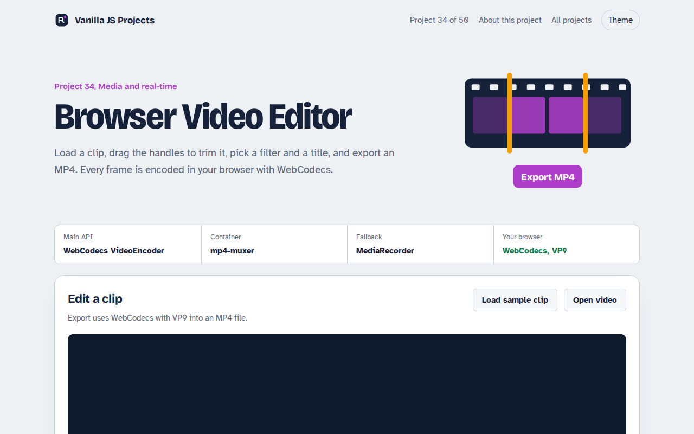

# Browser Video Editor in JavaScript (Free Project)



**Live demo:** https://mmrahmanbappi.github.io/vanilla-javascript-projects/05-media-and-realtime/034-browser-video-editor/demo.html
**Details and code:** https://mmrahmanbappi.github.io/vanilla-javascript-projects/05-media-and-realtime/034-browser-video-editor/

Free browser video editor in plain JavaScript. Trim a clip, add a filter and a title, and export a real MP4 with the WebCodecs VideoEncoder. No upload.

## What is the Browser Video Editor?

Load a video, drag two handles to trim it, pick a color filter, add a title and export an MP4. Every frame is processed and encoded inside your browser, so the video is never uploaded.

The page plays the clip and grabs each frame, draws it on a canvas with the filter and title, and sends it to the WebCodecs VideoEncoder. The mp4-muxer library packs the encoded frames into an MP4 file.

## What it does

- Timeline with 10 thumbnails and trim handles
- Filters: grayscale, sepia, vivid, fade, blur
- Title text burned into the video
- Export as MP4 with H.264, VP9 or AV1, whichever your browser can encode
- Export progress and final file size

## How it works

1. **Pick frames.** The video plays from the in point to the out point. requestVideoFrameCallback hands over each frame as it is shown.
2. **Edit the frame.** Each frame is drawn on a canvas with the filter and title, then wrapped in a VideoFrame with its timestamp.
3. **Encode and pack.** VideoEncoder compresses the frames. mp4-muxer puts the chunks into an MP4 file you can download.

## The key JavaScript

```js
import { Muxer, ArrayBufferTarget } from "https://cdn.jsdelivr.net/npm/mp4-muxer@5.2.2/+esm";

const muxer = new Muxer({ target: new ArrayBufferTarget(), video: { codec: "avc", width, height }, fastStart: "in-memory" });
const encoder = new VideoEncoder({ output: (chunk, meta) => muxer.addVideoChunk(chunk, meta), error: console.error });
encoder.configure({ codec: "avc1.42001f", width, height, bitrate: 4e6, framerate: 30 });

video.requestVideoFrameCallback(function onFrame(now, info) {
  ctx.drawImage(video, 0, 0);                                   // plus filter and title
  const frame = new VideoFrame(canvas, { timestamp: (info.mediaTime - start) * 1e6 });
  encoder.encode(frame, { keyFrame: n++ % 60 === 0 }); frame.close();
  video.requestVideoFrameCallback(onFrame);
});
```

## Browser support

WebCodecs: Chrome, Edge, Safari 17+ and Firefox 130+ on desktop. Audio is not included in the export in this version.

## How to use

1. Download `demo.html` from this folder.
2. Serve the folder with `npx serve .` or `python -m http.server`, then open it in your browser.
3. Change the text and colors, and upload it anywhere. One file, no build step.

## Questions

**What is WebCodecs?**

It is a browser API that gives JavaScript direct access to video and audio encoders and decoders. It is much faster than older canvas recording tricks.

**Is audio included in the export?**

Not in this version. The video track is exported. Audio can be added with AudioEncoder in the same way.

**Which codec does it use?**

It picks the first your browser can encode: H.264, then VP9, then AV1.

## License

MIT. Free for personal and commercial use.
