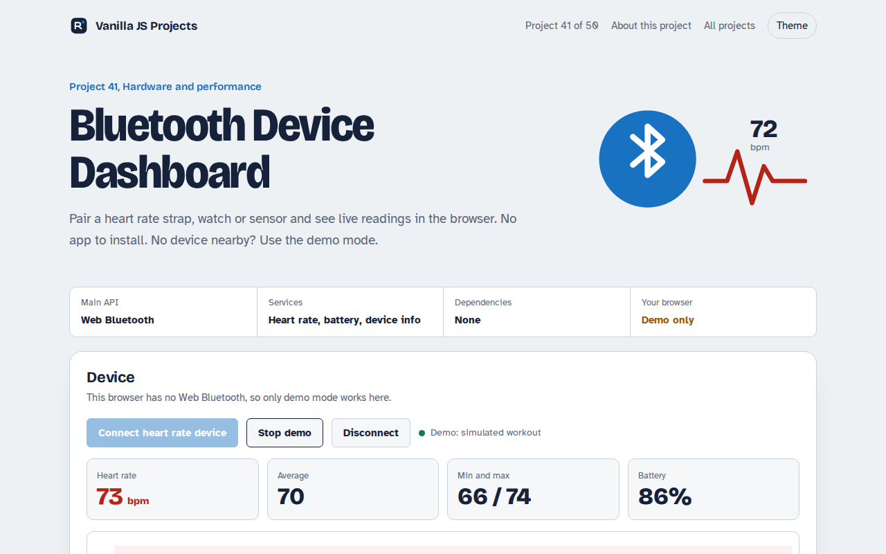

# Bluetooth Device Dashboard in JavaScript (Free Project)



**Live demo:** https://mmrahmanbappi.github.io/vanilla-javascript-projects/06-hardware-and-performance/041-bluetooth-dashboard/demo.html
**Details and code:** https://mmrahmanbappi.github.io/vanilla-javascript-projects/06-hardware-and-performance/041-bluetooth-dashboard/

Free Web Bluetooth dashboard in plain JavaScript. Connect a heart rate strap or watch, see a live chart, battery and device info, or try the demo mode.

## What is the Bluetooth Device Dashboard?

Pair a heart rate strap, fitness watch or sensor straight from the browser and see live readings with a 60 second chart, min, max and average, plus the battery level. No app to install.

The Web Bluetooth API opens the browser's device picker, connects to the device's GATT server and subscribes to notifications. Each heart rate reading arrives as a few bytes that the page decodes.

## What it does

- Scan and pair with devices that offer the heart rate service
- Live heart rate with a 60 second chart, min, max and average
- Battery level with change notifications
- Manufacturer and model from the Device Information service
- Demo mode that simulates a workout

## How it works

1. **Ask for a device.** The browser shows its own picker, filtered to devices with the heart rate service. The page only gets the one you choose.
2. **Subscribe.** The page connects to the GATT server and starts notifications on the heart rate characteristic.
3. **Decode.** Each notification is a few bytes. The first byte says if the value is 8 or 16 bit, then the reading follows.

## The key JavaScript

```js
const device = await navigator.bluetooth.requestDevice({
  filters: [{ services: ["heart_rate"] }], optionalServices: ["battery_service"],
});
const server = await device.gatt.connect();
const hr = await (await server.getPrimaryService("heart_rate"))
  .getCharacteristic("heart_rate_measurement");

hr.addEventListener("characteristicvaluechanged", (e) => {
  const v = e.target.value;                            // DataView
  const bpm = v.getUint8(0) & 1 ? v.getUint16(1, true) : v.getUint8(1);
  show(bpm);
});
await hr.startNotifications();
```

## Browser support

Chrome and Edge on desktop and Android, and Opera. Not available in Safari or Firefox. Needs HTTPS or localhost.

## How to use

1. Download `demo.html` from this folder.
2. Serve the folder with `npx serve .` or `python -m http.server`, then open it in your browser.
3. Change the text and colors, and upload it anywhere. One file, no build step.

## Questions

**Which browsers support Web Bluetooth?**

Chrome and Edge on desktop and Android, and Opera. Safari and Firefox do not support it.

**What devices can I connect?**

Any Bluetooth Low Energy device with a standard heart rate or battery service, including most chest straps and many watches.

**Can I try it without a device?**

Yes. Demo mode simulates a workout so you can see the chart and numbers move.

## License

MIT. Free for personal and commercial use.
