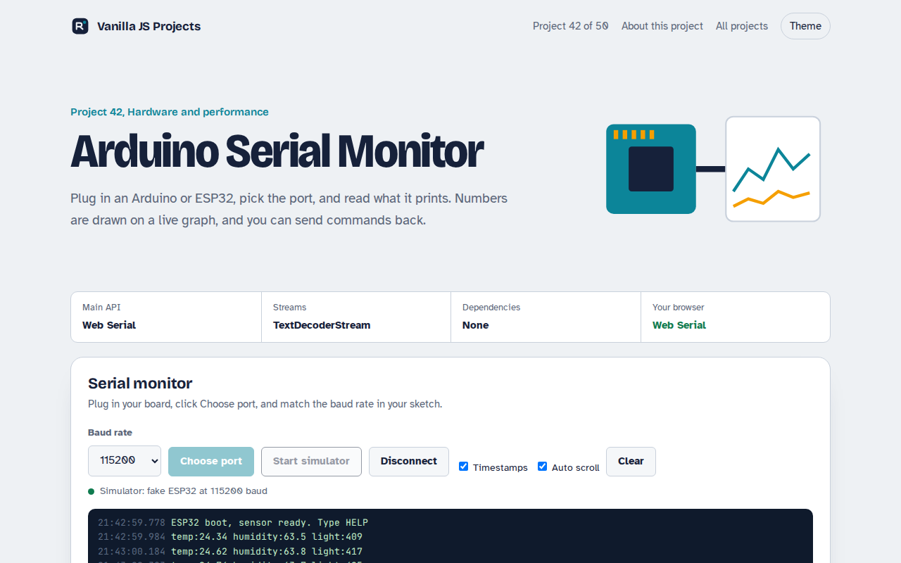

# Arduino Serial Monitor in JavaScript (Free Project)



**Live demo:** https://mmrahmanbappi.github.io/vanilla-javascript-projects/06-hardware-and-performance/042-serial-monitor/demo.html
**Details and code:** https://mmrahmanbappi.github.io/vanilla-javascript-projects/06-hardware-and-performance/042-serial-monitor/

Free serial monitor and plotter in plain JavaScript. Talk to an Arduino, ESP32 or Pico over USB with the Web Serial API, send commands and plot numbers live.

## What is the Arduino Serial Monitor?

Plug in an Arduino or ESP32, pick the port and read everything it prints, with timestamps. Numbers in each line are drawn on a live chart like the Arduino IDE plotter, and you can send commands back.

The Web Serial API opens the USB port at the baud rate you choose. Bytes flow through a TextDecoderStream and a small line splitter, and a simulator lets you try it without a board.

## What it does

- Pick any USB serial port and baud rate
- Line by line output with timestamps and auto scroll
- Send text with a choice of line ending
- Live plotter for up to 4 numbers per line, like 23.5,61
- Simulator that acts like a board sending sensor data

## How it works

1. **Open the port.** You choose the port in the browser's picker. The page opens it at the baud rate your board uses.
2. **Read lines.** Bytes flow through a TextDecoderStream and a small TransformStream that splits on new lines.
3. **Plot.** Each line is checked for numbers. If it has any, they are added to the chart as separate colored lines.

## The key JavaScript

```js
const port = await navigator.serial.requestPort();
await port.open({ baudRate: 115200 });

const lines = port.readable
  .pipeThrough(new TextDecoderStream())
  .pipeThrough(new TransformStream({
    transform(chunk, ctl) { (this.buf = (this.buf ?? "") + chunk).split("\n").slice(0, -1).forEach((l) => ctl.enqueue(l)); this.buf = this.buf.slice(this.buf.lastIndexOf("\n") + 1); },
  }));
for await (const line of lines) show(line);

const writer = port.writable.getWriter();
await writer.write(new TextEncoder().encode("LED ON\n"));
```

## Browser support

Chrome and Edge on desktop, and Opera. Not in Safari, Firefox or mobile browsers. Needs HTTPS or localhost.

## How to use

1. Download `demo.html` from this folder.
2. Serve the folder with `npx serve .` or `python -m http.server`, then open it in your browser.
3. Change the text and colors, and upload it anywhere. One file, no build step.

## Questions

**Which browsers support Web Serial?**

Chrome, Edge and Opera on desktop. It is not in Safari, Firefox or mobile browsers.

**What baud rate should I use?**

The same one as Serial.begin() in your sketch. 115200 is the most common.

**How do I plot values?**

Print numbers on one line, like temp:24.5 humidity:61. The plotter draws up to four values per line.

## License

MIT. Free for personal and commercial use.
