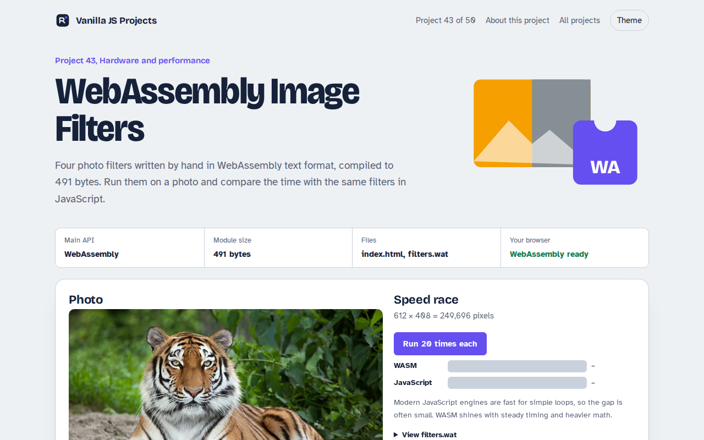

# WebAssembly Image Filters in JavaScript (Free Project)



**Live demo:** https://mmrahmanbappi.github.io/vanilla-javascript-projects/06-hardware-and-performance/043-wasm-image-filters/demo.html
**Details and code:** https://mmrahmanbappi.github.io/vanilla-javascript-projects/06-hardware-and-performance/043-wasm-image-filters/

Free WebAssembly image filters in plain JavaScript. Grayscale, sepia, invert and brightness in a 491 byte hand written WASM module, with a speed race against JS.

## What is the WebAssembly Image Filters?

Four photo filters written by hand in WebAssembly text format and compiled to just 491 bytes. Apply them to a photo, then race the same filters written in plain JavaScript to see which is faster.

The photo's pixels are copied into WebAssembly memory, the exported function changes them in place with integer math, and the result is copied back to the canvas. The readable filters.wat source is in the folder.

## What it does

- Grayscale, sepia, invert and brightness with contrast
- The same filters written in JavaScript for a fair race
- Timing for both, with a bar chart over repeated runs
- Works on your own photos of any size (memory grows as needed)
- The .wat source is included and readable

## How it works

1. **Copy pixels in.** The photo's RGBA bytes are copied into the WebAssembly memory. Memory grows in 64 KB pages to fit.
2. **Run the filter.** The exported function loops over every pixel in place, using only integer math.
3. **Copy pixels out.** The page reads the bytes back from the same memory and paints them on the canvas.

## The key JavaScript

```js
const bytes = Uint8Array.from(atob(WASM_BASE64), (c) => c.charCodeAt(0));
const { instance } = await WebAssembly.instantiate(bytes);
const { memory, grayscale } = instance.exports;

const img = ctx.getImageData(0, 0, w, h);
const need = Math.ceil(img.data.length / 65536) - memory.buffer.byteLength / 65536;
if (need > 0) memory.grow(need);                           // 64 KB pages

new Uint8Array(memory.buffer).set(img.data);                // copy in
grayscale(img.data.length);                                 // run in place
img.data.set(new Uint8Array(memory.buffer, 0, img.data.length));  // copy out
ctx.putImageData(img, 0, 0);
```

## Browser support

Every modern browser.

## How to use

1. Download `demo.html` from this folder.
2. Serve the folder with `npx serve .` or `python -m http.server`, then open it in your browser.
3. Change the text and colors, and upload it anywhere. One file, no build step.

## Questions

**Is WebAssembly always faster than JavaScript?**

No. For simple loops like these, modern JavaScript is close. WebAssembly wins on heavier math and gives steadier timing.

**What is WAT?**

WebAssembly Text format, the human readable version of WebAssembly. A tool like wat2wasm turns it into the binary file.

**Can I use WebAssembly from other languages?**

Yes. Rust, C, C++ and Go all compile to WebAssembly. Writing WAT by hand shows what they produce.

## License

MIT. Free for personal and commercial use.
