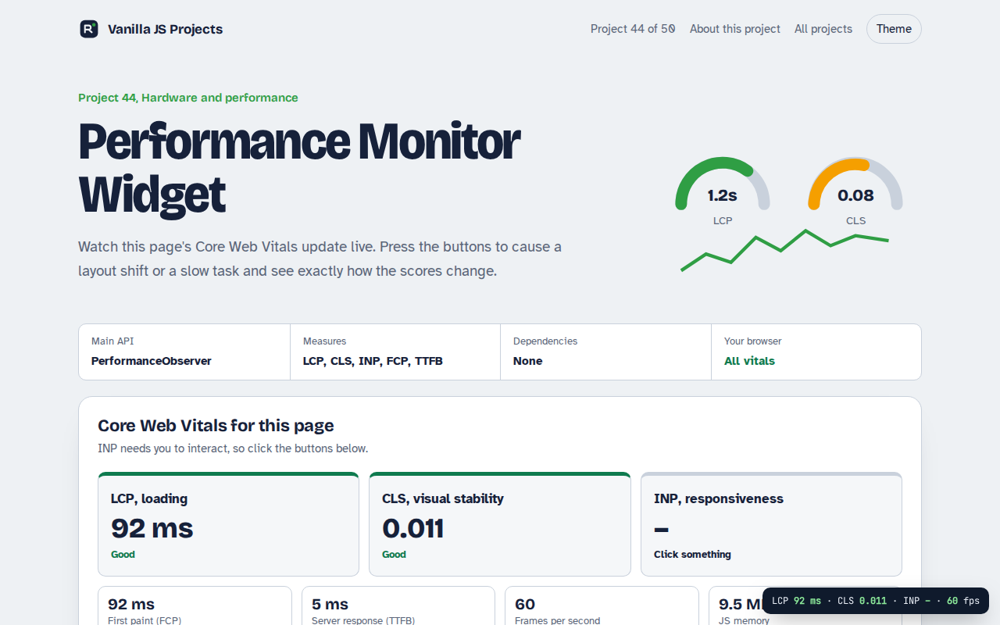

# Performance Monitor Widget in JavaScript (Free Project)



**Live demo:** https://mmrahmanbappi.github.io/vanilla-javascript-projects/06-hardware-and-performance/044-performance-monitor/demo.html
**Details and code:** https://mmrahmanbappi.github.io/vanilla-javascript-projects/06-hardware-and-performance/044-performance-monitor/

Free performance monitor in plain JavaScript. Measure LCP, CLS, INP, FCP, TTFB, long tasks and FPS live with PerformanceObserver, and trigger issues to learn.

## What is the Performance Monitor Widget?

Watch this page's Core Web Vitals update live: loading speed, layout shifts and how fast it responds to clicks. Buttons let you cause a layout shift or a slow task so you can see exactly how the scores react.

Every number comes from PerformanceObserver. CLS groups layout shifts into session windows, INP takes the slowest interaction, and each value is rated with Google's official good and poor thresholds.

## What it does

- LCP, CLS and INP rated good, needs work or poor with Google's thresholds
- FCP, TTFB and a navigation timing waterfall
- Long tasks list with durations
- Live frames per second graph and JS memory where available
- Floating mini widget you can copy into your own site

## How it works

1. **Observe entries.** A PerformanceObserver subscribes to each entry type. buffered: true replays what happened before the script ran.
2. **Compute the metric.** CLS groups shifts into session windows. INP takes the slowest interaction. LCP takes the last large paint.
3. **Rate it.** Each value is compared with the official thresholds, for example LCP is good under 2.5 seconds.

## The key JavaScript

```js
new PerformanceObserver((list) => {
  const last = list.getEntries().at(-1);
  report("LCP", last.startTime);                        // good under 2500 ms
}).observe({ type: "largest-contentful-paint", buffered: true });

let cls = 0;
new PerformanceObserver((list) => {
  for (const e of list.getEntries()) if (!e.hadRecentInput) cls += e.value;
  report("CLS", cls);                                   // good under 0.1
}).observe({ type: "layout-shift", buffered: true });

new PerformanceObserver((list) => {
  for (const e of list.getEntries()) if (e.interactionId) inp = Math.max(inp, e.duration);
}).observe({ type: "event", durationThreshold: 16, buffered: true });
```

## Browser support

All metrics: Chrome and Edge. Safari and Firefox support FCP, TTFB and LCP (Firefox and Safari 26+), with INP and CLS in the newest versions or not at all.

## How to use

1. Download `demo.html` from this folder.
2. Serve the folder with `npx serve .` or `python -m http.server`, then open it in your browser.
3. Change the text and colors, and upload it anywhere. One file, no build step.

## Questions

**What are good Core Web Vitals scores?**

LCP under 2.5 seconds, CLS under 0.1 and INP under 200 milliseconds count as good.

**Why is INP empty at first?**

INP measures interactions, so it needs you to click or type something first.

**Can I add this to my own site?**

Yes. Copy the observer code and send the values to your analytics instead of showing them.

## License

MIT. Free for personal and commercial use.
