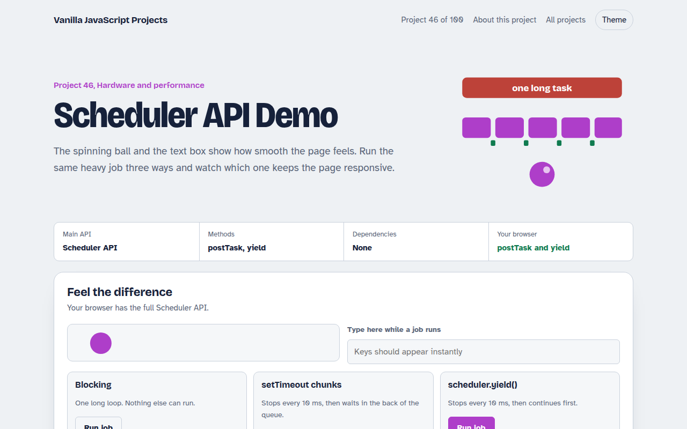

# Scheduler API Demo in JavaScript (Free Project)



**Live demo:** https://mmrahmanbappi.github.io/100-vanilla-javascript-projects/06-hardware-and-performance/046-scheduler-api-demo/demo.html
**Details and code:** https://mmrahmanbappi.github.io/100-vanilla-javascript-projects/06-hardware-and-performance/046-scheduler-api-demo/

Free Scheduler API demo in plain JavaScript. Run the same heavy job blocking, chunked with setTimeout and with scheduler.yield(), and watch the jank.

## What is the Scheduler API Demo?

A moving ball and a text box show how smooth the page feels. Run the same heavy job three ways and watch which one freezes the page, which one keeps it moving, and how long each takes.

scheduler.yield() lets a long loop pause so the browser can handle clicks and paint, then continue ahead of other waiting work. scheduler.postTask() runs tasks by priority, and a second demo shows the order.

## What it does

- Same 2 second job run three ways: blocking, setTimeout chunks and scheduler.yield()
- Live animation and typing box to feel the jank
- Frame drop counter and a timeline of long frames
- Task priority demo: user-blocking, user-visible and background
- Fallback to setTimeout when the API is missing

## How it works

1. **Break the work.** The heavy job is a loop. Every few milliseconds it stops to let the browser handle input and paint.
2. **Yield smartly.** await scheduler.yield() pauses and then continues ahead of other queued tasks, so the job still finishes quickly.
3. **Prioritize.** postTask runs callbacks by priority, so user-blocking work jumps ahead of background work.

## The key JavaScript

```js
async function processAll(items) {
  let last = performance.now();
  for (const item of items) {
    doWork(item);
    if (performance.now() - last > 10) {         // every 10 ms...
      await scheduler.yield();                   // ...let input and paint happen
      last = performance.now();
    }
  }
}
scheduler.postTask(() => saveDraft(), { priority: "background" });
scheduler.postTask(() => showMenu(), { priority: "user-blocking" });  // runs first
```

## Browser support

scheduler.postTask: Chrome, Edge and Firefox 142+. scheduler.yield: Chrome and Edge 129+. Others use a setTimeout fallback.

## How to use

1. Download `demo.html` from this folder.
2. Serve the folder with `npx serve .` or `python -m http.server`, then open it in your browser.
3. Change the text and colors, and upload it anywhere. One file, no build step.

## Questions

**What is scheduler.yield()?**

A function that pauses your code and lets the browser do other work, then resumes your task first. It is the easiest way to break up long tasks.

**How is it different from setTimeout?**

After setTimeout your code waits at the back of the queue. After scheduler.yield() it continues sooner, so the job finishes faster.

**Which browsers support it?**

scheduler.postTask is in Chrome, Edge and recent Firefox. scheduler.yield is in Chrome and Edge 129 and newer. The demo falls back to setTimeout.

## License

MIT. Free for personal and commercial use.
