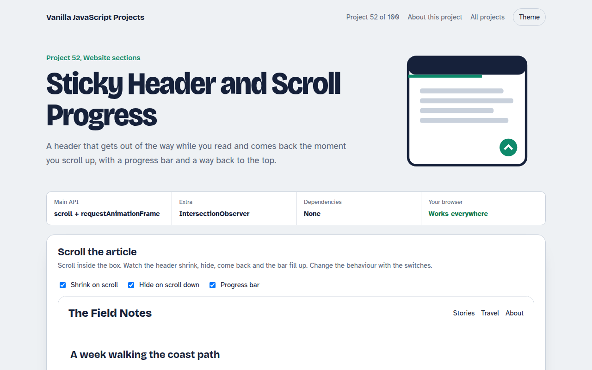

# Sticky Header and Scroll Progress in JavaScript (Free Project)



**Live demo:** https://mmrahmanbappi.github.io/100-vanilla-javascript-projects/08-website-sections/052-sticky-header-scroll-progress/demo.html
**Details and code:** https://mmrahmanbappi.github.io/100-vanilla-javascript-projects/08-website-sections/052-sticky-header-scroll-progress/

Free sticky header in plain JavaScript. The header shrinks and hides on scroll down, shows on scroll up, with a reading progress bar and a back to top button.

## What is the Sticky Header and Scroll Progress?

A sticky header that shrinks after you start scrolling, hides when you scroll down and slides back as soon as you scroll up.

It also shows a reading progress bar and a round back to top button that appears halfway down the page.

## What it does

- Shrinking header after 40 pixels
- Hide on scroll down, show on scroll up
- Reading progress bar
- Back to top button that appears when needed
- Passive listener with requestAnimationFrame for smooth scrolling

## How it works

1. **Read scroll once per frame.** The scroll handler only asks for a frame. The real work runs in requestAnimationFrame, so scrolling stays smooth.
2. **Compare with last position.** If the new position is lower than the last one, the reader is going down, so the header hides.
3. **Progress is a fraction.** scrollTop divided by the scrollable height gives 0 to 1, which becomes the bar width.

## The key JavaScript

```js
let last = 0, ticking = false;
window.addEventListener("scroll", () => {
  if (ticking) return; ticking = true;
  requestAnimationFrame(() => {
    const y = scrollY, max = document.documentElement.scrollHeight - innerHeight;
    header.classList.toggle("small", y > 40);
    header.classList.toggle("hide", y > 160 && y > last);
    bar.style.width = (y / max) * 100 + "%";
    last = y; ticking = false;
  });
}, { passive: true });
```

## Browser support

Works in all modern browsers.

## How to use

1. Download `demo.html` from this folder.
2. Serve the folder with `npx serve .` or `python -m http.server`, then open it in your browser.
3. Change the text and colors, and upload it anywhere. One file, no build step.

## Questions

**Why not use position sticky alone?**

Sticky keeps the header in place, but it cannot shrink or hide it. A little JavaScript adds that behaviour.

**Will this slow my page down?**

No. The listener is passive and the work runs at most once per frame.

**Can I use it on the whole window?**

Yes. Swap the frame element for window and scrollTop for scrollY, as shown in the code.

## License

MIT. Free for personal and commercial use.
