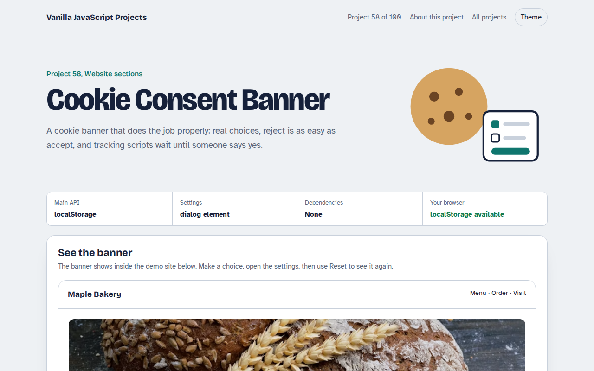

# Cookie Consent Banner in JavaScript (Free Project)



**Live demo:** https://mmrahmanbappi.github.io/100-vanilla-javascript-projects/08-website-sections/058-cookie-consent-banner/demo.html
**Details and code:** https://mmrahmanbappi.github.io/100-vanilla-javascript-projects/08-website-sections/058-cookie-consent-banner/

Free cookie consent banner in plain JavaScript. Accept, reject or choose categories, save the choice with a date and version, and only load analytics and ads after consent.

## What is the Cookie Consent Banner?

A cookie banner with Accept all, Reject all and Choose buttons. The settings panel lets people switch analytics, marketing and preference cookies on or off.

The choice is saved with a date and version, and the demo shows which scripts are loaded or blocked so you can see consent working.

## What it does

- Accept, reject and custom choice
- Four categories with necessary always on
- Saved choice with date and version
- Scripts blocked until their category is allowed
- Settings link to change your mind later

## How it works

1. **Nothing loads before consent.** Analytics and ad scripts are only added to the page when their category is switched on.
2. **Save a version and date.** The choice is stored with a version number. Change your cookie list, bump the version and everyone is asked again.
3. **Reject is one click.** Reject all sits next to Accept all with the same size, which is what regulators expect.

## The key JavaScript

```js
function loadIfAllowed(src, category) {
  const c = JSON.parse(localStorage.getItem("consent-v1") || "null");
  if (!c || !c.choices[category]) return;          // blocked until consent
  const s = document.createElement("script");
  s.src = src; s.async = true; document.head.append(s);
}
localStorage.setItem("consent-v1", JSON.stringify({
  version: 2, date: new Date().toISOString(),
  choices: { necessary: true, analytics: true, marketing: false }
}));
```

## Browser support

Works in all modern browsers.

## How to use

1. Download `demo.html` from this folder.
2. Serve the folder with `npx serve .` or `python -m http.server`, then open it in your browser.
3. Change the text and colors, and upload it anywhere. One file, no build step.

## Questions

**Is this enough for GDPR?**

It covers the main technical parts: real choice, easy reject, no tracking before consent and a record of the choice. Check the wording with your own legal adviser.

**How do I block Google Analytics until consent?**

Do not put the script tag in the HTML. Call a loader function like the one shown only when analytics is allowed.

**When should I ask again?**

When you add new cookies, raise the version number. Many sites also ask again after 12 months.

## License

MIT. Free for personal and commercial use.
