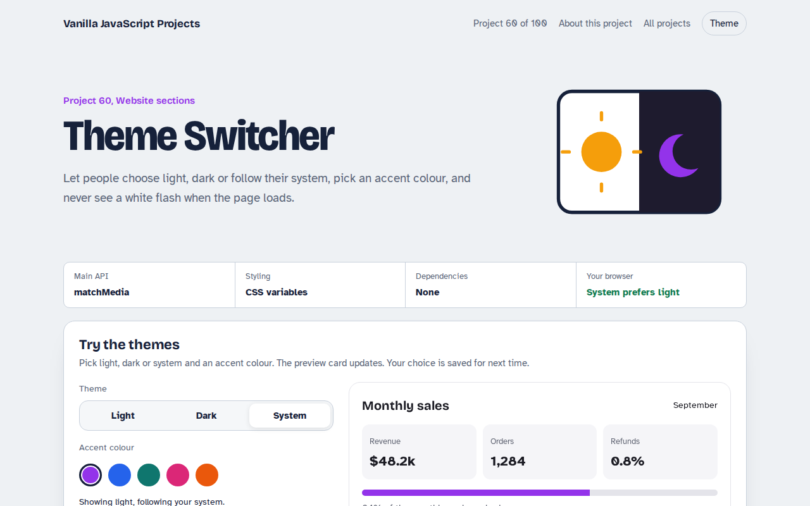

# Theme Switcher in JavaScript (Free Project)



**Live demo:** https://mmrahmanbappi.github.io/vanilla-javascript-projects/08-website-sections/060-theme-switcher/demo.html
**Details and code:** https://mmrahmanbappi.github.io/vanilla-javascript-projects/08-website-sections/060-theme-switcher/

Free theme switcher in plain JavaScript. Light, dark and system modes, an accent colour picker, saved choice, live system change and a tiny script that stops the white flash.

## What is the Theme Switcher?

A theme switcher with light, dark and system options plus an accent colour picker. The preview dashboard card changes instantly.

The choice is saved, system mode updates live when your computer switches, and a three line head script prevents the white flash on page load.

## What it does

- Light, dark and system modes
- Live update when the system theme changes
- Accent colour picker with CSS variables
- Saved choice in localStorage
- No flash script for the head

## How it works

1. **Colours are variables.** Every colour is a CSS variable. Dark mode just swaps the values, so no element needs its own dark rule.
2. **Three choices, one rule.** Light and dark are fixed. System follows prefers-color-scheme and updates live when the operating system changes.
3. **Decide before paint.** A tiny script in the head sets the theme before the CSS loads, so there is no white flash on reload.

## The key JavaScript

```js
const mq = matchMedia("(prefers-color-scheme: dark)");
function apply(mode) {
  const dark = mode === "dark" || (mode === "system" && mq.matches);
  document.documentElement.dataset.theme = dark ? "dark" : "light";
  localStorage.setItem("theme", mode);
}
mq.addEventListener("change", () => apply(localStorage.getItem("theme") || "system"));

/* CSS */
:root { --bg: #fff; --ink: #111; }
[data-theme="dark"] { --bg: #111; --ink: #eee; }
```

## Browser support

Works in all modern browsers.

## How to use

1. Download `demo.html` from this folder.
2. Serve the folder with `npx serve .` or `python -m http.server`, then open it in your browser.
3. Change the text and colors, and upload it anywhere. One file, no build step.

## Questions

**Why offer a system option?**

Many people set dark mode for their whole device. System respects that without making them choose again.

**What causes the white flash?**

The page paints before your JavaScript runs. Setting the theme in a small script at the top of the head fixes it.

**Do I need two stylesheets?**

No. Use CSS variables and change their values for the dark theme.

## License

MIT. Free for personal and commercial use.
