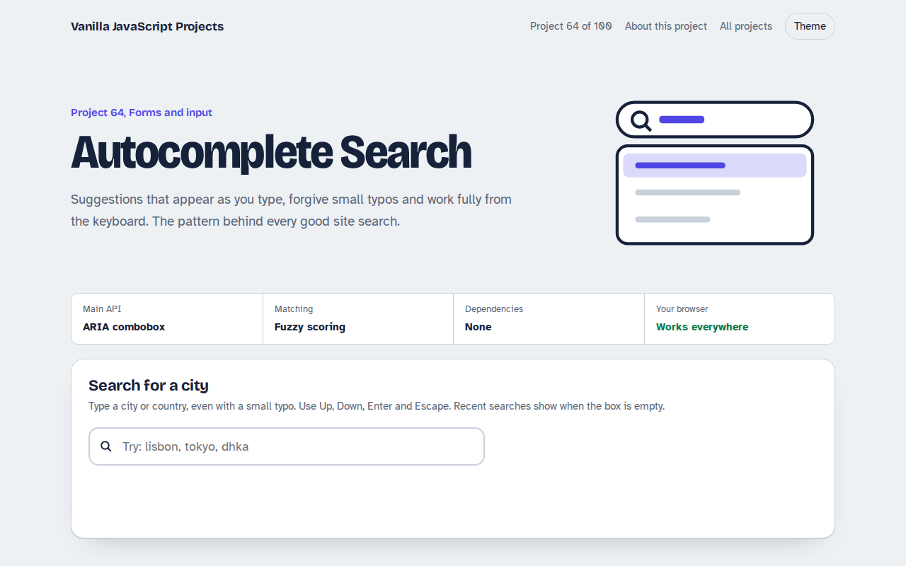

# Autocomplete Search in JavaScript (Free Project)



**Live demo:** https://mmrahmanbappi.github.io/vanilla-javascript-projects/09-forms-input/064-autocomplete-search/demo.html
**Details and code:** https://mmrahmanbappi.github.io/vanilla-javascript-projects/09-forms-input/064-autocomplete-search/

Free autocomplete search in plain JavaScript. Suggestions as you type with fuzzy matching, highlighted matches, arrow keys, Enter and Escape, recent searches and ARIA combobox.

## What is the Autocomplete Search?

A search box that suggests cities as you type. It matches the start of words first, then anywhere in the name, and forgives a missing letter.

Everything works with the keyboard, matching letters are highlighted, and your last five picks show as recent searches when the box is empty.

## What it does

- Suggestions as you type with a short debounce
- Fuzzy matching that forgives small typos
- Highlighted matching text
- Arrow keys, Enter and Escape
- Recent searches saved in the browser

## How it works

1. **Score every item.** A starts-with match scores highest, then contains, then a loose letter-by-letter match that allows a small gap, so dhka still finds Dhaka.
2. **Combobox roles.** The input has role combobox and points to the listbox. aria-activedescendant tells screen readers which option is highlighted while focus stays in the box.
3. **Wait a moment.** A short debounce means the list only updates after a pause in typing, which matters when results come from a server.

## The key JavaScript

```js
input.addEventListener("input", () => {
  clearTimeout(timer);
  timer = setTimeout(() => {
    const q = input.value.trim().toLowerCase();
    const results = data
      .map((item) => [item, score(q, item.name)])
      .filter(([, s]) => s > 0)
      .sort((a, b) => b[1] - a[1])
      .slice(0, 8);
    render(results);
  }, 120);
});
input.setAttribute("aria-activedescendant", "option-" + active);
```

## Browser support

Works in all modern browsers.

## How to use

1. Download `demo.html` from this folder.
2. Serve the folder with `npx serve .` or `python -m http.server`, then open it in your browser.
3. Change the text and colors, and upload it anywhere. One file, no build step.

## Questions

**How do I search a server instead?**

Replace the local filter with a fetch to your search endpoint inside the debounced function, and cancel older requests with AbortController.

**What is aria-activedescendant?**

It lets focus stay in the input while telling screen readers which suggestion is currently highlighted.

**How many suggestions should I show?**

Between five and ten. More than that is hard to scan.

## License

MIT. Free for personal and commercial use.
