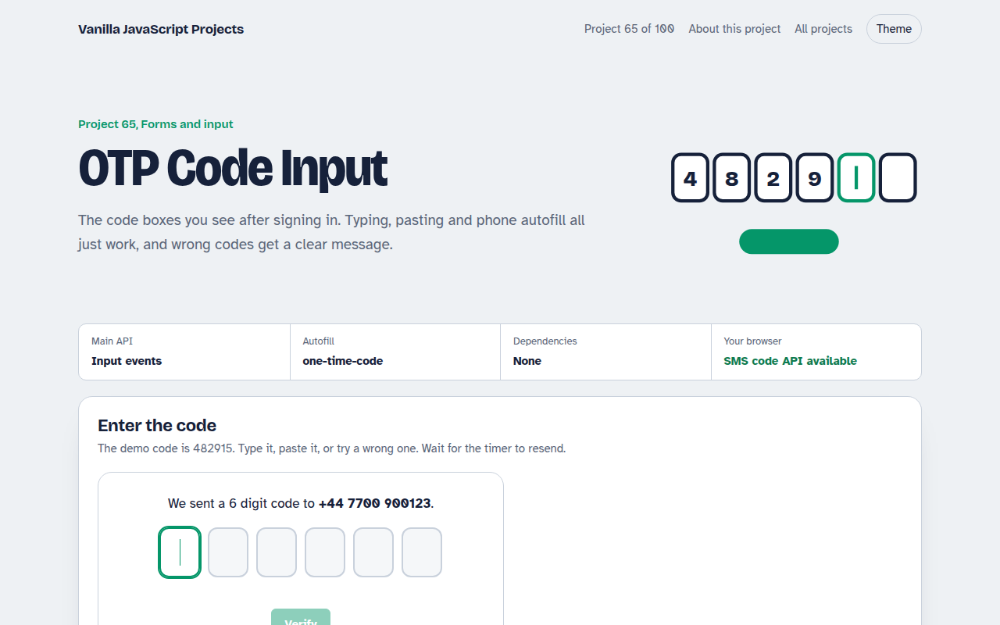

# OTP Code Input in JavaScript (Free Project)



**Live demo:** https://mmrahmanbappi.github.io/100-vanilla-javascript-projects/09-forms-input/065-otp-code-input/demo.html
**Details and code:** https://mmrahmanbappi.github.io/100-vanilla-javascript-projects/09-forms-input/065-otp-code-input/

Free OTP code input in plain JavaScript. Six boxes that move forward as you type, back on Backspace, accept a pasted code, fill from SMS autofill and show a resend timer.

## What is the OTP Code Input?

Six boxes for a verification code. Focus jumps forward as you type and back when you press Backspace, and a pasted code fills every box at once.

On phones the first box accepts SMS autofill. Wrong codes shake with a message and a count of tries left, and the resend link becomes active after 30 seconds.

## What it does

- Auto advance and smart Backspace
- Paste a whole code into any box
- SMS autofill with one-time-code
- Three tries then lock
- Resend timer

## How it works

1. **One digit per box.** Each box takes one digit and moves focus to the next. Backspace on an empty box goes back and clears the previous digit.
2. **Paste and autofill.** Pasting or autofill can drop the whole code into one box. The script spreads the digits across all six.
3. **Limit tries and wait.** Three wrong tries lock the boxes, and the resend link waits 30 seconds, like real sign in flows.

## The key JavaScript

```js
inputs.forEach((box, i) => {
  box.addEventListener("input", () => {
    const digits = box.value.replace(/\D/g, "");
    if (digits.length > 1) return spread(digits, i);   // pasted or autofilled
    box.value = digits;
    if (digits && i < inputs.length - 1) inputs[i + 1].focus();
  });
  box.addEventListener("keydown", (e) => {
    if (e.key === "Backspace" && !box.value && i > 0) inputs[i - 1].focus();
  });
});
// first box: <input autocomplete="one-time-code" inputmode="numeric">
```

## Browser support

Works in all modern browsers. SMS code reading via WebOTP works in Chrome on Android.

## How to use

1. Download `demo.html` from this folder.
2. Serve the folder with `npx serve .` or `python -m http.server`, then open it in your browser.
3. Change the text and colors, and upload it anywhere. One file, no build step.

## Questions

**Why six separate inputs?**

They make the length clear and each digit easy to check. The script makes them behave like one field.

**How does SMS autofill work?**

autocomplete="one-time-code" lets phones offer the code from a new message above the keyboard.

**Should I check the code in JavaScript?**

Only for the demo. Real codes must be checked on your server.

## License

MIT. Free for personal and commercial use.
