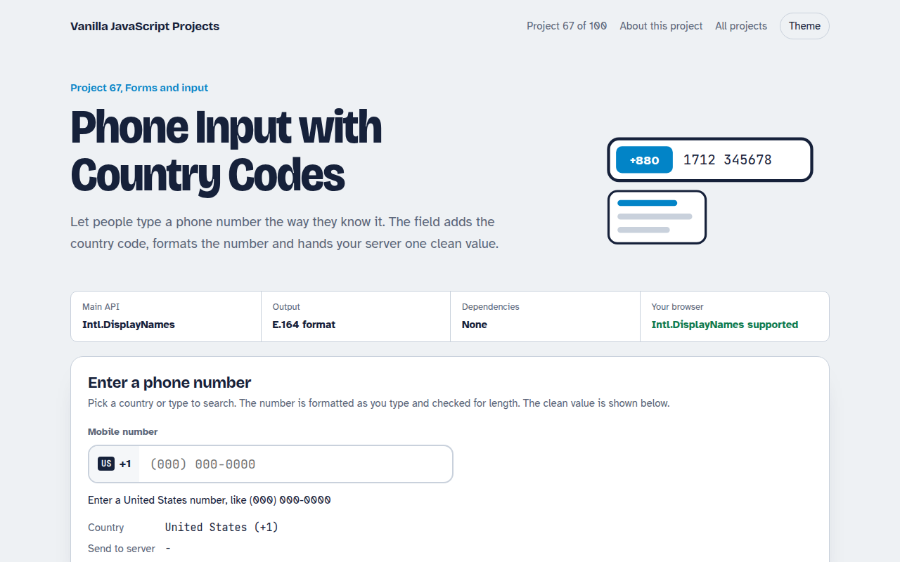

# Phone Input with Country Codes in JavaScript (Free Project)



**Live demo:** https://mmrahmanbappi.github.io/100-vanilla-javascript-projects/09-forms-input/067-phone-input-country-codes/demo.html
**Details and code:** https://mmrahmanbappi.github.io/100-vanilla-javascript-projects/09-forms-input/067-phone-input-country-codes/

Free international phone number input in plain JavaScript. Searchable country list with dial codes, formatting as you type, length checks and E.164 output for your server.

## What is the Phone Input with Country Codes?

A phone field with a country picker. Choose a country from a searchable list or type a dial code, and the number is formatted the local way as you type.

The field tells you how many digits are missing, and shows the clean international version that you would send to your server or SMS service.

## What it does

- Searchable list of 28 countries with dial codes
- Country names in the visitor's language
- Formatting as you type with the cursor kept in place
- Length check with helpful messages
- E.164 output for servers

## How it works

1. **Country data in one list.** Each country has an ISO code, dial code, a display mask and the expected number of digits. Names come from Intl.DisplayNames in the visitor's language.
2. **Format as you type.** Only digits are kept, a leading 0 is dropped, and the mask adds spaces and brackets in the right places.
3. **Send one clean value.** The server gets the number in E.164 format: a plus sign, the dial code and the digits, with no spaces.

## The key JavaScript

```js
const names = new Intl.DisplayNames(["en"], { type: "region" });
names.of("BD");                           // "Bangladesh"

function format(digits, mask) {           // mask like "####-######"
  let out = "", i = 0;
  for (const ch of mask) {
    if (i >= digits.length) break;
    out += ch === "#" ? digits[i++] : ch;
  }
  return out;
}
const e164 = "+" + country.dial + digits; // "+8801712345678"
```

## Browser support

Works in all modern browsers.

## How to use

1. Download `demo.html` from this folder.
2. Serve the folder with `npx serve .` or `python -m http.server`, then open it in your browser.
3. Change the text and colors, and upload it anywhere. One file, no build step.

## Questions

**What is E.164?**

The international phone format: a plus sign, country code and number with no spaces, like +447700900123. SMS services expect it.

**Why no flag emoji?**

Flag emoji do not show on Windows, so the demo uses short country codes that look the same everywhere.

**Is a length check enough?**

It catches most typos. For full checks, use a phone library on your server or verify the number with a code.

## License

MIT. Free for personal and commercial use.
