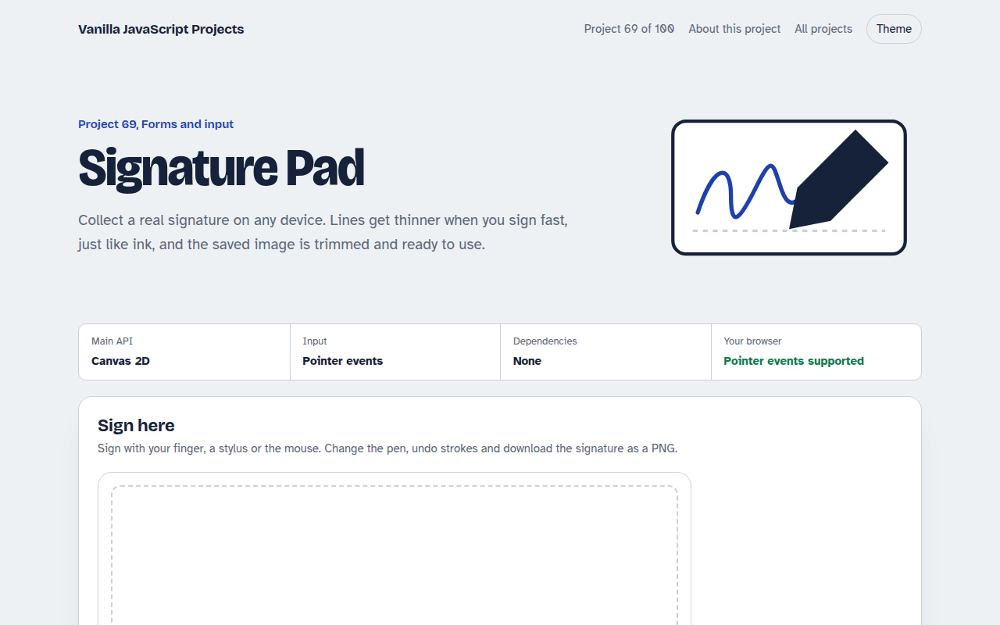

# Signature Pad in JavaScript (Free Project)



**Live demo:** https://mmrahmanbappi.github.io/100-vanilla-javascript-projects/09-forms-input/069-signature-pad/demo.html
**Details and code:** https://mmrahmanbappi.github.io/100-vanilla-javascript-projects/09-forms-input/069-signature-pad/

Free signature pad in plain JavaScript. Sign with a finger, pen or mouse, smooth lines that respond to speed, undo, clear, trimmed PNG download and sharp on high resolution screens.

## What is the Signature Pad?

A signature box that works with a finger, a stylus or a mouse. Lines are smooth and change thickness with speed and pen pressure, so signatures look natural.

You can pick an ink colour and pen size, undo strokes or clear. Saving trims the empty space and gives you a transparent PNG to download or send to your server.

## What it does

- Finger, stylus and mouse input
- Speed and pressure sensitive lines
- Ink colours and pen sizes
- Undo and clear
- Trimmed transparent PNG download

## How it works

1. **Sharp on every screen.** The canvas is sized in real device pixels and scaled back, so lines stay crisp on phones and high resolution laptops.
2. **Smooth, ink-like lines.** Points are joined with quadratic curves through their midpoints. Fast movement makes the line thinner, and pen pressure is used when available.
3. **Trim before saving.** The script scans the pixels for the signature's edges and copies just that area, with a little padding, into a new PNG.

## The key JavaScript

```js
canvas.addEventListener("pointermove", (e) => {
  if (!drawing) return;
  const p = point(e), last = pts.at(-1);
  const speed = Math.hypot(p.x - last.x, p.y - last.y) / (p.t - last.t);
  p.w = last.w * 0.6 + base * Math.max(0.45, 1.5 - speed * 0.6) * 0.4; // faster = thinner
  const mid = { x: (last.x + p.x) / 2, y: (last.y + p.y) / 2 };
  ctx.lineWidth = p.w;
  ctx.quadraticCurveTo(last.x, last.y, mid.x, mid.y);
  ctx.stroke();
  pts.push(p);
});
```

## Browser support

Works in all modern browsers. Pressure works with pens that report it, such as Apple Pencil and Surface Pen.

## How to use

1. Download `demo.html` from this folder.
2. Serve the folder with `npx serve .` or `python -m http.server`, then open it in your browser.
3. Change the text and colors, and upload it anywhere. One file, no build step.

## Questions

**Is a drawn signature legally valid?**

In many countries a drawn signature is accepted for everyday agreements. Check the rules for your country and use case.

**How do I send the signature to my server?**

Use canvas.toBlob() and add the blob to a FormData object, then post it with fetch.

**Why does the page not scroll when I sign?**

touch-action: none on the signing area stops the page from scrolling while you draw.

## License

MIT. Free for personal and commercial use.
