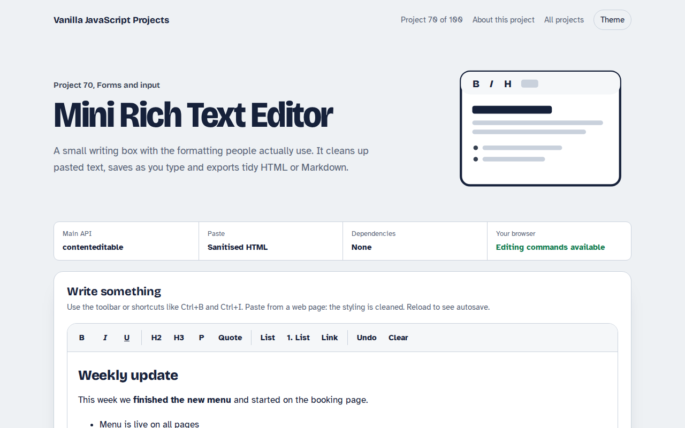

# Mini Rich Text Editor in JavaScript (Free Project)



**Live demo:** https://mmrahmanbappi.github.io/vanilla-javascript-projects/09-forms-input/070-mini-rich-text-editor/demo.html
**Details and code:** https://mmrahmanbappi.github.io/vanilla-javascript-projects/09-forms-input/070-mini-rich-text-editor/

Free mini rich text editor in plain JavaScript. Bold, italic, headings, lists, quotes and links, keyboard shortcuts, clean paste, word count, autosave and HTML or Markdown export.

## What is the Mini Rich Text Editor?

A small rich text editor with a toolbar for bold, italic, underline, headings, quotes, lists and links, plus the usual keyboard shortcuts.

Text pasted from web pages or Word is cleaned to simple HTML. The editor saves as you type, counts words and exports clean HTML or Markdown.

## What it does

- Toolbar with active state
- Headings, quotes, lists and safe links
- Clean paste that strips styles and scripts
- Word count, reading time and autosave
- HTML and Markdown export

## How it works

1. **A div you can type in.** contenteditable turns a normal div into an editor. The toolbar runs editing commands like bold and formatBlock on the current selection.
2. **Clean every paste.** Pasted HTML is parsed with DOMParser, and only safe tags like p, b, a and lists are kept. Styles, classes and scripts are removed.
3. **Export two ways.** The cleaned HTML is shown as is, and a small walker turns the same tree into Markdown.

## The key JavaScript

```js
editor.addEventListener("paste", (e) => {
  e.preventDefault();
  const html = e.clipboardData.getData("text/html");
  const doc = new DOMParser().parseFromString(html, "text/html");
  doc.querySelectorAll("*").forEach((el) => {
    if (!ALLOWED.has(el.tagName)) el.replaceWith(...el.childNodes);
    else [...el.attributes].forEach((a) => a.name !== "href" && el.removeAttribute(a.name));
  });
  document.execCommand("insertHTML", false, doc.body.innerHTML);
});
```

## Browser support

Works in all modern browsers. execCommand is marked as old in the specs but is still supported everywhere.

## How to use

1. Download `demo.html` from this folder.
2. Serve the folder with `npx serve .` or `python -m http.server`, then open it in your browser.
3. Change the text and colors, and upload it anywhere. One file, no build step.

## Questions

**Is execCommand safe to use?**

It is still supported in every browser. For a very large editor you may want a dedicated library, but for simple formatting it works well.

**Can people paste harmful code?**

Pasted content is cleaned to a short list of safe tags, and link addresses must start with http, https or mailto. Clean it again on your server.

**Where is the text saved?**

In localStorage in your browser, half a second after you stop typing.

## License

MIT. Free for personal and commercial use.
