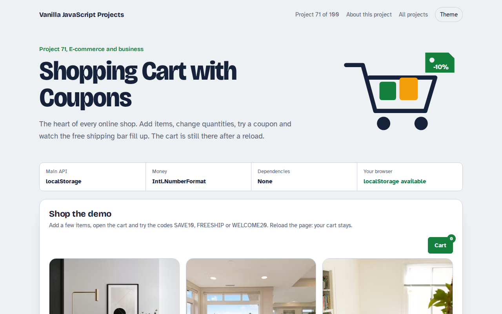

# Shopping Cart with Coupons in JavaScript (Free Project)



**Live demo:** https://mmrahmanbappi.github.io/vanilla-javascript-projects/10-ecommerce-business/071-shopping-cart-coupons/demo.html
**Details and code:** https://mmrahmanbappi.github.io/vanilla-javascript-projects/10-ecommerce-business/071-shopping-cart-coupons/

Free shopping cart in plain JavaScript. Add products, change quantities in a cart drawer, apply coupon codes, see free shipping progress, tax and totals, and keep the cart after reload.

## What is the Shopping Cart with Coupons?

A small furniture shop with a slide-out cart. Add products, change quantities, remove items and see the subtotal, discount, shipping, tax and total update.

Try three coupon codes, one with a minimum order. A progress bar shows how much more you need for free shipping, and the cart is saved in the browser.

## What it does

- Cart drawer built on the dialog element
- Quantity buttons and remove
- Coupon codes with minimum order rules
- Free shipping progress bar
- Tax and totals, saved in localStorage

## How it works

1. **Cart is one small object.** Items are stored as product id and quantity. Prices are always read from the product list, so they cannot be edited in the cart.
2. **Recalculate everything.** Subtotal, discount, shipping, tax and total are worked out again on every change, in that order.
3. **Save after each change.** The cart object is saved to localStorage, so it survives a reload or coming back tomorrow.

## The key JavaScript

```js
const cart = JSON.parse(localStorage.getItem("cart") || "{}"); // { productId: qty }
function totals() {
  const sub = Object.entries(cart).reduce((a, [id, q]) => a + products[id].price * q, 0);
  const discount = code === "SAVE10" ? sub * 0.1 : 0;
  const shipping = sub >= 500 || code === "FREESHIP" ? 0 : 25;
  const tax = (sub - discount) * 0.2;
  return { sub, discount, shipping, tax, total: sub - discount + shipping + tax };
}
localStorage.setItem("cart", JSON.stringify(cart));
```

## Browser support

Works in all modern browsers.

## How to use

1. Download `demo.html` from this folder.
2. Serve the folder with `npx serve .` or `python -m http.server`, then open it in your browser.
3. Change the text and colors, and upload it anywhere. One file, no build step.

## Questions

**Is a JavaScript cart safe?**

For showing the cart, yes. Always calculate the final price again on your server before taking payment.

**How do I connect a payment provider?**

Send the cart items to your server, create a checkout session with your provider and redirect to it.

**How long is the cart kept?**

Until the visitor clears their browser data. You can add a date and empty old carts after a few weeks.

## License

MIT. Free for personal and commercial use.
