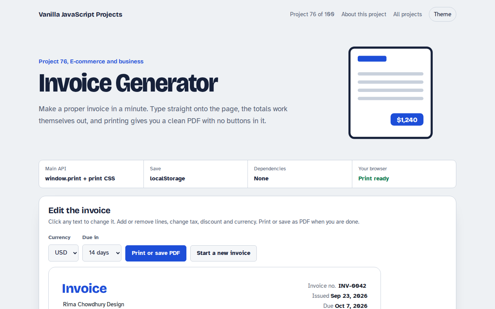

# Invoice Generator in JavaScript (Free Project)



**Live demo:** https://mmrahmanbappi.github.io/100-vanilla-javascript-projects/10-ecommerce-business/076-invoice-generator/demo.html
**Details and code:** https://mmrahmanbappi.github.io/100-vanilla-javascript-projects/10-ecommerce-business/076-invoice-generator/

Free invoice generator in plain JavaScript. Edit your details, add line items, set tax and discount, pick a currency and due date, and print a clean PDF. Saved in your browser.

## What is the Invoice Generator?

An invoice you edit directly on the page: your details, the client, the project, line items with quantity and rate, discount, tax and notes.

Totals update as you type, dates fill in by themselves, the currency can be changed, and printing or saving as PDF gives a clean page without buttons.

## What it does

- Editable text right on the invoice
- Add and remove line items
- Discount, tax and currency
- Issue and due dates filled in
- Print to PDF with clean print styles

## How it works

1. **Type on the page.** Names, addresses and descriptions are contenteditable, so the invoice itself is the form. Numbers use small inputs.
2. **One calc function.** Every change runs calc(): line amounts, subtotal, discount, tax and total, then saves everything to localStorage.
3. **Print CSS hides the rest.** A print media query hides the whole page except the invoice, and removes buttons and input borders, so Save as PDF looks clean.

## The key JavaScript

```js
function calc() {
  const sub = rows.reduce((a, r) => a + r.qty * r.rate, 0);
  const discount = sub * discountPct / 100;
  const tax = (sub - discount) * taxPct / 100;
  total.textContent = money(sub - discount + tax);
  localStorage.setItem("invoice", JSON.stringify(data));
}
/* print only the invoice */
@media print {
  body * { visibility: hidden; }
  .invoice, .invoice * { visibility: visible; }
}
```

## Browser support

Works in all modern browsers. Use the print dialog and choose Save as PDF.

## How to use

1. Download `demo.html` from this folder.
2. Serve the folder with `npx serve .` or `python -m http.server`, then open it in your browser.
3. Change the text and colors, and upload it anywhere. One file, no build step.

## Questions

**How do I make a PDF?**

Click Print or save PDF and pick Save as PDF in the print dialog. The print styles hide everything except the invoice.

**Is my invoice saved?**

Yes, in localStorage in your browser. It is still there next time you open the page on the same device.

**Can I add my logo?**

Yes. Put an img tag in the header. It will print with the invoice.

## License

MIT. Free for personal and commercial use.
