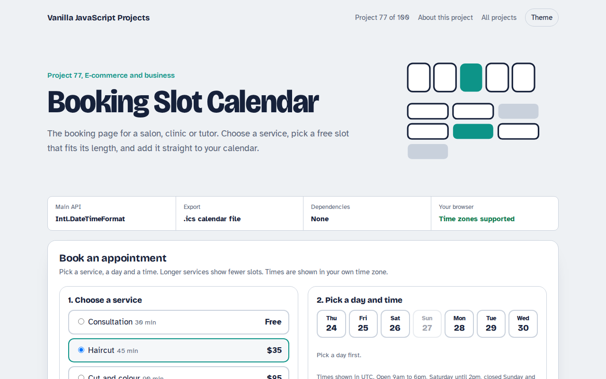

# Booking Slot Calendar in JavaScript (Free Project)



**Live demo:** https://mmrahmanbappi.github.io/vanilla-javascript-projects/10-ecommerce-business/077-booking-slot-calendar/demo.html
**Details and code:** https://mmrahmanbappi.github.io/vanilla-javascript-projects/10-ecommerce-business/077-booking-slot-calendar/

Free booking slot calendar in plain JavaScript. Pick a service, day and free time slot, see times in your own time zone, fill in your details and download a calendar file.

## What is the Booking Slot Calendar?

A booking page with four services of different lengths, a strip of the next seven days and a grid of free times. Longer services show fewer slots.

Booked times, lunch and Sundays are unavailable, times appear in the visitor's own time zone, and after booking you can download a calendar file.

## What it does

- Services with different durations
- Seven day strip with closed days
- Free slots that fit the full service
- Times in the visitor's time zone
- Downloadable ICS calendar file

## How it works

1. **Slots fit the service.** For each day the script walks from opening to closing time and keeps a start time only if the whole service fits without touching a booked slot.
2. **Local times for everyone.** Times are made with Date and shown with toLocaleTimeString, so each visitor sees them in their own time zone and format.
3. **A real calendar file.** The confirmation builds an ICS file as a data link. Opening it adds the appointment to Google, Apple or Outlook calendars.

## The key JavaScript

```js
for (let m = open; m + length <= close; m += 15) {
  const clash = booked.some(([start, len]) => m < start + len && m + length > start);
  if (!clash) slots.push(m);           // minutes after midnight
}
const ics = `BEGIN:VCALENDAR\r\nVERSION:2.0\r\nBEGIN:VEVENT\r\n` +
  `DTSTART:${utc(start)}\r\nDTEND:${utc(end)}\r\nSUMMARY:Haircut\r\n` +
  `END:VEVENT\r\nEND:VCALENDAR`;
link.href = "data:text/calendar," + encodeURIComponent(ics);
```

## Browser support

Works in all modern browsers.

## How to use

1. Download `demo.html` from this folder.
2. Serve the folder with `npx serve .` or `python -m http.server`, then open it in your browser.
3. Change the text and colors, and upload it anywhere. One file, no build step.

## Questions

**Where do booked times come from?**

In the demo they are made up. In a real site, fetch booked slots for the chosen day from your server.

**How do I stop double bookings?**

Check the slot again on the server when the booking is saved, and refuse it if someone else took it a moment earlier.

**Does the ICS file work with Google Calendar?**

Yes. Opening the file on a phone or computer offers to add it to the default calendar app.

## License

MIT. Free for personal and commercial use.
