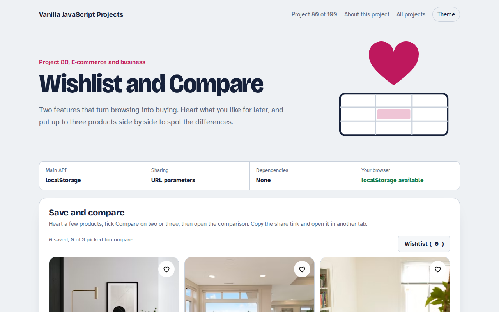

# Wishlist and Compare in JavaScript (Free Project)



**Live demo:** https://mmrahmanbappi.github.io/vanilla-javascript-projects/10-ecommerce-business/080-wishlist-compare/demo.html
**Details and code:** https://mmrahmanbappi.github.io/vanilla-javascript-projects/10-ecommerce-business/080-wishlist-compare/

Free wishlist and product compare in plain JavaScript. Save favourites with a heart, keep them after reload, share the list as a link, and compare up to three products with differences highlighted.

## What is the Wishlist and Compare?

A product grid where every item has a heart for the wishlist and a Compare tick box. Saved items stay after a reload and can be shared as a link.

Pick two or three products and open a comparison table that highlights rows where they differ and shows the best price, rating, delivery time and warranty in green.

## What it does

- Heart button with a small pop animation
- Wishlist saved in localStorage
- Share link that adds items to someone else's list
- Compare up to three products
- Differences and best values highlighted

## How it works

1. **A set of saved ids.** The wishlist is a Set of product ids saved to localStorage, so hearts stay filled after a reload or a new visit.
2. **Share as a link.** The share link adds ?w=0,2,5 to the page address. Opening it merges those products into the other person's wishlist.
3. **Compare what differs.** For up to three products, each row checks if the values differ and highlights the row, and marks the best value, like the lowest price.

## The key JavaScript

```js
const wish = new Set(JSON.parse(localStorage.getItem("wish") || "[]"));
heart.onclick = () => {
  wish.has(id) ? wish.delete(id) : wish.add(id);
  localStorage.setItem("wish", JSON.stringify([...wish]));
};
shareInput.value = location.origin + location.pathname + "?w=" + [...wish].join(",");

const values = picked.map((p) => p.price);
const differs = new Set(values).size > 1;
const best = Math.min(...values);
```

## Browser support

Works in all modern browsers.

## How to use

1. Download `demo.html` from this folder.
2. Serve the folder with `npx serve .` or `python -m http.server`, then open it in your browser.
3. Change the text and colors, and upload it anywhere. One file, no build step.

## Questions

**Should the wishlist be saved on the server?**

For signed in customers, yes, so it follows them across devices. For guests, localStorage is simple and works well.

**Why only three to compare?**

More than three columns gets hard to read, especially on phones.

**Is the share link private?**

It only lists product numbers, nothing personal. Anyone with the link sees those products.

## License

MIT. Free for personal and commercial use.
