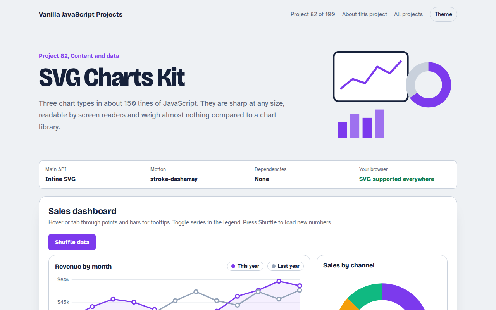

# SVG Charts Kit in JavaScript (Free Project)



**Live demo:** https://mmrahmanbappi.github.io/100-vanilla-javascript-projects/11-content-data/082-svg-charts-kit/demo.html
**Details and code:** https://mmrahmanbappi.github.io/100-vanilla-javascript-projects/11-content-data/082-svg-charts-kit/

Free SVG charts in plain JavaScript. Line, bar and donut charts that scale to any width, with tooltips, keyboard focus, series toggles, animation and an accessible data table.

## What is the SVG Charts Kit?

A small dashboard with three hand-made SVG charts: monthly revenue as a line chart with two series, orders by weekday as bars, and sales by channel as a donut.

Hover or tab to any point for a tooltip, switch series on and off, shuffle the data to see the charts redraw with animation, and open the data as a plain table.

## What it does

- Line chart with area fill and two series
- Bar chart with the best day highlighted
- Donut chart with a total in the middle
- Tooltips on hover and keyboard focus
- Legend toggles, animation and data table

## How it works

1. **Scale data to pixels.** Each chart maps values to a viewBox with two tiny functions, x(i) and y(v). The viewBox makes the chart scale to any width.
2. **Draw with paths.** The line is one path of M and L commands. Bars are rects. The donut uses circles with stroke-dasharray slices.
3. **Tooltips for mouse and keyboard.** Every point is a focusable group with a label. Hover or focus shows the same tooltip, and screen readers read the label.

## The key JavaScript

```js
const x = (i) => pad + i * (width - pad * 2) / (values.length - 1);
const y = (v) => height - pad - (v / max) * (height - pad * 2);
const d = values.map((v, i) => (i ? "L" : "M") + x(i) + " " + y(v)).join(" ");
svg.innerHTML = `<path d="${d}" fill="none" stroke="#7C3AED" stroke-width="3"/>`;

// donut slice
const len = (value / total) * 2 * Math.PI * r;
circle.setAttribute("stroke-dasharray", `${len} ${circumference - len}`);
```

## Browser support

Works in all modern browsers.

## How to use

1. Download `demo.html` from this folder.
2. Serve the folder with `npx serve .` or `python -m http.server`, then open it in your browser.
3. Change the text and colors, and upload it anywhere. One file, no build step.

## Questions

**When should I use a chart library instead?**

For zooming, huge datasets or many chart types. For a few simple charts, plain SVG is lighter and easier to style.

**Are SVG charts accessible?**

They can be. Here every point has a label, points are focusable and the data is also available as a table.

**How do I use my own data?**

Replace the generated arrays with numbers from your API and call the draw functions again.

## License

MIT. Free for personal and commercial use.
