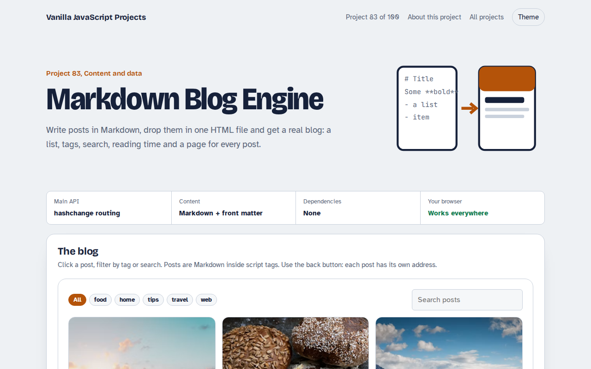

# Markdown Blog Engine in JavaScript (Free Project)



**Live demo:** https://mmrahmanbappi.github.io/100-vanilla-javascript-projects/11-content-data/083-markdown-blog-engine/demo.html
**Details and code:** https://mmrahmanbappi.github.io/100-vanilla-javascript-projects/11-content-data/083-markdown-blog-engine/

Free Markdown blog engine in plain JavaScript. Write posts in Markdown with front matter, get a post list with tags, search, reading time and pretty post pages with hash routing.

## What is the Markdown Blog Engine?

A small blog built from three Markdown posts stored in the page. The home view shows cards with cover photos, dates and reading time, with tag filters and search.

Clicking a post opens a clean article page with its own address, so the back button and shared links work. The Markdown parser handles headings, lists, quotes, code blocks, bold, italic and links.

## What it does

- Markdown posts with front matter
- Post list with covers, dates and reading time
- Tag filter and full text search
- Hash routing with back button support
- Small, safe Markdown parser

## How it works

1. **Posts live in script tags.** Each post is Markdown inside a script tag with type text/markdown, so the browser ignores it and the script reads it.
2. **Front matter and a small parser.** The block between the --- lines gives the title, date, tags and cover. A 30 line parser turns headings, lists, quotes, code and links into HTML.
3. **Hash routing.** Links like #/post/sourdough-start switch to the post view. The hashchange event makes the back button work.

## The key JavaScript

```js
const [, frontMatter, body] = text.match(/^---\n([\s\S]*?)\n---\n([\s\S]*)$/);
const meta = Object.fromEntries(frontMatter.split("\n").map((l) => {
  const i = l.indexOf(":");
  return [l.slice(0, i).trim(), l.slice(i + 1).trim()];
}));
addEventListener("hashchange", () => {
  const m = location.hash.match(/^#\/post\/(.+)/);
  m ? showPost(m[1]) : showList();
});
```

## Browser support

Works in all modern browsers.

## How to use

1. Download `demo.html` from this folder.
2. Serve the folder with `npx serve .` or `python -m http.server`, then open it in your browser.
3. Change the text and colors, and upload it anywhere. One file, no build step.

## Questions

**Can I load posts from separate files?**

Yes. Fetch each .md file and pass its text to the same parser. You need to serve the page from a web server for fetch to work.

**Is the Markdown parser safe?**

Text is escaped before formatting and links must start with http or https, so posts cannot inject scripts.

**Is hash routing good for search engines?**

Search engines can read it, but for the best results publish a real HTML page per post.

## License

MIT. Free for personal and commercial use.
