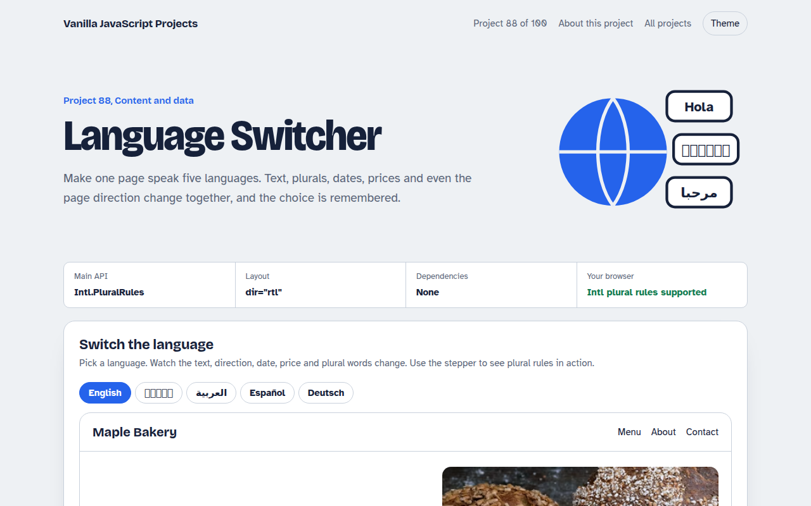

# Language Switcher in JavaScript (Free Project)



**Live demo:** https://mmrahmanbappi.github.io/100-vanilla-javascript-projects/11-content-data/088-language-switcher/demo.html
**Details and code:** https://mmrahmanbappi.github.io/100-vanilla-javascript-projects/11-content-data/088-language-switcher/

Free language switcher in plain JavaScript. Translations from JSON, right to left layout for Arabic, plural rules, dates, numbers and prices formatted for each language, and a remembered choice.

## What is the Language Switcher?

A small bakery website that switches between English, Bengali, Arabic, Spanish and German. Every label, button and image description changes, and the choice is remembered.

Arabic flips the layout to right to left. Dates, numbers and prices use each language's format, and the basket line shows plural rules working, including Arabic's six plural forms.

## What it does

- Five languages from JSON style objects
- Right to left support for Arabic
- Plural rules with Intl.PluralRules
- Local dates, numbers and prices
- Remembered choice and browser language guess

## How it works

1. **Text lives in one object per language.** Every piece of text has a key like hero.title. Elements say which key they need with data-i18n, and one loop fills them in.
2. **Direction and language tags.** Switching to Arabic sets dir="rtl" and lang="ar", so the layout mirrors and screen readers use the right voice.
3. **Let Intl do the grammar.** Intl.PluralRules picks one, two, few, many or other for each language. Dates, numbers and prices use the matching locale.

## The key JavaScript

```js
const t = translations[lang];
document.querySelectorAll("[data-i18n]").forEach((el) => {
  el.textContent = el.dataset.i18n.split(".").reduce((o, k) => o[k], t);
});
document.documentElement.lang = lang;
document.documentElement.dir = lang === "ar" ? "rtl" : "ltr";

const rule = new Intl.PluralRules("ar").select(3);   // "few"
const text = t.cart[rule].replace("{n}", 3);
```

## Browser support

Works in all modern browsers.

## How to use

1. Download `demo.html` from this folder.
2. Serve the folder with `npx serve .` or `python -m http.server`, then open it in your browser.
3. Change the text and colors, and upload it anywhere. One file, no build step.

## Questions

**Should translations be in separate files?**

For bigger sites, yes. Load /i18n/es.json with fetch when someone picks Spanish, so people only download their language.

**Is this good for SEO?**

For search engines, give each language its own URL, like /es/, with hreflang tags. Client side switching is best for apps.

**Why do plurals need special handling?**

Many languages have more than two forms. Arabic has six. Intl.PluralRules knows the rules for each language.

## License

MIT. Free for personal and commercial use.
