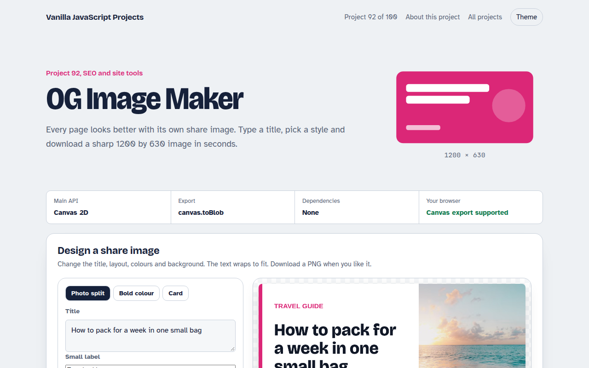

# OG Image Maker in JavaScript (Free Project)



**Live demo:** https://mmrahmanbappi.github.io/100-vanilla-javascript-projects/12-seo-site-tools/092-og-image-maker/demo.html
**Details and code:** https://mmrahmanbappi.github.io/100-vanilla-javascript-projects/12-seo-site-tools/092-og-image-maker/

Free Open Graph image maker in plain JavaScript. Pick a layout, type a title, choose colours or a photo background, and download a 1200 by 630 PNG ready for social sharing.

## What is the OG Image Maker?

A small design tool for social share images. Choose one of three layouts, type a title, a small label and your site name, pick a colour and a background photo.

The title wraps and shrinks to fit, the preview updates instantly, and one click downloads a 1200 by 630 PNG you can use as your og:image.

## What it does

- Three layouts: photo split, bold colour and card
- Automatic title wrapping and sizing
- Five colours and four photos
- Full size 1200 by 630 export
- Works offline once loaded

## How it works

1. **Draw at full size.** The canvas is 1200 by 630 pixels, the standard share size, and CSS only shrinks the preview. The download is always sharp.
2. **Wrap and shrink the title.** Words are measured one by one to break lines. If the title needs more than four lines, the font gets smaller until it fits.
3. **Photos without tainting.** The background photo loads with crossOrigin set to anonymous, so the canvas can still be exported as a PNG.

## The key JavaScript

```js
function wrap(text, maxWidth, size) {
  ctx.font = `800 ${size}px sans-serif`;
  const lines = []; let line = "";
  for (const word of text.split(" ")) {
    const test = line ? line + " " + word : word;
    if (ctx.measureText(test).width > maxWidth && line) { lines.push(line); line = word; }
    else line = test;
  }
  lines.push(line);
  return lines.length > 4 ? wrap(text, maxWidth, size - 6) : lines;
}
canvas.toBlob((blob) => download(blob, "share-image.png"));
```

## Browser support

Works in all modern browsers.

## How to use

1. Download `demo.html` from this folder.
2. Serve the folder with `npx serve .` or `python -m http.server`, then open it in your browser.
3. Change the text and colors, and upload it anywhere. One file, no build step.

## Questions

**Why 1200 by 630?**

It is the size most social networks and chat apps use for large link previews.

**Can I make these automatically for every post?**

Yes. The same drawing code runs in a build script with a canvas library, or in a serverless function.

**Why do some photos stop the download?**

If a photo server does not allow cross origin use, the browser blocks export. Unsplash allows it.

## License

MIT. Free for personal and commercial use.
