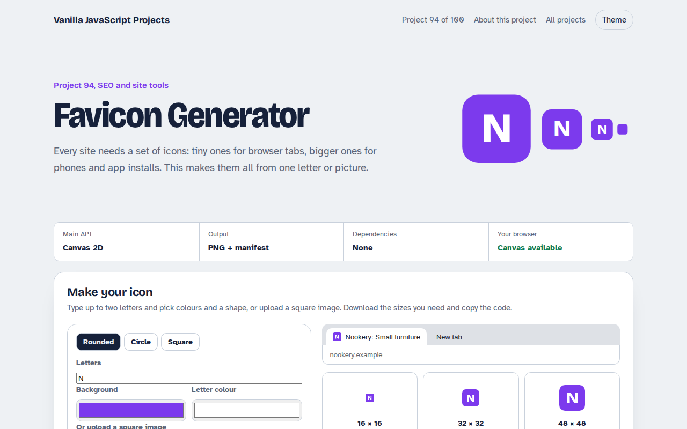

# Favicon Generator in JavaScript (Free Project)



**Live demo:** https://mmrahmanbappi.github.io/100-vanilla-javascript-projects/12-seo-site-tools/094-favicon-generator/demo.html
**Details and code:** https://mmrahmanbappi.github.io/100-vanilla-javascript-projects/12-seo-site-tools/094-favicon-generator/

Free favicon generator in plain JavaScript. Make an icon from a letter or upload an image, preview it in a browser tab, download 16 to 512 pixel PNGs, and copy the HTML and manifest.

## What is the Favicon Generator?

A favicon maker. Type one or two letters, choose colours and a shape, or upload a square picture, and see the icon in a pretend browser tab.

It makes six PNG sizes from 16 to 512 pixels for tabs, phones and app installs, and gives you the HTML link tags and a web manifest file.

## What it does

- Letter icons with colour and shape choice
- Upload your own square image
- Six PNG sizes with separate downloads
- Browser tab preview
- HTML tags and web manifest

## How it works

1. **Draw once per size.** Each size is drawn fresh on its own canvas, not scaled down from a big one, so small icons stay crisp.
2. **Shapes with clip.** A rounded rectangle, circle or square clip is applied before drawing, so letters and photos fit the chosen shape.
3. **Code that goes with it.** The tool writes the link tags for the head and a web manifest for phones and app installs.

## The key JavaScript

```js
function icon(size, letter, bg, fg) {
  const c = document.createElement("canvas");
  c.width = c.height = size;
  const x = c.getContext("2d");
  x.beginPath(); x.roundRect(0, 0, size, size, size * 0.22); x.clip();
  x.fillStyle = bg; x.fillRect(0, 0, size, size);
  x.fillStyle = fg; x.textAlign = "center"; x.textBaseline = "middle";
  x.font = `800 ${size * 0.62}px sans-serif`;
  x.fillText(letter, size / 2, size / 2);
  return c.toDataURL("image/png");
}
```

## Browser support

Works in all modern browsers.

## How to use

1. Download `demo.html` from this folder.
2. Serve the folder with `npx serve .` or `python -m http.server`, then open it in your browser.
3. Change the text and colors, and upload it anywhere. One file, no build step.

## Questions

**Do I still need a favicon.ico file?**

Most browsers now use PNG icons from link tags. An .ico file in the site root is only a fallback for very old browsers.

**Which sizes matter most?**

32 pixels for browser tabs, 180 for iPhones and 192 and 512 for Android and installs.

**What is a maskable icon?**

An icon with extra padding so Android can crop it into circles or other shapes without cutting off the design.

## License

MIT. Free for personal and commercial use.
