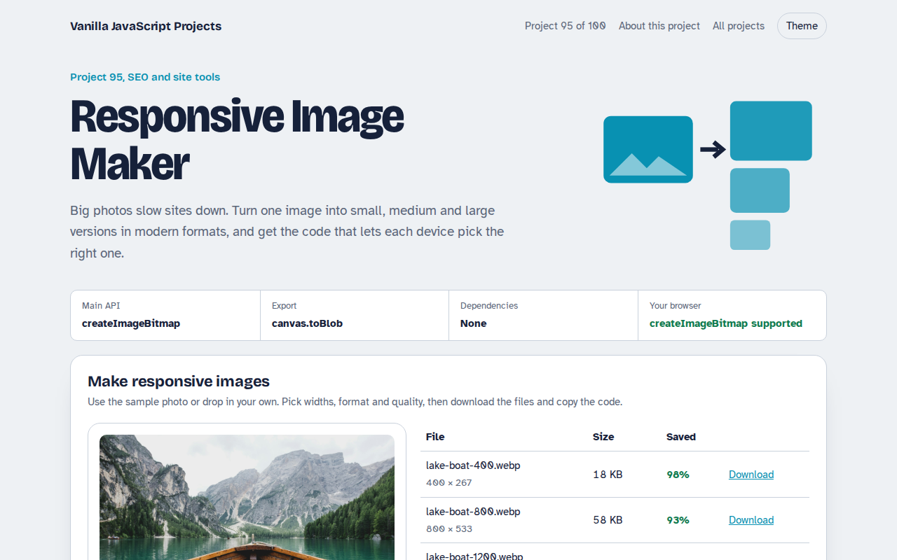

# Responsive Image Maker in JavaScript (Free Project)



**Live demo:** https://mmrahmanbappi.github.io/vanilla-javascript-projects/12-seo-site-tools/095-responsive-image-maker/demo.html
**Details and code:** https://mmrahmanbappi.github.io/vanilla-javascript-projects/12-seo-site-tools/095-responsive-image-maker/

Free responsive image maker in plain JavaScript. Drop in one photo, get it resized to several widths as WebP or JPEG, compare file sizes and copy ready srcset and picture code.

## What is the Responsive Image Maker?

An image resizer for the web. Start with the sample photo or drop in your own, choose widths, a format and quality, and get resized files in a few seconds.

A table shows each file size and how much smaller it is than the original. The tool also writes the srcset or picture code so each device loads the right size.

## What it does

- Four widths from 400 to 1600 pixels
- WebP, JPEG or AVIF output
- Quality slider with size comparison
- Individual downloads
- Ready srcset and picture code

## How it works

1. **Decode once.** createImageBitmap decodes the photo a single time. Every size is then drawn from that bitmap onto a canvas of the right width.
2. **Encode to modern formats.** canvas.toBlob saves each size as WebP, JPEG or AVIF at the quality you choose, and the file sizes are shown so you can compare.
3. **Let the browser choose.** The srcset and sizes code lists every file with its width. Each device then downloads only the size it needs.

## The key JavaScript

```js
const bitmap = await createImageBitmap(file);
for (const w of [400, 800, 1200]) {
  const c = document.createElement("canvas");
  c.width = w; c.height = Math.round(bitmap.height * w / bitmap.width);
  c.getContext("2d").drawImage(bitmap, 0, 0, c.width, c.height);
  const blob = await new Promise((r) => c.toBlob(r, "image/webp", 0.75));
}
// 
```

## Browser support

Works in all modern browsers. AVIF export depends on the browser; the tool falls back to WebP.

## How to use

1. Download `demo.html` from this folder.
2. Serve the folder with `npx serve .` or `python -m http.server`, then open it in your browser.
3. Change the text and colors, and upload it anywhere. One file, no build step.

## Questions

**Are my photos uploaded?**

No. Everything happens in your browser. The photo never leaves your device.

**Which format should I use?**

WebP works everywhere today and is usually 25 to 35 percent smaller than JPEG. AVIF is smaller still where supported.

**What does the sizes attribute do?**

It tells the browser how wide the image will be shown, so it can pick the best file before the page layout is ready.

## License

MIT. Free for personal and commercial use.
