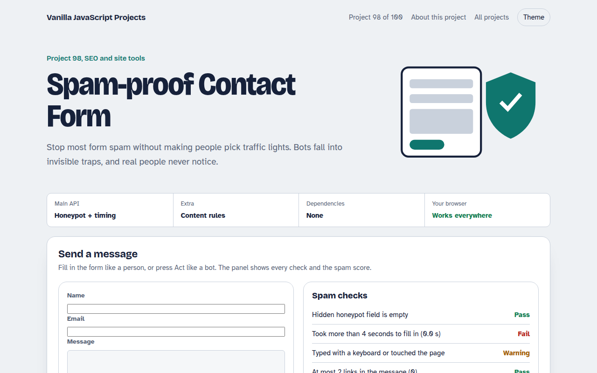

# Spam-proof Contact Form in JavaScript (Free Project)



**Live demo:** https://mmrahmanbappi.github.io/100-vanilla-javascript-projects/12-seo-site-tools/098-spam-proof-contact-form/demo.html
**Details and code:** https://mmrahmanbappi.github.io/100-vanilla-javascript-projects/12-seo-site-tools/098-spam-proof-contact-form/

Free spam-proof contact form in plain JavaScript. A hidden honeypot field, a minimum fill time, link and keyword checks and a friendly rate limit, all without a captcha.

## What is the Spam-proof Contact Form?

A contact form protected against spam without a captcha. It uses a hidden honeypot field, a minimum time to fill in, link and keyword checks, a capital letters check and a simple rate limit.

A panel shows each check passing or failing and adds up a spam score. Try sending a normal message, then press Act like a bot to see it blocked.

## What it does

- Invisible honeypot field
- Minimum fill time
- Link, keyword and capital letter checks
- Rate limit per browser
- Score based decision: send, review or block

## How it works

1. **A trap only bots see.** The website field is moved far off screen and hidden from screen readers. People never fill it in, but many bots fill every field.
2. **Humans are not instant.** Real people need several seconds to type a name, email and message. Forms sent faster than four seconds are suspicious.
3. **Score first, then decide.** Each failed check adds points. High scores are blocked, middle scores are sent but marked for review, so real people are rarely lost.

## The key JavaScript

```js
<div style="position:absolute;left:-10000px" aria-hidden="true">
  <input name="website" tabindex="-1" autocomplete="off">
</div>

const started = Date.now();
form.onsubmit = (e) => {
  let score = 0;
  if (form.website.value) score += 60;                 // honeypot filled
  if (Date.now() - started < 4000) score += 40;        // too fast
  if ((msg.match(/https?:\/\//g) || []).length > 2) score += 30;
  if (score >= 50) { e.preventDefault(); /* drop silently */ }
};
```

## Browser support

Works in all modern browsers.

## How to use

1. Download `demo.html` from this folder.
2. Serve the folder with `npx serve .` or `python -m http.server`, then open it in your browser.
3. Change the text and colors, and upload it anywhere. One file, no build step.

## Questions

**Is this enough to stop all spam?**

It stops most simple bots. Repeat the same checks on your server, because bots can skip your JavaScript completely.

**Is the honeypot a problem for screen readers?**

No. It is hidden with aria-hidden and taken out of the tab order, so assistive technology ignores it.

**Why not use a captcha?**

Captchas annoy real people and lower form completion. Try these quiet checks first and add a captcha only if spam continues.

## License

MIT. Free for personal and commercial use.
