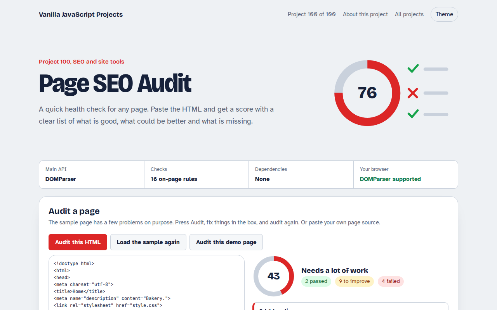

# Page SEO Audit in JavaScript (Free Project)



**Live demo:** https://mmrahmanbappi.github.io/vanilla-javascript-projects/12-seo-site-tools/100-page-seo-audit/demo.html
**Details and code:** https://mmrahmanbappi.github.io/vanilla-javascript-projects/12-seo-site-tools/100-page-seo-audit/

Free on-page SEO audit in plain JavaScript. Paste a page's HTML to check the title, description, headings, image alt text, links, canonical, Open Graph, schema and more, with a score and fixes.

## What is the Page SEO Audit?

An on-page SEO checker. Paste any page source, or use the sample bakery page, and get a score out of 100 with passed checks, things to improve and failures.

It checks the title, description, headings, image alt text and sizes, language, mobile viewport, canonical, social tags, structured data, word count, links and noindex, with a short fix for each problem.

## What it does

- 16 on-page checks
- Score ring with pass, improve and fail counts
- Plain reasons and code snippets for fixes
- Paste any HTML or audit the demo page itself
- Nothing is uploaded

## How it works

1. **Parse without loading.** DOMParser turns the pasted HTML into a document you can query, without running its scripts or loading its images.
2. **Sixteen quick rules.** Title and description length, one h1 and heading order, alt text and image sizes, language, viewport, canonical, Open Graph, schema, word count, links and noindex.
3. **Score and sort.** Passes count fully, warnings half. Failed checks come first, each with a short reason and, where useful, the code to add.

## The key JavaScript

```js
const doc = new DOMParser().parseFromString(html, "text/html");
const checks = [];
const title = doc.querySelector("title")?.textContent.trim() || "";
checks.push(title.length >= 30 && title.length <= 60 ? "pass" : "warn");
checks.push(doc.querySelectorAll("h1").length === 1 ? "pass" : "fail");
checks.push(doc.querySelectorAll("img:not([alt])").length ? "fail" : "pass");
checks.push(doc.querySelector('link[rel="canonical"]') ? "pass" : "warn");
const score = checks.reduce((a, c) => a + (c === "pass" ? 1 : c === "warn" ? 0.5 : 0), 0) / checks.length * 100;
```

## Browser support

Works in all modern browsers.

## How to use

1. Download `demo.html` from this folder.
2. Serve the folder with `npx serve .` or `python -m http.server`, then open it in your browser.
3. Change the text and colors, and upload it anywhere. One file, no build step.

## Questions

**Can it check a live URL?**

Browsers block reading other sites directly. Open the page, view its source, and paste it here. A server version could fetch URLs for you.

**Does a score of 100 mean I will rank first?**

No. These checks cover the basics on the page. Content quality, links and speed matter a lot too.

**Why is word count a warning, not a failure?**

Some pages, like contact pages, are short on purpose. Thin content only matters on pages you want to rank.

## License

MIT. Free for personal and commercial use.
