# 100 Free Vanilla JavaScript Projects

Real projects built with plain JavaScript and the newest browser features, each with a live demo and a single HTML file. No framework, no build step, free for commercial use.

**Live gallery:** https://mmrahmanbappi.github.io/vanilla-javascript-projects/

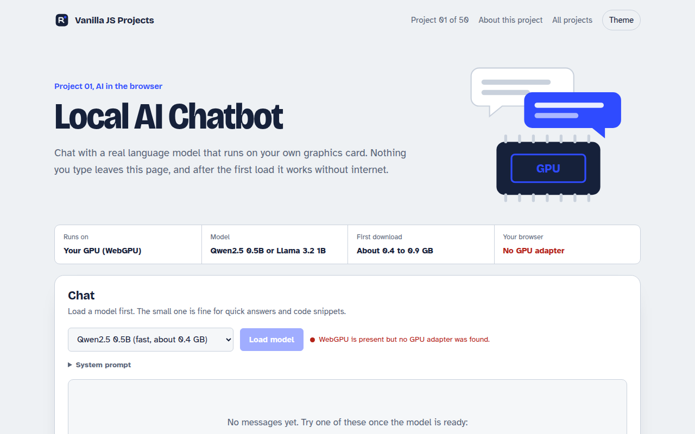

## Projects so far

| # | Project | What it does | Live | Preview |
|---|---|---|---|---|
| 001 | [Local AI Chatbot](https://mmrahmanbappi.github.io/vanilla-javascript-projects/01-ai-in-the-browser/001-local-ai-chatbot/) | A private chat assistant that runs on your graphics card | [Demo](https://mmrahmanbappi.github.io/vanilla-javascript-projects/01-ai-in-the-browser/001-local-ai-chatbot/demo.html) |  |
| 002 | [Image Classifier](https://mmrahmanbappi.github.io/vanilla-javascript-projects/01-ai-in-the-browser/002-image-classifier/) | Drop a photo and see what the AI thinks it is | [Demo](https://mmrahmanbappi.github.io/vanilla-javascript-projects/01-ai-in-the-browser/002-image-classifier/demo.html) | 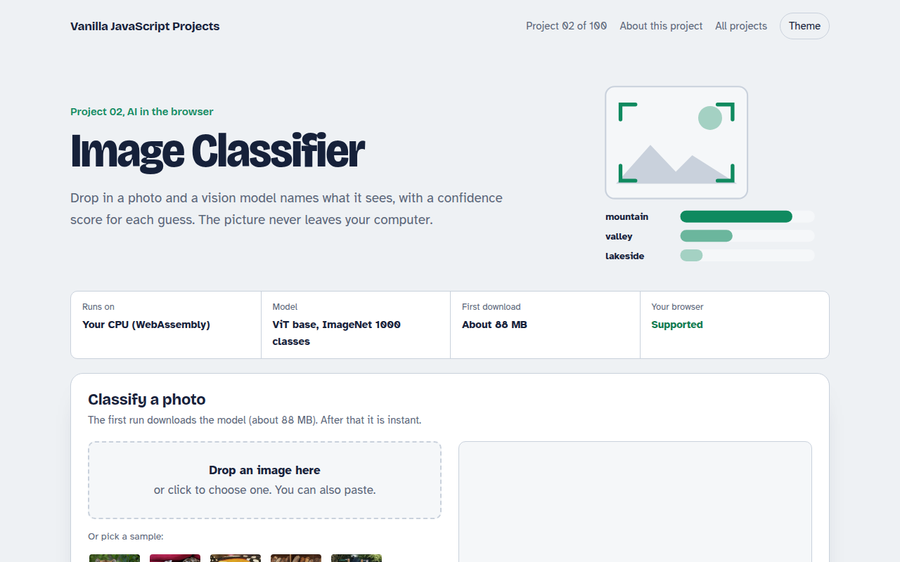 |
| 003 | [Speech to Text Notes](https://mmrahmanbappi.github.io/vanilla-javascript-projects/01-ai-in-the-browser/003-speech-to-text-notes/) | A voice notes app that writes down what you say | [Demo](https://mmrahmanbappi.github.io/vanilla-javascript-projects/01-ai-in-the-browser/003-speech-to-text-notes/demo.html) |  |
| 004 | [AI Text Summarizer](https://mmrahmanbappi.github.io/vanilla-javascript-projects/01-ai-in-the-browser/004-ai-text-summarizer/) | Paste a long article and get the key points | [Demo](https://mmrahmanbappi.github.io/vanilla-javascript-projects/01-ai-in-the-browser/004-ai-text-summarizer/demo.html) | 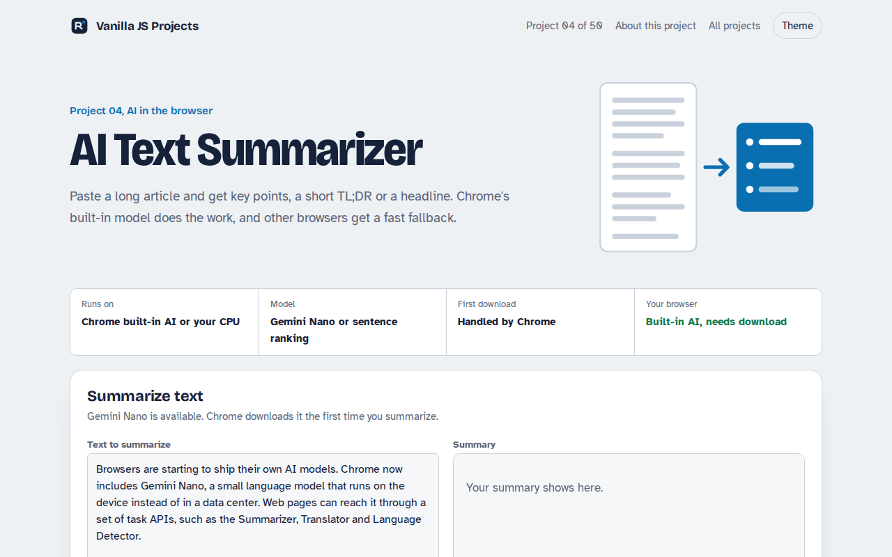 |
| 005 | [Smart Writing Assistant](https://mmrahmanbappi.github.io/vanilla-javascript-projects/01-ai-in-the-browser/005-smart-writing-assistant/) | A writing helper that drafts, rewrites and checks your text | [Demo](https://mmrahmanbappi.github.io/vanilla-javascript-projects/01-ai-in-the-browser/005-smart-writing-assistant/demo.html) |  |
| 006 | [Live Translator](https://mmrahmanbappi.github.io/vanilla-javascript-projects/01-ai-in-the-browser/006-live-translator/) | A translator that works as you type, in 15 languages | [Demo](https://mmrahmanbappi.github.io/vanilla-javascript-projects/01-ai-in-the-browser/006-live-translator/demo.html) | 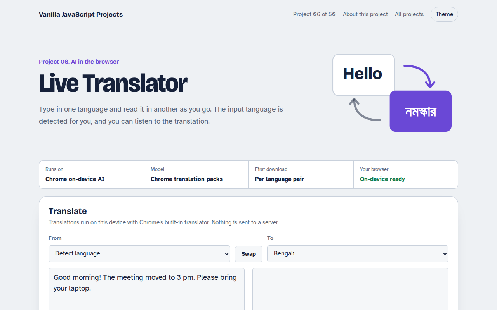 |
| 007 | [Background Remover](https://mmrahmanbappi.github.io/vanilla-javascript-projects/01-ai-in-the-browser/007-background-remover/) | Cut the background out of any photo in seconds | [Demo](https://mmrahmanbappi.github.io/vanilla-javascript-projects/01-ai-in-the-browser/007-background-remover/demo.html) | 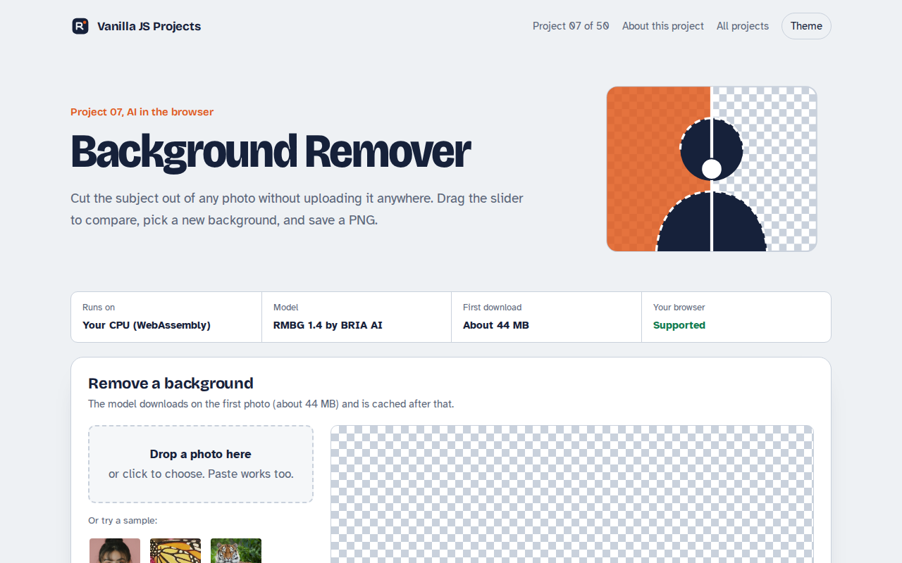 |
| 008 | [Semantic Search for Notes](https://mmrahmanbappi.github.io/vanilla-javascript-projects/01-ai-in-the-browser/008-semantic-search-notes/) | Search your notes by meaning, not exact words | [Demo](https://mmrahmanbappi.github.io/vanilla-javascript-projects/01-ai-in-the-browser/008-semantic-search-notes/demo.html) | 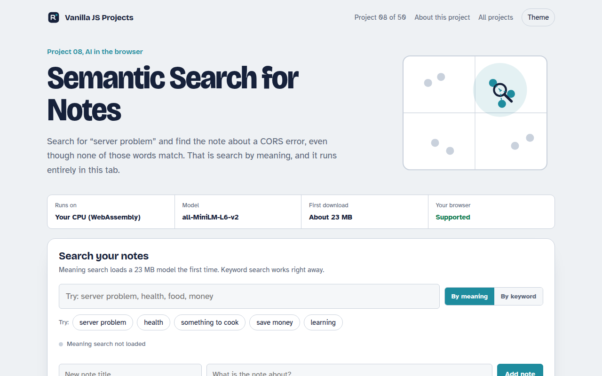 |
| 009 | [Voice Command Controller](https://mmrahmanbappi.github.io/vanilla-javascript-projects/01-ai-in-the-browser/009-voice-command-controller/) | Control a smart home dashboard with your voice | [Demo](https://mmrahmanbappi.github.io/vanilla-javascript-projects/01-ai-in-the-browser/009-voice-command-controller/demo.html) |  |
| 010 | [QR and Barcode Scanner](https://mmrahmanbappi.github.io/vanilla-javascript-projects/01-ai-in-the-browser/010-barcode-qr-scanner/) | Scan QR codes and barcodes with your camera | [Demo](https://mmrahmanbappi.github.io/vanilla-javascript-projects/01-ai-in-the-browser/010-barcode-qr-scanner/demo.html) | 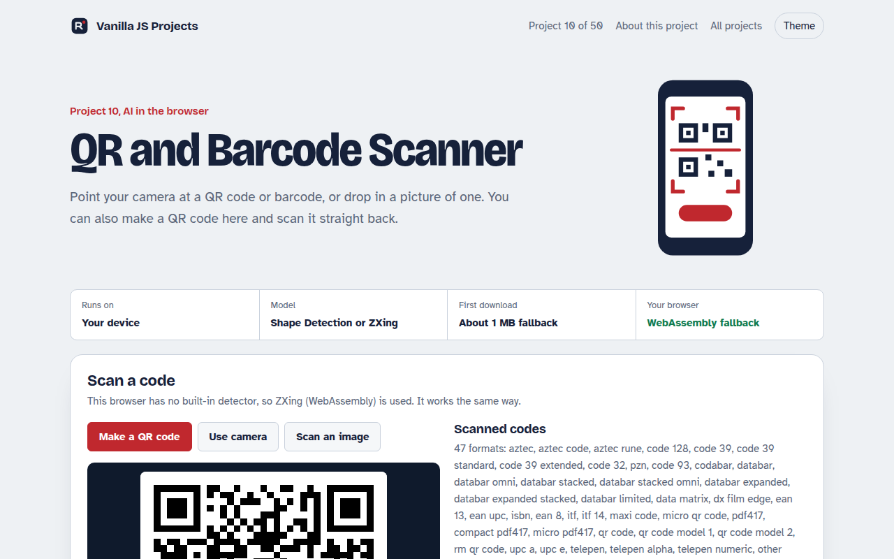 |
| 011 | [UI Component Library](https://mmrahmanbappi.github.io/vanilla-javascript-projects/02-modern-ui/011-ui-component-library/) | Six reusable Web Components you can drop into any page | [Demo](https://mmrahmanbappi.github.io/vanilla-javascript-projects/02-modern-ui/011-ui-component-library/demo.html) | 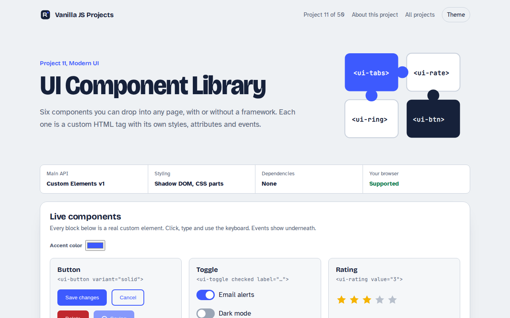 |
| 012 | [View Transitions Gallery](https://mmrahmanbappi.github.io/vanilla-javascript-projects/02-modern-ui/012-view-transitions-gallery/) | A photo gallery where images grow smoothly into the detail page | [Demo](https://mmrahmanbappi.github.io/vanilla-javascript-projects/02-modern-ui/012-view-transitions-gallery/demo.html) |  |
| 013 | [Client-side Router](https://mmrahmanbappi.github.io/vanilla-javascript-projects/02-modern-ui/013-client-side-router/) | A tiny single page app router with real URLs | [Demo](https://mmrahmanbappi.github.io/vanilla-javascript-projects/02-modern-ui/013-client-side-router/demo.html) | 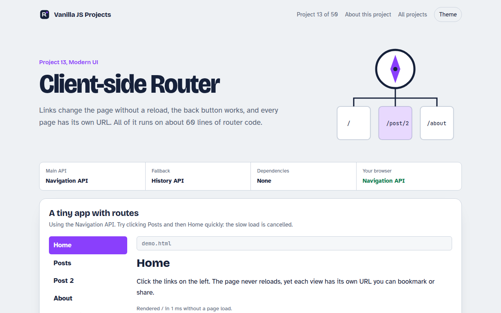 |
| 014 | [Popovers Without Libraries](https://mmrahmanbappi.github.io/vanilla-javascript-projects/02-modern-ui/014-popover-anchor-ui/) | Tooltips, menus, toasts and a side sheet with no library | [Demo](https://mmrahmanbappi.github.io/vanilla-javascript-projects/02-modern-ui/014-popover-anchor-ui/demo.html) | 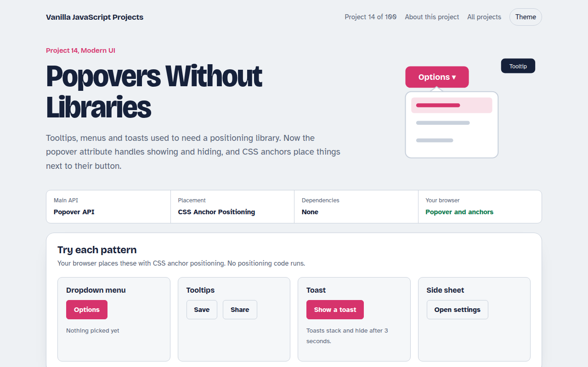 |
| 015 | [Signals State Library](https://mmrahmanbappi.github.io/vanilla-javascript-projects/02-modern-ui/015-signals-state-library/) | A 40 line reactive state library running a shopping cart | [Demo](https://mmrahmanbappi.github.io/vanilla-javascript-projects/02-modern-ui/015-signals-state-library/demo.html) | 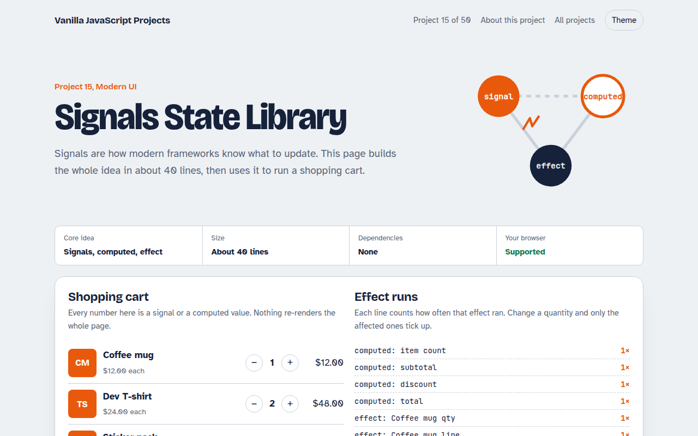 |
| 016 | [Infinite Scroll Feed](https://mmrahmanbappi.github.io/vanilla-javascript-projects/02-modern-ui/016-infinite-scroll-feed/) | A photo feed that loads more posts as you scroll | [Demo](https://mmrahmanbappi.github.io/vanilla-javascript-projects/02-modern-ui/016-infinite-scroll-feed/demo.html) | 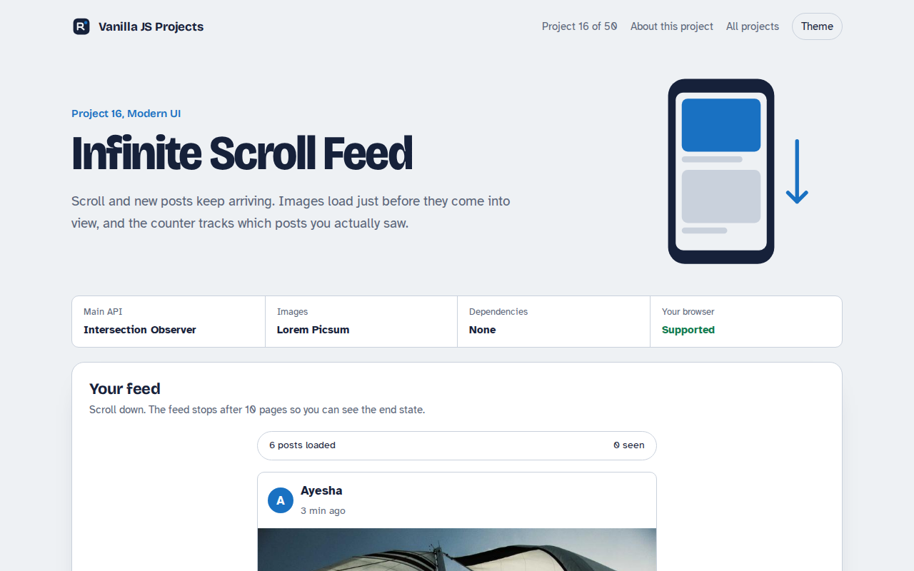 |
| 017 | [Responsive Dashboard Widgets](https://mmrahmanbappi.github.io/vanilla-javascript-projects/02-modern-ui/017-responsive-dashboard-widgets/) | Dashboard widgets that change layout when you resize them | [Demo](https://mmrahmanbappi.github.io/vanilla-javascript-projects/02-modern-ui/017-responsive-dashboard-widgets/demo.html) | 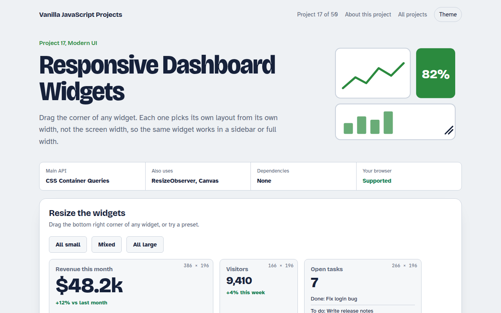 |
| 018 | [Kanban Board](https://mmrahmanbappi.github.io/vanilla-javascript-projects/02-modern-ui/018-kanban-board/) | A Trello style task board with drag and drop | [Demo](https://mmrahmanbappi.github.io/vanilla-javascript-projects/02-modern-ui/018-kanban-board/demo.html) | 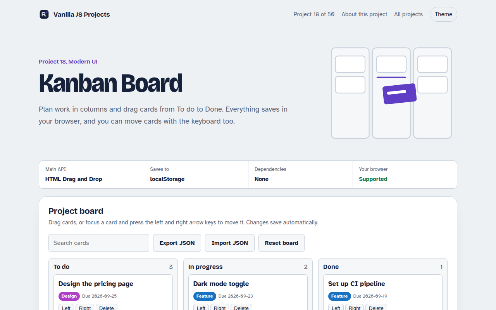 |
| 019 | [Color Picker and Palette Tool](https://mmrahmanbappi.github.io/vanilla-javascript-projects/02-modern-ui/019-color-picker-palette/) | A color picker that pulls palettes from photos and checks contrast | [Demo](https://mmrahmanbappi.github.io/vanilla-javascript-projects/02-modern-ui/019-color-picker-palette/demo.html) |  |
| 020 | [Accessible Modal and Form Kit](https://mmrahmanbappi.github.io/vanilla-javascript-projects/02-modern-ui/020-accessible-dialog-forms/) | An accessible sign up form inside a native dialog | [Demo](https://mmrahmanbappi.github.io/vanilla-javascript-projects/02-modern-ui/020-accessible-dialog-forms/demo.html) |  |
| 021 | [Offline-first Todo PWA](https://mmrahmanbappi.github.io/vanilla-javascript-projects/03-pwa-and-offline/021-offline-todo-pwa/) | A todo app you can install that works with no internet | [Demo](https://mmrahmanbappi.github.io/vanilla-javascript-projects/03-pwa-and-offline/021-offline-todo-pwa/demo.html) | 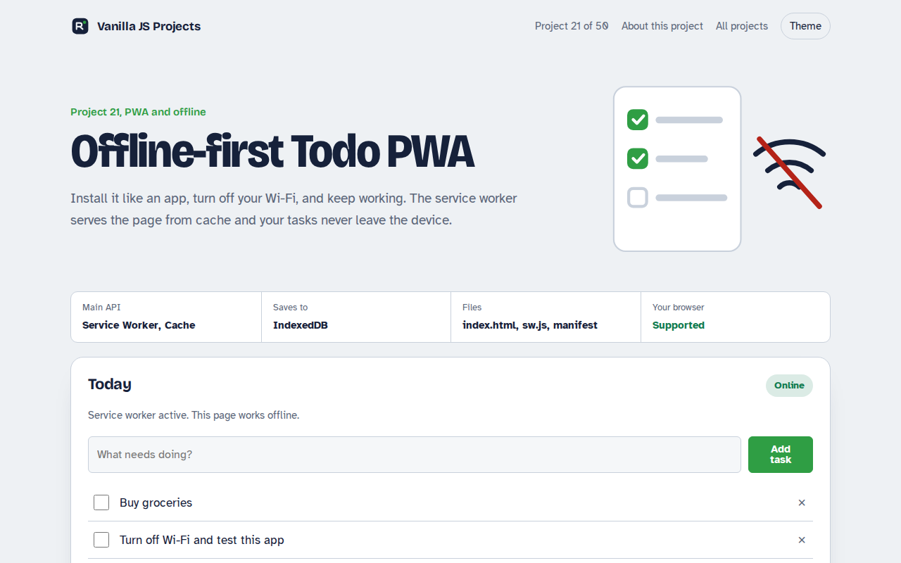 |
| 022 | [Expense Tracker PWA](https://mmrahmanbappi.github.io/vanilla-javascript-projects/03-pwa-and-offline/022-expense-tracker-pwa/) | A spending tracker with charts that syncs when back online | [Demo](https://mmrahmanbappi.github.io/vanilla-javascript-projects/03-pwa-and-offline/022-expense-tracker-pwa/demo.html) |  |
| 023 | [Reminder Notifications](https://mmrahmanbappi.github.io/vanilla-javascript-projects/03-pwa-and-offline/023-reminder-notifications/) | A reminder app with Done and Snooze buttons in the notification | [Demo](https://mmrahmanbappi.github.io/vanilla-javascript-projects/03-pwa-and-offline/023-reminder-notifications/demo.html) |  |
| 024 | [Local Markdown Editor](https://mmrahmanbappi.github.io/vanilla-javascript-projects/03-pwa-and-offline/024-markdown-editor/) | A Markdown editor that saves real files on your disk | [Demo](https://mmrahmanbappi.github.io/vanilla-javascript-projects/03-pwa-and-offline/024-markdown-editor/demo.html) | 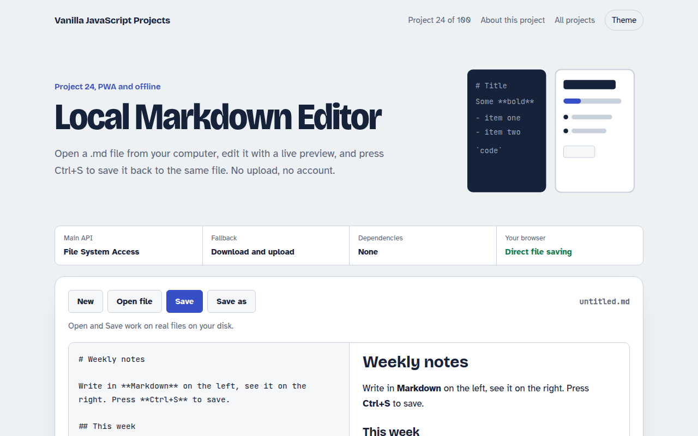 |
| 025 | [Share Target Link Saver](https://mmrahmanbappi.github.io/vanilla-javascript-projects/03-pwa-and-offline/025-share-target-link-saver/) | A reading list app that appears in your phone's share menu | [Demo](https://mmrahmanbappi.github.io/vanilla-javascript-projects/03-pwa-and-offline/025-share-target-link-saver/demo.html) |  |
| 026 | [Multi-tab Sync](https://mmrahmanbappi.github.io/vanilla-javascript-projects/03-pwa-and-offline/026-multi-tab-sync/) | Open it in several tabs and watch them stay in sync | [Demo](https://mmrahmanbappi.github.io/vanilla-javascript-projects/03-pwa-and-offline/026-multi-tab-sync/demo.html) |  |
| 027 | [Instant-loading Blog](https://mmrahmanbappi.github.io/vanilla-javascript-projects/03-pwa-and-offline/027-instant-blog-speculation-rules/) | A blog where the next page is ready before you click | [Demo](https://mmrahmanbappi.github.io/vanilla-javascript-projects/03-pwa-and-offline/027-instant-blog-speculation-rules/demo.html) |  |
| 028 | [Passkey Login Demo](https://mmrahmanbappi.github.io/vanilla-javascript-projects/04-security-and-auth/028-passkey-login/) | Sign up and sign in with your fingerprint instead of a password | [Demo](https://mmrahmanbappi.github.io/vanilla-javascript-projects/04-security-and-auth/028-passkey-login/demo.html) | 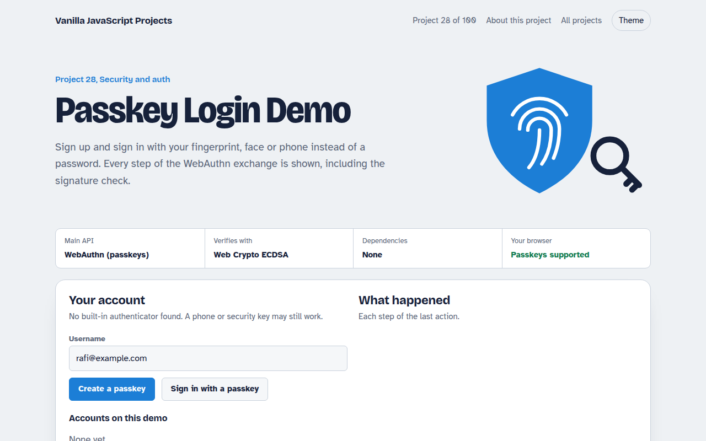 |
| 029 | [Client-side Password Manager](https://mmrahmanbappi.github.io/vanilla-javascript-projects/04-security-and-auth/029-password-manager/) | An encrypted password vault that only your master password opens | [Demo](https://mmrahmanbappi.github.io/vanilla-javascript-projects/04-security-and-auth/029-password-manager/demo.html) | 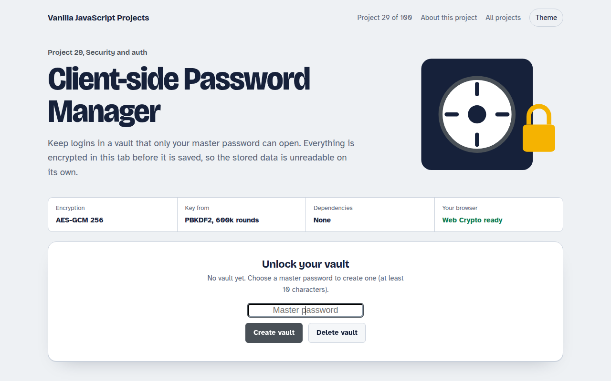 |
| 030 | [Secure File Encryptor](https://mmrahmanbappi.github.io/vanilla-javascript-projects/04-security-and-auth/030-file-encryptor/) | Lock any file with a password, right in your browser | [Demo](https://mmrahmanbappi.github.io/vanilla-javascript-projects/04-security-and-auth/030-file-encryptor/demo.html) | 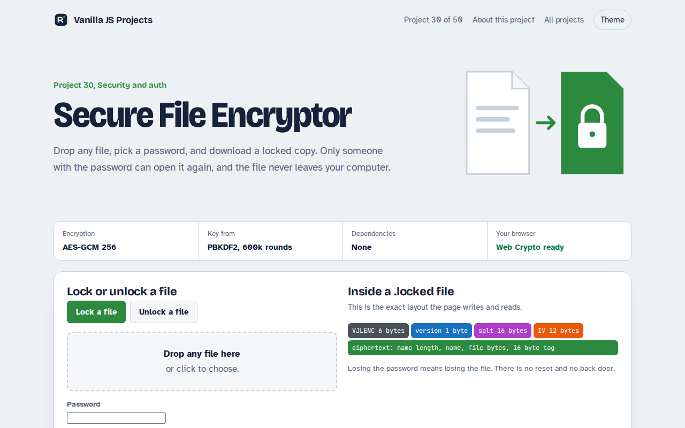 |
| 031 | [TOTP 2FA Authenticator](https://mmrahmanbappi.github.io/vanilla-javascript-projects/04-security-and-auth/031-totp-authenticator/) | An authenticator app that makes six digit 2FA codes | [Demo](https://mmrahmanbappi.github.io/vanilla-javascript-projects/04-security-and-auth/031-totp-authenticator/demo.html) | 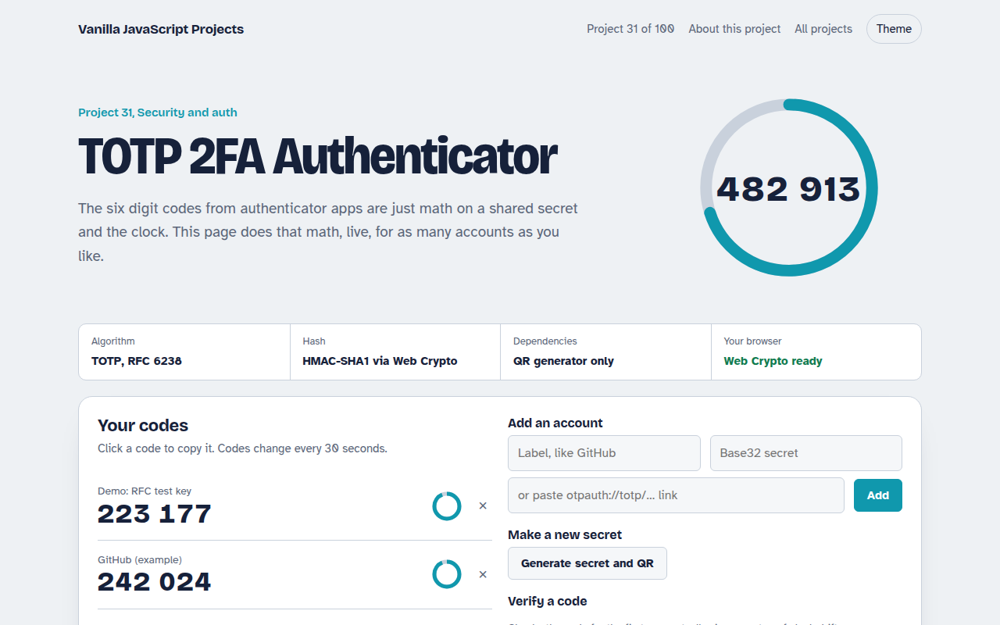 |
| 032 | [Video Call App](https://mmrahmanbappi.github.io/vanilla-javascript-projects/05-media-and-realtime/032-webrtc-video-call/) | A peer to peer video call between two browsers | [Demo](https://mmrahmanbappi.github.io/vanilla-javascript-projects/05-media-and-realtime/032-webrtc-video-call/demo.html) | 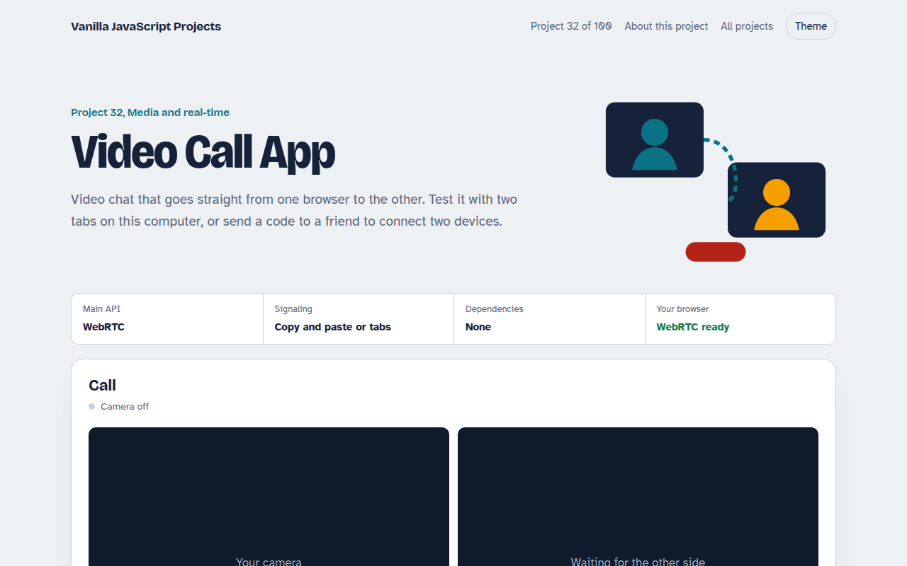 |
| 033 | [Screen Recorder](https://mmrahmanbappi.github.io/vanilla-javascript-projects/05-media-and-realtime/033-screen-recorder/) | Record your screen with your voice and your face in the corner | [Demo](https://mmrahmanbappi.github.io/vanilla-javascript-projects/05-media-and-realtime/033-screen-recorder/demo.html) |  |
| 034 | [Browser Video Editor](https://mmrahmanbappi.github.io/vanilla-javascript-projects/05-media-and-realtime/034-browser-video-editor/) | Trim a clip, add a filter and a title, and export an MP4 | [Demo](https://mmrahmanbappi.github.io/vanilla-javascript-projects/05-media-and-realtime/034-browser-video-editor/demo.html) |  |
| 035 | [Collaborative Whiteboard](https://mmrahmanbappi.github.io/vanilla-javascript-projects/05-media-and-realtime/035-collaborative-whiteboard/) | A shared drawing board with live cursors | [Demo](https://mmrahmanbappi.github.io/vanilla-javascript-projects/05-media-and-realtime/035-collaborative-whiteboard/demo.html) | 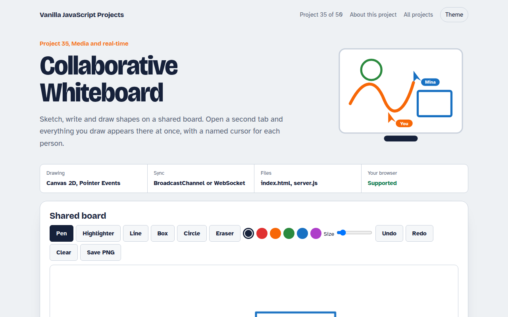 |
| 036 | [Music Visualizer](https://mmrahmanbappi.github.io/vanilla-javascript-projects/05-media-and-realtime/036-music-visualizer/) | Turn music into moving bars, waves and a glowing ring | [Demo](https://mmrahmanbappi.github.io/vanilla-javascript-projects/05-media-and-realtime/036-music-visualizer/demo.html) | 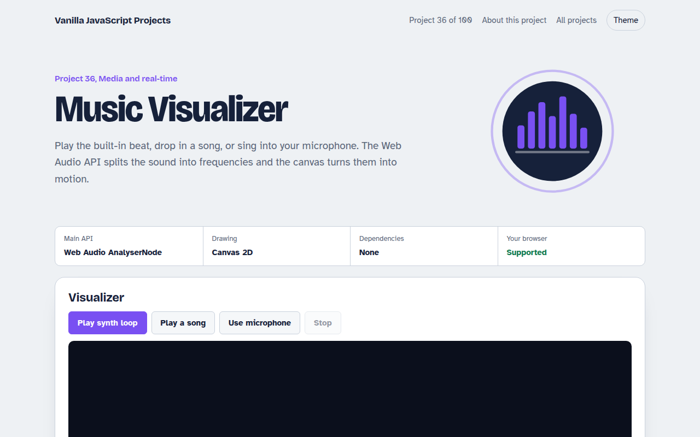 |
| 037 | [WebGPU Particle Playground](https://mmrahmanbappi.github.io/vanilla-javascript-projects/05-media-and-realtime/037-webgpu-particles/) | Up to a million glowing particles that follow your mouse | [Demo](https://mmrahmanbappi.github.io/vanilla-javascript-projects/05-media-and-realtime/037-webgpu-particles/demo.html) | 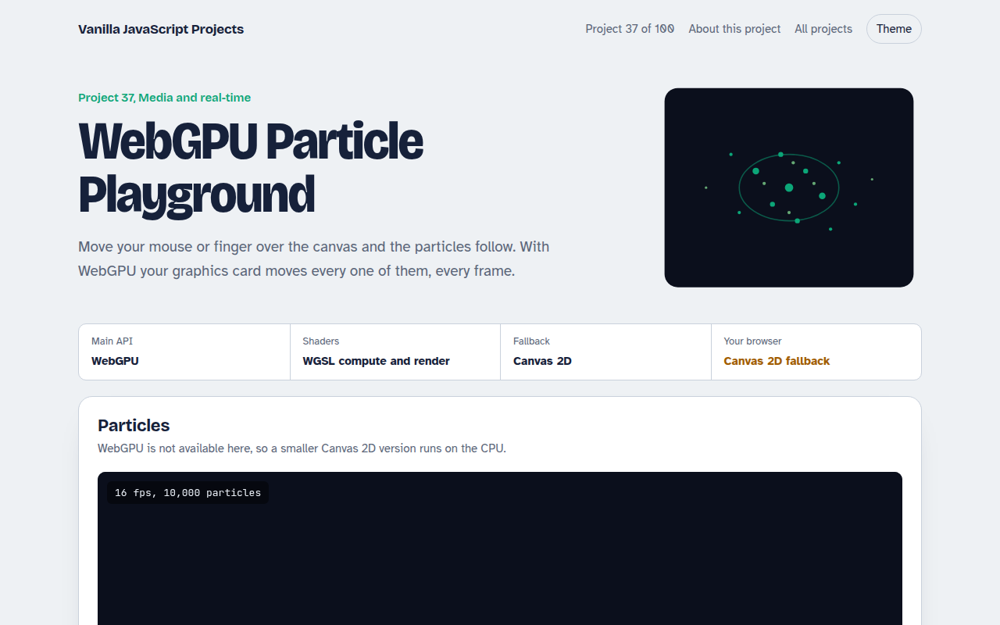 |
| 038 | [Image Compressor](https://mmrahmanbappi.github.io/vanilla-javascript-projects/05-media-and-realtime/038-image-compressor/) | Shrink photos in bulk without uploading them | [Demo](https://mmrahmanbappi.github.io/vanilla-javascript-projects/05-media-and-realtime/038-image-compressor/demo.html) | 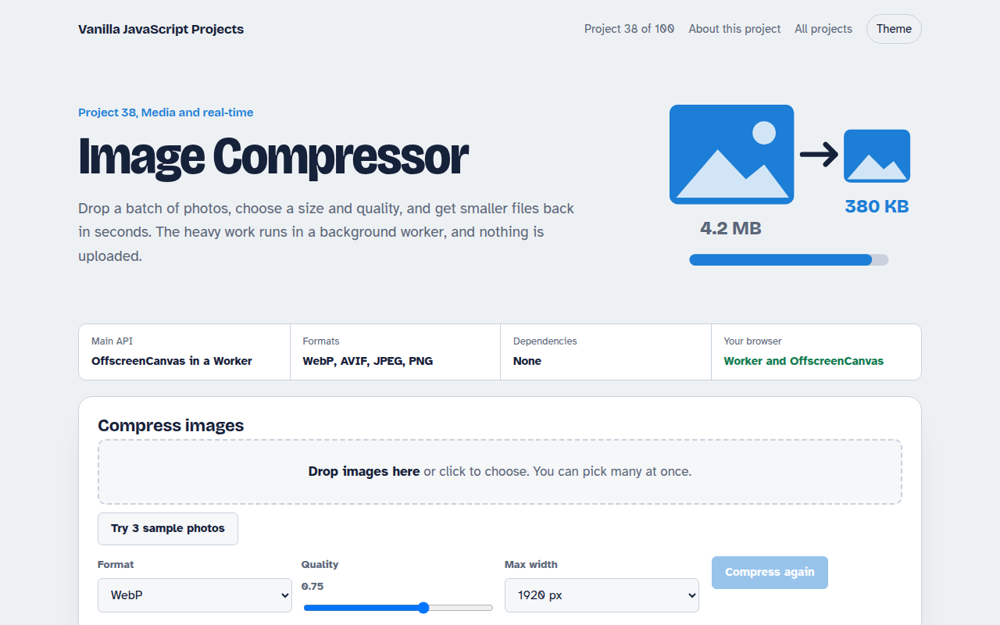 |
| 039 | [Live Chat App](https://mmrahmanbappi.github.io/vanilla-javascript-projects/05-media-and-realtime/039-live-chat/) | A real time chat with rooms and typing indicators | [Demo](https://mmrahmanbappi.github.io/vanilla-javascript-projects/05-media-and-realtime/039-live-chat/demo.html) | 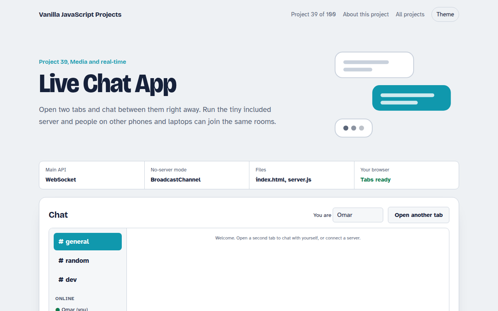 |
| 040 | [Online Code Playground](https://mmrahmanbappi.github.io/vanilla-javascript-projects/05-media-and-realtime/040-code-playground/) | A CodePen style editor with live preview and share links | [Demo](https://mmrahmanbappi.github.io/vanilla-javascript-projects/05-media-and-realtime/040-code-playground/demo.html) | 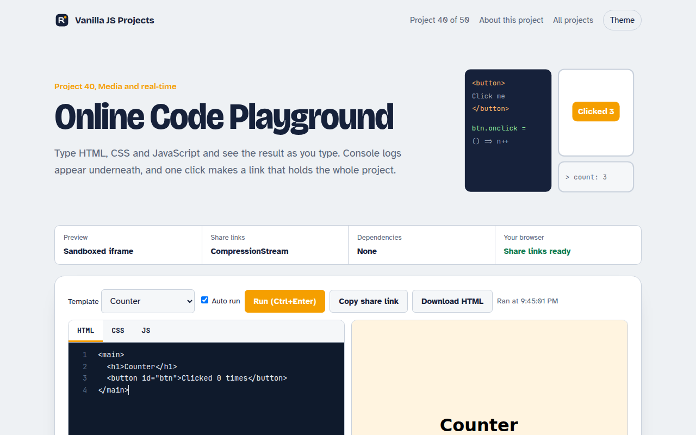 |
| 041 | [Bluetooth Device Dashboard](https://mmrahmanbappi.github.io/vanilla-javascript-projects/06-hardware-and-performance/041-bluetooth-dashboard/) | Read live heart rate and battery from a Bluetooth device | [Demo](https://mmrahmanbappi.github.io/vanilla-javascript-projects/06-hardware-and-performance/041-bluetooth-dashboard/demo.html) |  |
| 042 | [Arduino Serial Monitor](https://mmrahmanbappi.github.io/vanilla-javascript-projects/06-hardware-and-performance/042-serial-monitor/) | Read and plot data from an Arduino or ESP32 over USB | [Demo](https://mmrahmanbappi.github.io/vanilla-javascript-projects/06-hardware-and-performance/042-serial-monitor/demo.html) |  |
| 043 | [WebAssembly Image Filters](https://mmrahmanbappi.github.io/vanilla-javascript-projects/06-hardware-and-performance/043-wasm-image-filters/) | Photo filters in hand written WebAssembly, raced against JavaScript | [Demo](https://mmrahmanbappi.github.io/vanilla-javascript-projects/06-hardware-and-performance/043-wasm-image-filters/demo.html) |  |
| 044 | [Performance Monitor Widget](https://mmrahmanbappi.github.io/vanilla-javascript-projects/06-hardware-and-performance/044-performance-monitor/) | A live panel for Core Web Vitals on any page | [Demo](https://mmrahmanbappi.github.io/vanilla-javascript-projects/06-hardware-and-performance/044-performance-monitor/demo.html) |  |
| 045 | [Browser File Compressor](https://mmrahmanbappi.github.io/vanilla-javascript-projects/06-hardware-and-performance/045-file-compressor/) | Gzip any file or unpack a .gz right in the browser | [Demo](https://mmrahmanbappi.github.io/vanilla-javascript-projects/06-hardware-and-performance/045-file-compressor/demo.html) | 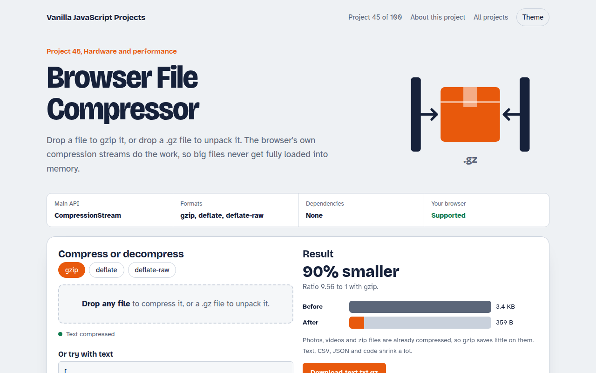 |
| 046 | [Scheduler API Demo](https://mmrahmanbappi.github.io/vanilla-javascript-projects/06-hardware-and-performance/046-scheduler-api-demo/) | See why long tasks freeze a page and how to fix it | [Demo](https://mmrahmanbappi.github.io/vanilla-javascript-projects/06-hardware-and-performance/046-scheduler-api-demo/demo.html) |  |
| 047 | [JSON Formatter and Validator](https://mmrahmanbappi.github.io/vanilla-javascript-projects/07-developer-tools/047-json-formatter/) | Format, check and browse JSON, even large files | [Demo](https://mmrahmanbappi.github.io/vanilla-javascript-projects/07-developer-tools/047-json-formatter/demo.html) | 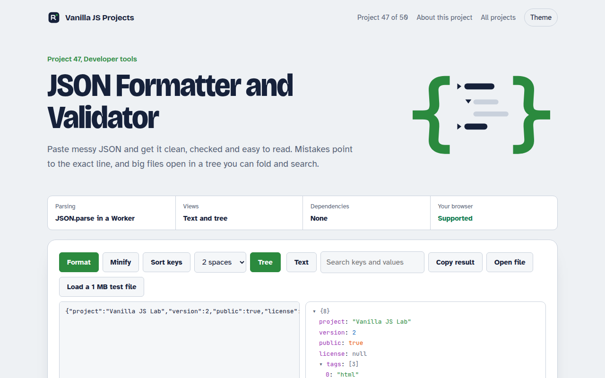 |
| 048 | [Regex Tester](https://mmrahmanbappi.github.io/vanilla-javascript-projects/07-developer-tools/048-regex-tester/) | Test regular expressions with live highlights and groups | [Demo](https://mmrahmanbappi.github.io/vanilla-javascript-projects/07-developer-tools/048-regex-tester/demo.html) | 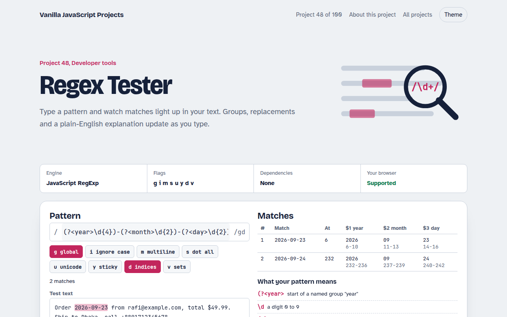 |
| 049 | [Mini Postman API Client](https://mmrahmanbappi.github.io/vanilla-javascript-projects/07-developer-tools/049-mini-postman/) | Send API requests and read clean responses | [Demo](https://mmrahmanbappi.github.io/vanilla-javascript-projects/07-developer-tools/049-mini-postman/demo.html) | 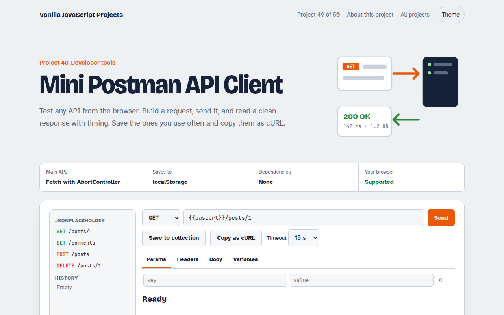 |
| 050 | [Temporal Date and Time Toolkit](https://mmrahmanbappi.github.io/vanilla-javascript-projects/07-developer-tools/050-temporal-datetime/) | Time zones, date math and Unix time with the new Temporal API | [Demo](https://mmrahmanbappi.github.io/vanilla-javascript-projects/07-developer-tools/050-temporal-datetime/demo.html) | 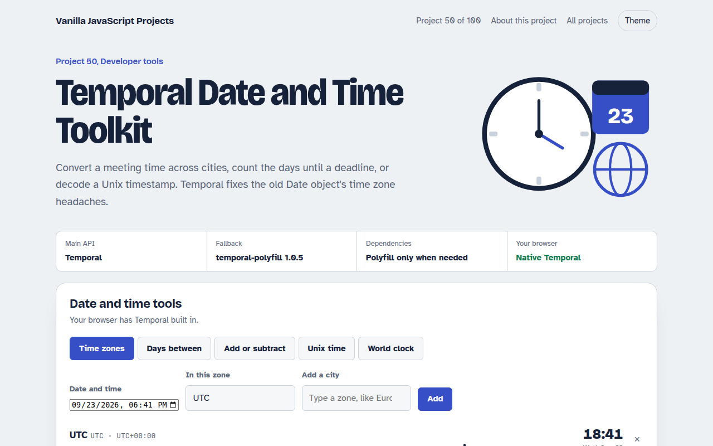 |
| 051 | [Mega Menu Navigation](https://mmrahmanbappi.github.io/vanilla-javascript-projects/08-website-sections/051-mega-menu-navigation/) | A big dropdown menu with columns, keyboard support and a mobile drawer | [Demo](https://mmrahmanbappi.github.io/vanilla-javascript-projects/08-website-sections/051-mega-menu-navigation/demo.html) | 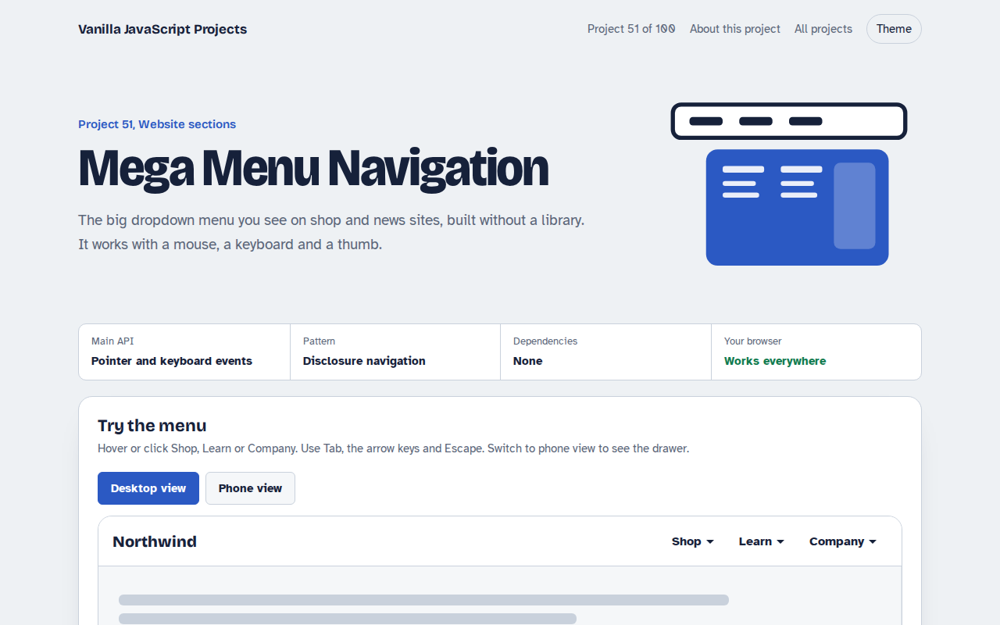 |
| 052 | [Sticky Header and Scroll Progress](https://mmrahmanbappi.github.io/vanilla-javascript-projects/08-website-sections/052-sticky-header-scroll-progress/) | A header that shrinks on scroll with a reading progress bar and back to top button | [Demo](https://mmrahmanbappi.github.io/vanilla-javascript-projects/08-website-sections/052-sticky-header-scroll-progress/demo.html) |  |
| 053 | [Touch Image Slider](https://mmrahmanbappi.github.io/vanilla-javascript-projects/08-website-sections/053-touch-image-slider/) | A photo slider with swipe, autoplay, dots and keyboard control | [Demo](https://mmrahmanbappi.github.io/vanilla-javascript-projects/08-website-sections/053-touch-image-slider/demo.html) | 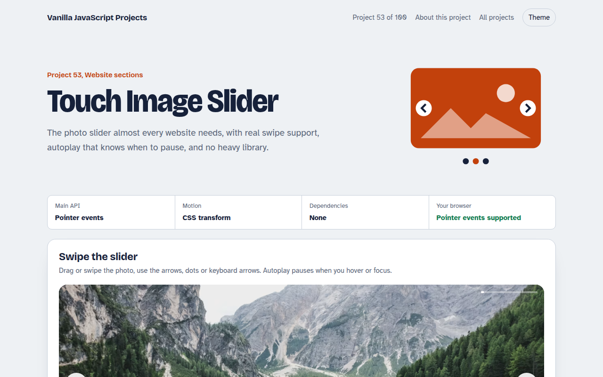 |
| 054 | [Lightbox Gallery with Zoom](https://mmrahmanbappi.github.io/vanilla-javascript-projects/08-website-sections/054-lightbox-gallery-zoom/) | A photo grid that opens a full screen viewer with zoom and pan | [Demo](https://mmrahmanbappi.github.io/vanilla-javascript-projects/08-website-sections/054-lightbox-gallery-zoom/demo.html) | 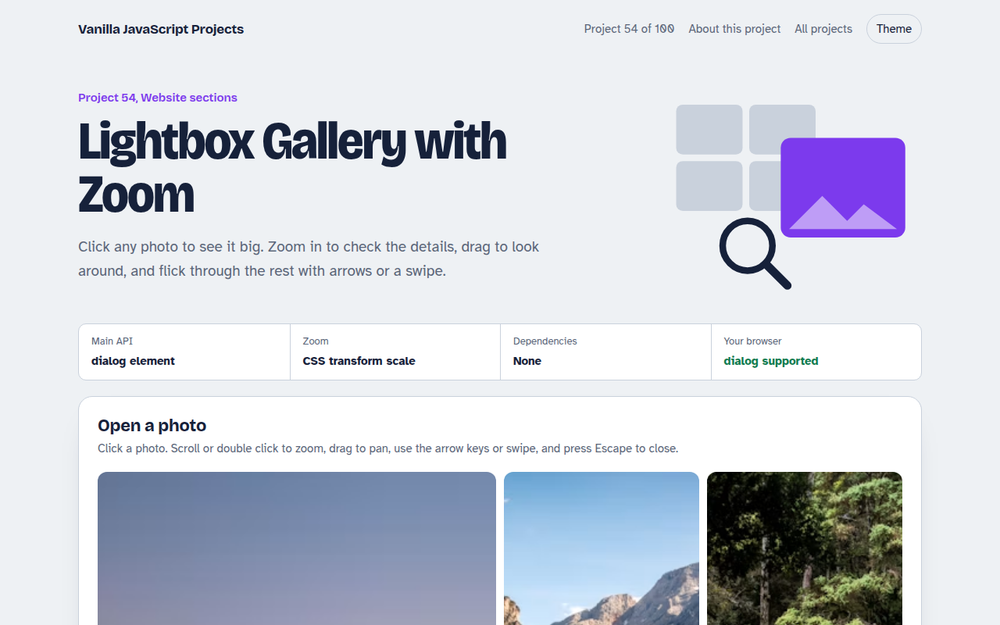 |
| 055 | [Tabs and Accordion Kit](https://mmrahmanbappi.github.io/vanilla-javascript-projects/08-website-sections/055-tabs-accordion-kit/) | Accessible tabs and accordions with keyboard support and smooth height animation | [Demo](https://mmrahmanbappi.github.io/vanilla-javascript-projects/08-website-sections/055-tabs-accordion-kit/demo.html) | 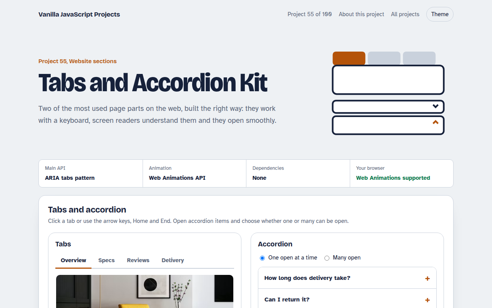 |
| 056 | [Pricing Table with Toggle](https://mmrahmanbappi.github.io/vanilla-javascript-projects/08-website-sections/056-pricing-table-toggle/) | A pricing table with a monthly and yearly switch, currencies and a seat slider | [Demo](https://mmrahmanbappi.github.io/vanilla-javascript-projects/08-website-sections/056-pricing-table-toggle/demo.html) | 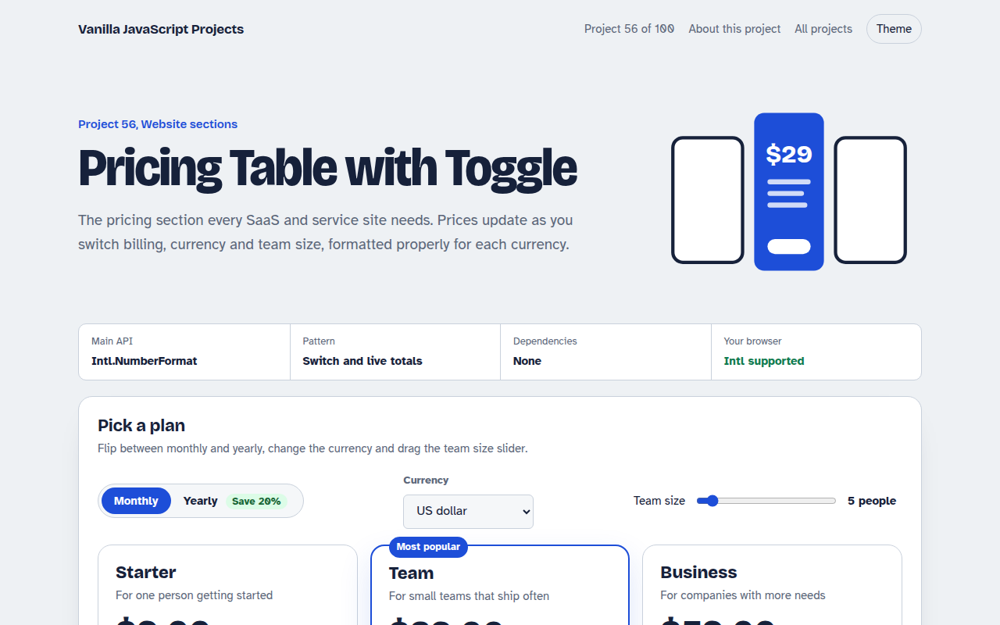 |
| 057 | [Testimonial Carousel](https://mmrahmanbappi.github.io/vanilla-javascript-projects/08-website-sections/057-testimonial-carousel/) | A customer reviews slider that shows one, two or three cards depending on space | [Demo](https://mmrahmanbappi.github.io/vanilla-javascript-projects/08-website-sections/057-testimonial-carousel/demo.html) | 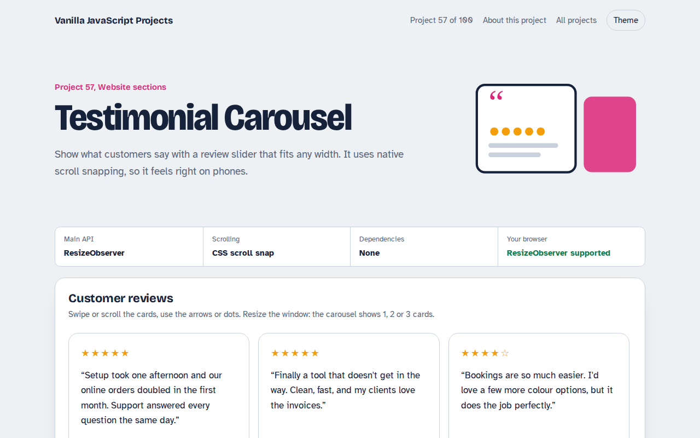 |
| 058 | [Cookie Consent Banner](https://mmrahmanbappi.github.io/vanilla-javascript-projects/08-website-sections/058-cookie-consent-banner/) | A GDPR style cookie banner with categories, saved choices and blocked scripts | [Demo](https://mmrahmanbappi.github.io/vanilla-javascript-projects/08-website-sections/058-cookie-consent-banner/demo.html) |  |
| 059 | [Scrollspy Table of Contents](https://mmrahmanbappi.github.io/vanilla-javascript-projects/08-website-sections/059-scrollspy-table-of-contents/) | An automatic table of contents that highlights the section you are reading | [Demo](https://mmrahmanbappi.github.io/vanilla-javascript-projects/08-website-sections/059-scrollspy-table-of-contents/demo.html) | 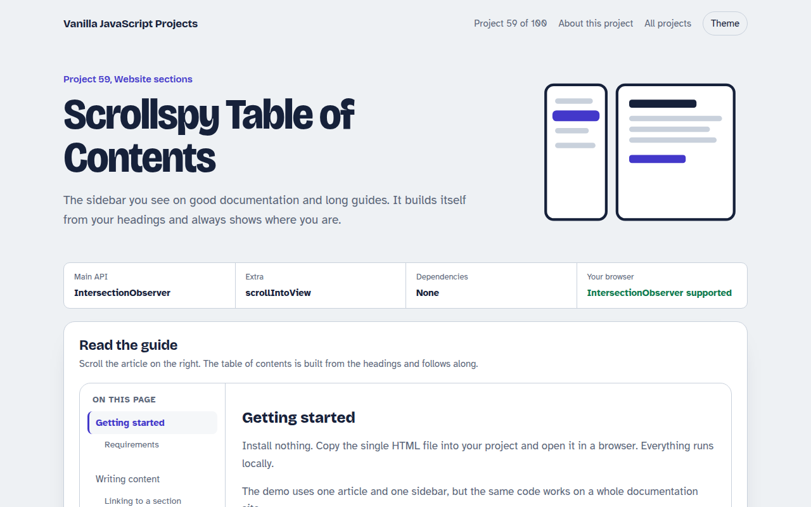 |
| 060 | [Theme Switcher](https://mmrahmanbappi.github.io/vanilla-javascript-projects/08-website-sections/060-theme-switcher/) | A light, dark and system theme switch that remembers the choice with no flash | [Demo](https://mmrahmanbappi.github.io/vanilla-javascript-projects/08-website-sections/060-theme-switcher/demo.html) |  |
| 061 | [Multi-step Form Wizard](https://mmrahmanbappi.github.io/vanilla-javascript-projects/09-forms-input/061-multi-step-form-wizard/) | A sign up form split into steps with checks, a progress bar and a saved draft | [Demo](https://mmrahmanbappi.github.io/vanilla-javascript-projects/09-forms-input/061-multi-step-form-wizard/demo.html) | 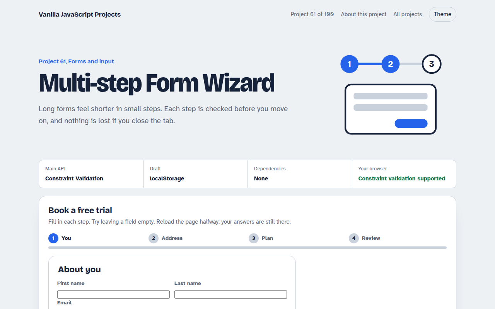 |
| 062 | [File Upload Dropzone](https://mmrahmanbappi.github.io/vanilla-javascript-projects/09-forms-input/062-file-upload-dropzone/) | A drag and drop uploader with previews, size limits and progress bars | [Demo](https://mmrahmanbappi.github.io/vanilla-javascript-projects/09-forms-input/062-file-upload-dropzone/demo.html) | 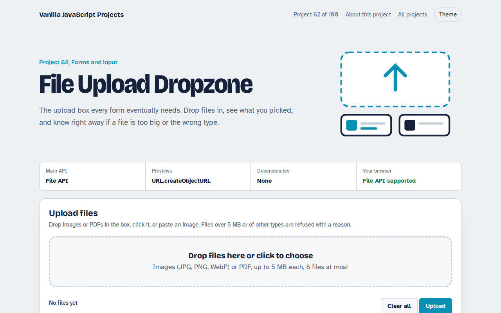 |
| 063 | [Date Range Picker](https://mmrahmanbappi.github.io/vanilla-javascript-projects/09-forms-input/063-date-range-picker/) | A two month calendar for picking check in and check out dates | [Demo](https://mmrahmanbappi.github.io/vanilla-javascript-projects/09-forms-input/063-date-range-picker/demo.html) | 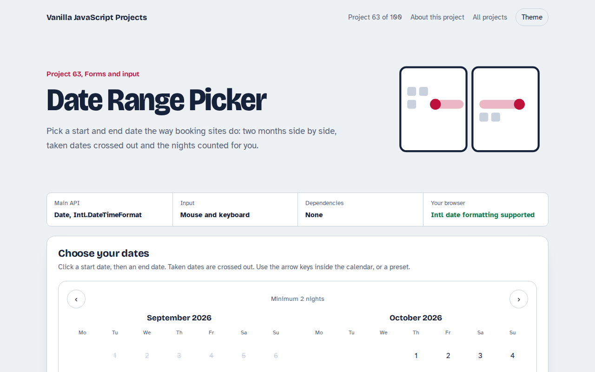 |
| 064 | [Autocomplete Search](https://mmrahmanbappi.github.io/vanilla-javascript-projects/09-forms-input/064-autocomplete-search/) | A search box that suggests results as you type, with keyboard control | [Demo](https://mmrahmanbappi.github.io/vanilla-javascript-projects/09-forms-input/064-autocomplete-search/demo.html) |  |
| 065 | [OTP Code Input](https://mmrahmanbappi.github.io/vanilla-javascript-projects/09-forms-input/065-otp-code-input/) | A six box verification code input with paste, auto advance and a resend timer | [Demo](https://mmrahmanbappi.github.io/vanilla-javascript-projects/09-forms-input/065-otp-code-input/demo.html) |  |
| 066 | [Password Strength Meter](https://mmrahmanbappi.github.io/vanilla-javascript-projects/09-forms-input/066-password-strength-meter/) | A password box that rates strength, estimates crack time and suggests a strong password | [Demo](https://mmrahmanbappi.github.io/vanilla-javascript-projects/09-forms-input/066-password-strength-meter/demo.html) | 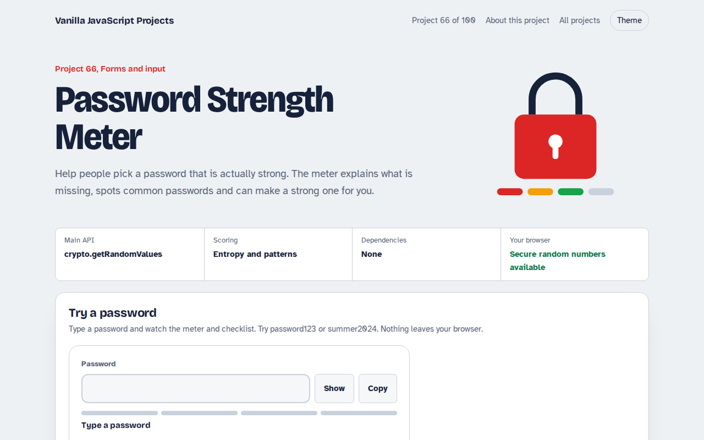 |
| 067 | [Phone Input with Country Codes](https://mmrahmanbappi.github.io/vanilla-javascript-projects/09-forms-input/067-phone-input-country-codes/) | A phone number field with a searchable country list and automatic formatting | [Demo](https://mmrahmanbappi.github.io/vanilla-javascript-projects/09-forms-input/067-phone-input-country-codes/demo.html) |  |
| 068 | [Star Rating and Review Form](https://mmrahmanbappi.github.io/vanilla-javascript-projects/09-forms-input/068-star-rating-review-form/) | A review form with half star ratings, photos and a live rating summary | [Demo](https://mmrahmanbappi.github.io/vanilla-javascript-projects/09-forms-input/068-star-rating-review-form/demo.html) | 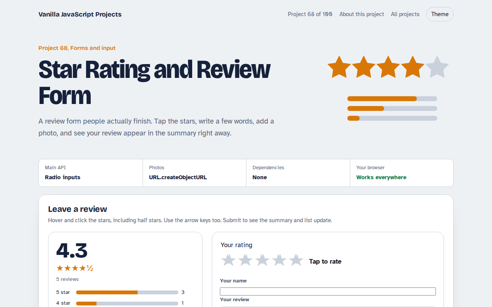 |
| 069 | [Signature Pad](https://mmrahmanbappi.github.io/vanilla-javascript-projects/09-forms-input/069-signature-pad/) | A canvas where people sign with a finger, pen or mouse and save a PNG | [Demo](https://mmrahmanbappi.github.io/vanilla-javascript-projects/09-forms-input/069-signature-pad/demo.html) |  |
| 070 | [Mini Rich Text Editor](https://mmrahmanbappi.github.io/vanilla-javascript-projects/09-forms-input/070-mini-rich-text-editor/) | A small editor with bold, headings, lists and links that exports clean HTML and Markdown | [Demo](https://mmrahmanbappi.github.io/vanilla-javascript-projects/09-forms-input/070-mini-rich-text-editor/demo.html) |  |
| 071 | [Shopping Cart with Coupons](https://mmrahmanbappi.github.io/vanilla-javascript-projects/10-ecommerce-business/071-shopping-cart-coupons/) | A cart drawer with quantities, coupon codes, free shipping progress and saved items | [Demo](https://mmrahmanbappi.github.io/vanilla-javascript-projects/10-ecommerce-business/071-shopping-cart-coupons/demo.html) |  |
| 072 | [Product Variant Picker](https://mmrahmanbappi.github.io/vanilla-javascript-projects/10-ecommerce-business/072-product-variant-picker/) | A product page where colour and size change the picture, price and stock | [Demo](https://mmrahmanbappi.github.io/vanilla-javascript-projects/10-ecommerce-business/072-product-variant-picker/demo.html) | 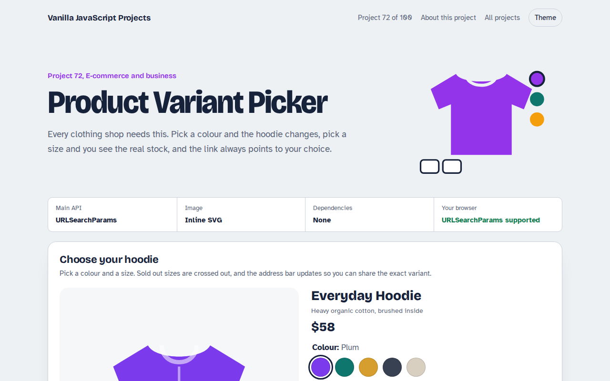 |
| 073 | [Product Filter and Sort](https://mmrahmanbappi.github.io/vanilla-javascript-projects/10-ecommerce-business/073-product-filter-sort/) | A product listing with category, price, colour and rating filters saved in the URL | [Demo](https://mmrahmanbappi.github.io/vanilla-javascript-projects/10-ecommerce-business/073-product-filter-sort/demo.html) | 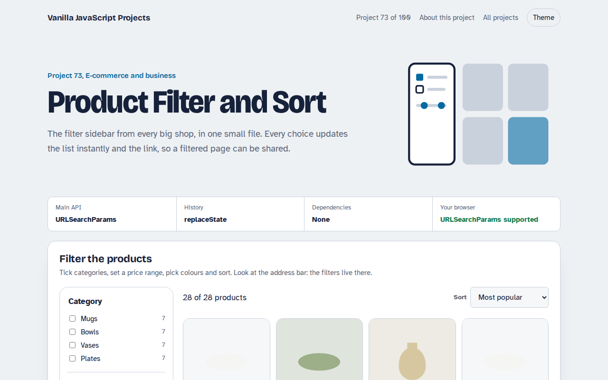 |
| 074 | [Checkout Form](https://mmrahmanbappi.github.io/vanilla-javascript-projects/10-ecommerce-business/074-checkout-form/) | A one page checkout with address, delivery options, card checks and an order summary | [Demo](https://mmrahmanbappi.github.io/vanilla-javascript-projects/10-ecommerce-business/074-checkout-form/demo.html) | 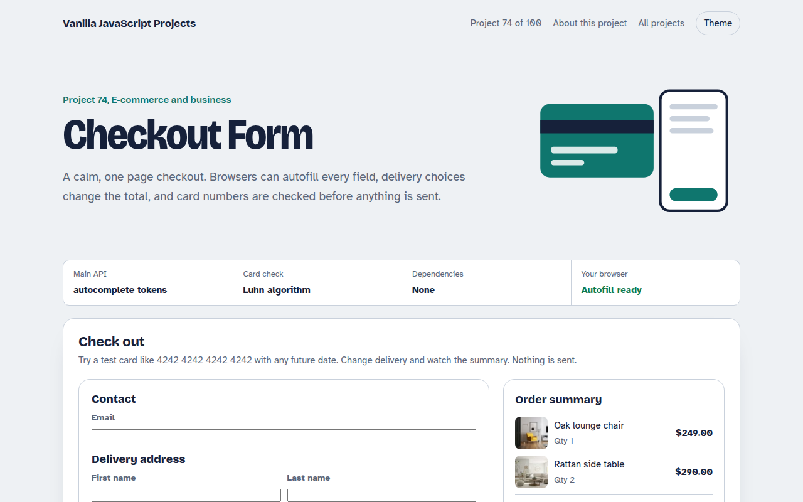 |
| 075 | [Multi-currency Prices](https://mmrahmanbappi.github.io/vanilla-javascript-projects/10-ecommerce-business/075-multi-currency-prices/) | Prices that switch to the visitor's currency with local formatting and neat rounding | [Demo](https://mmrahmanbappi.github.io/vanilla-javascript-projects/10-ecommerce-business/075-multi-currency-prices/demo.html) | 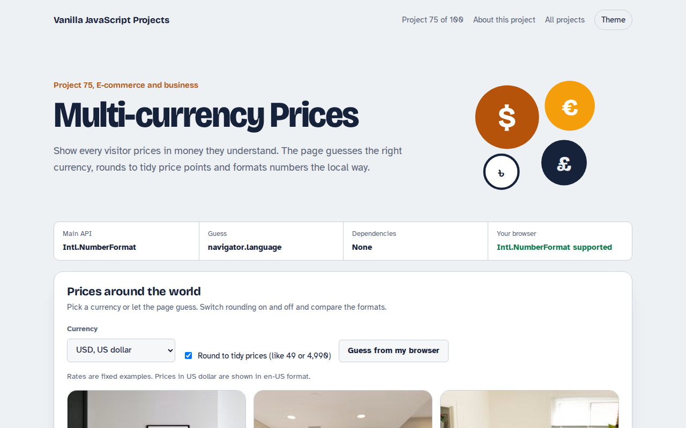 |
| 076 | [Invoice Generator](https://mmrahmanbappi.github.io/vanilla-javascript-projects/10-ecommerce-business/076-invoice-generator/) | An editable invoice that does the maths and prints to a clean PDF | [Demo](https://mmrahmanbappi.github.io/vanilla-javascript-projects/10-ecommerce-business/076-invoice-generator/demo.html) |  |
| 077 | [Booking Slot Calendar](https://mmrahmanbappi.github.io/vanilla-javascript-projects/10-ecommerce-business/077-booking-slot-calendar/) | An appointment picker with services, available time slots and a calendar file | [Demo](https://mmrahmanbappi.github.io/vanilla-javascript-projects/10-ecommerce-business/077-booking-slot-calendar/demo.html) |  |
| 078 | [Store Locator](https://mmrahmanbappi.github.io/vanilla-javascript-projects/10-ecommerce-business/078-store-locator/) | A list of shops sorted by distance from you, with open now status and a simple map | [Demo](https://mmrahmanbappi.github.io/vanilla-javascript-projects/10-ecommerce-business/078-store-locator/demo.html) | 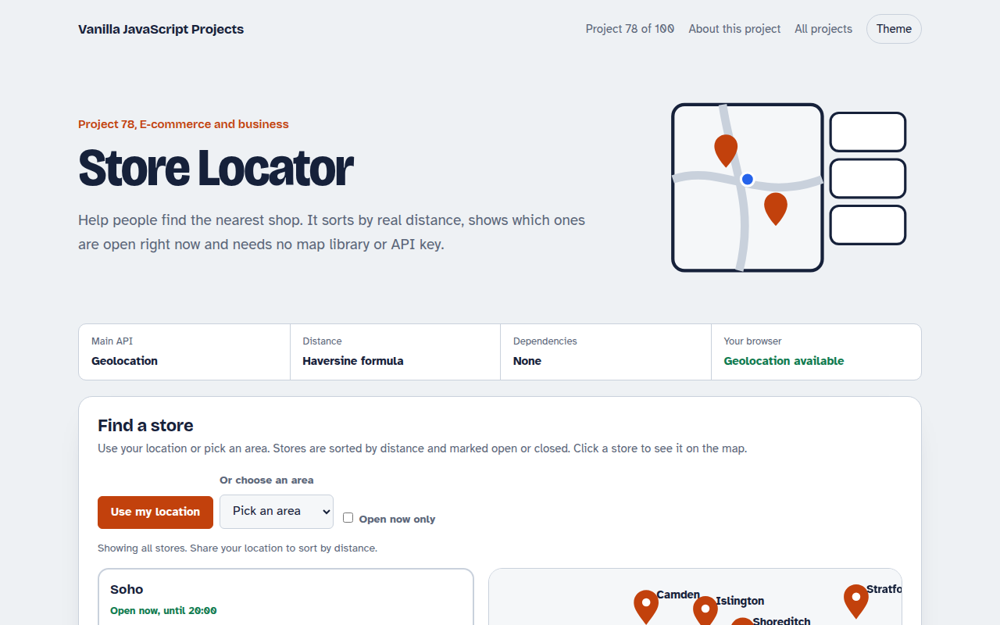 |
| 079 | [Order Tracking Timeline](https://mmrahmanbappi.github.io/vanilla-javascript-projects/10-ecommerce-business/079-order-tracking-timeline/) | An order status page with a step timeline, delivery estimate and live updates | [Demo](https://mmrahmanbappi.github.io/vanilla-javascript-projects/10-ecommerce-business/079-order-tracking-timeline/demo.html) | 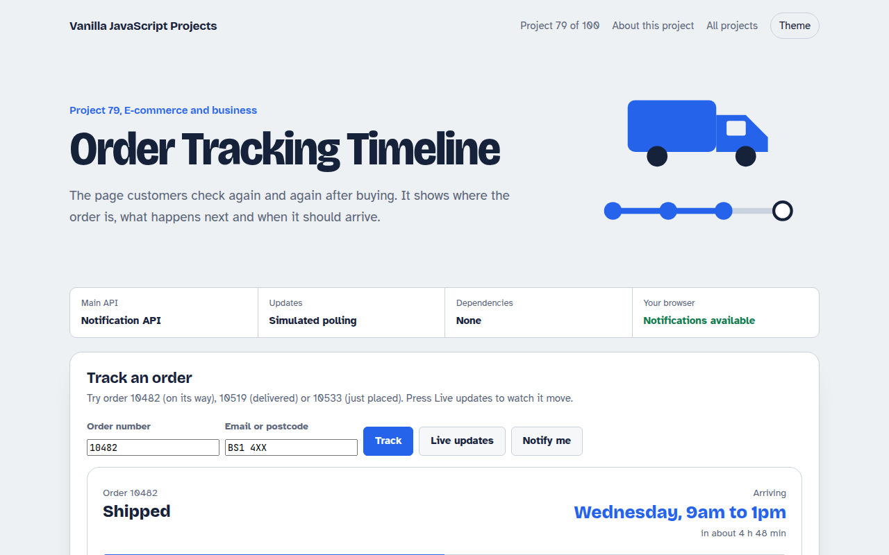 |
| 080 | [Wishlist and Compare](https://mmrahmanbappi.github.io/vanilla-javascript-projects/10-ecommerce-business/080-wishlist-compare/) | Heart products to a saved wishlist and compare up to three side by side | [Demo](https://mmrahmanbappi.github.io/vanilla-javascript-projects/10-ecommerce-business/080-wishlist-compare/demo.html) |  |
| 081 | [Data Table](https://mmrahmanbappi.github.io/vanilla-javascript-projects/11-content-data/081-data-table/) | A sortable, searchable table with filters, pages, row selection and CSV export | [Demo](https://mmrahmanbappi.github.io/vanilla-javascript-projects/11-content-data/081-data-table/demo.html) | 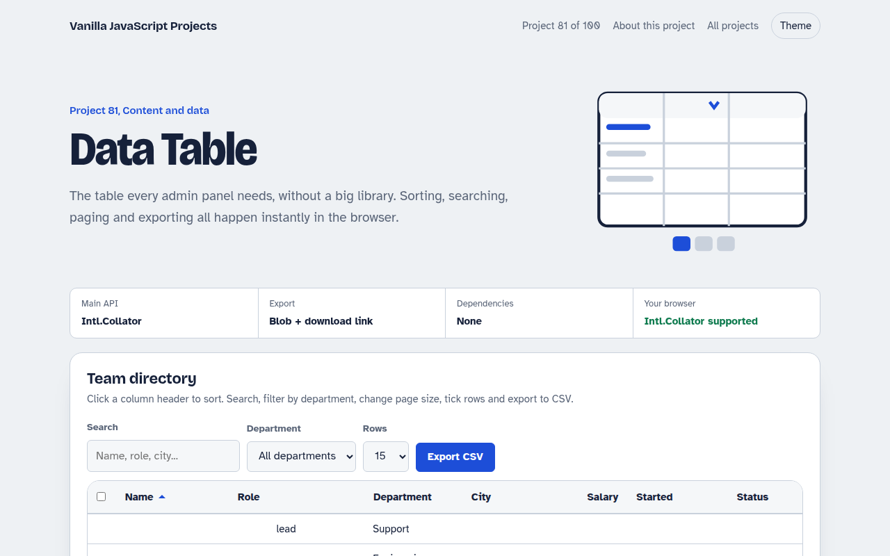 |
| 082 | [SVG Charts Kit](https://mmrahmanbappi.github.io/vanilla-javascript-projects/11-content-data/082-svg-charts-kit/) | Line, bar and donut charts drawn with plain SVG, with tooltips and a data table | [Demo](https://mmrahmanbappi.github.io/vanilla-javascript-projects/11-content-data/082-svg-charts-kit/demo.html) |  |
| 083 | [Markdown Blog Engine](https://mmrahmanbappi.github.io/vanilla-javascript-projects/11-content-data/083-markdown-blog-engine/) | A tiny blog that reads Markdown posts, with tags, search and reading time | [Demo](https://mmrahmanbappi.github.io/vanilla-javascript-projects/11-content-data/083-markdown-blog-engine/demo.html) |  |
| 084 | [Blur-up Lazy Images](https://mmrahmanbappi.github.io/vanilla-javascript-projects/11-content-data/084-blur-up-lazy-images/) | A photo grid that shows tiny blurred placeholders and loads full images when they scroll into view | [Demo](https://mmrahmanbappi.github.io/vanilla-javascript-projects/11-content-data/084-blur-up-lazy-images/demo.html) | 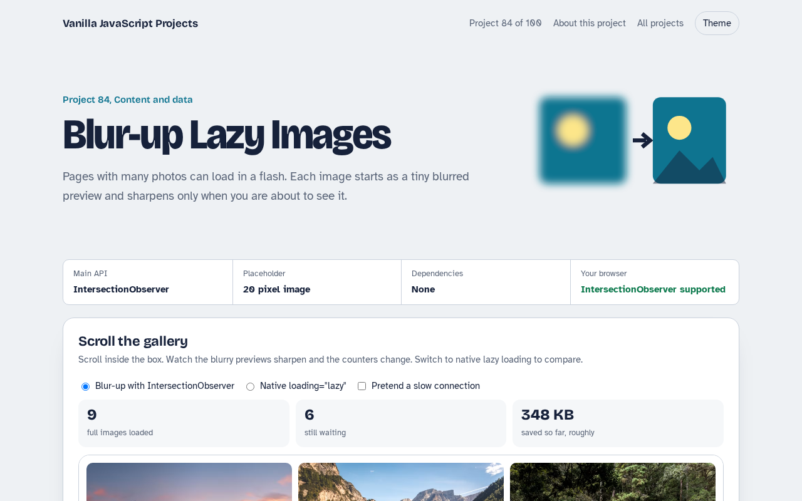 |
| 085 | [Countdown Timer Kit](https://mmrahmanbappi.github.io/vanilla-javascript-projects/11-content-data/085-countdown-timer-kit/) | An event countdown, a sale timer, a kitchen timer with sound and a stopwatch with laps | [Demo](https://mmrahmanbappi.github.io/vanilla-javascript-projects/11-content-data/085-countdown-timer-kit/demo.html) | 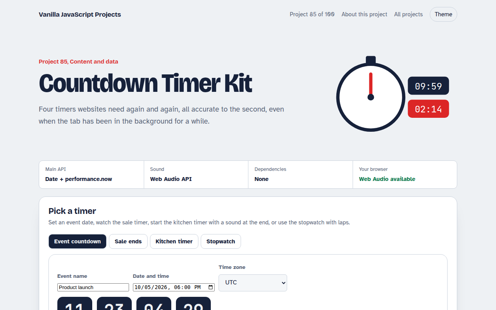 |
| 086 | [Toast Notification Center](https://mmrahmanbappi.github.io/vanilla-javascript-projects/11-content-data/086-toast-notification-center/) | Toast messages with types, positions, undo actions and a notification history | [Demo](https://mmrahmanbappi.github.io/vanilla-javascript-projects/11-content-data/086-toast-notification-center/demo.html) | 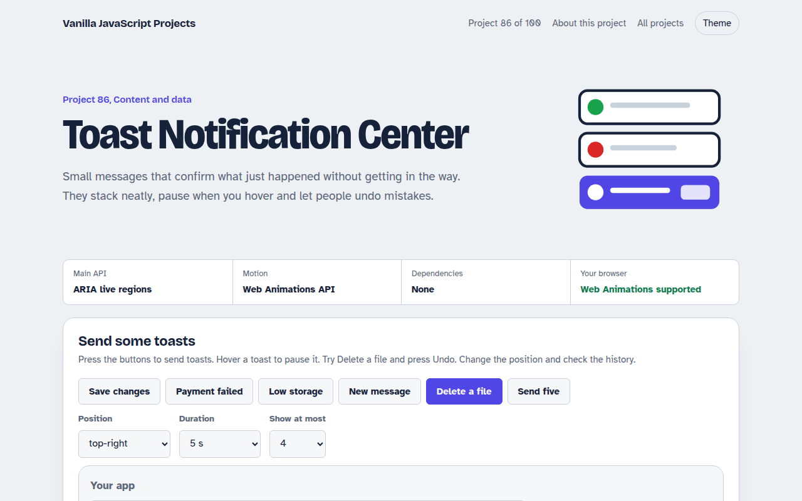 |
| 087 | [Threaded Comments](https://mmrahmanbappi.github.io/vanilla-javascript-projects/11-content-data/087-threaded-comments/) | A comment section with nested replies, likes, editing, sorting and relative times | [Demo](https://mmrahmanbappi.github.io/vanilla-javascript-projects/11-content-data/087-threaded-comments/demo.html) | 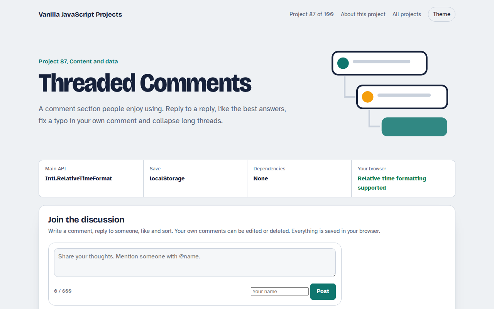 |
| 088 | [Language Switcher](https://mmrahmanbappi.github.io/vanilla-javascript-projects/11-content-data/088-language-switcher/) | A page that switches between five languages, including right to left Arabic | [Demo](https://mmrahmanbappi.github.io/vanilla-javascript-projects/11-content-data/088-language-switcher/demo.html) |  |
| 089 | [Searchable FAQ](https://mmrahmanbappi.github.io/vanilla-javascript-projects/11-content-data/089-searchable-faq/) | An FAQ with instant search, categories, deep links, votes and automatic schema markup | [Demo](https://mmrahmanbappi.github.io/vanilla-javascript-projects/11-content-data/089-searchable-faq/demo.html) | 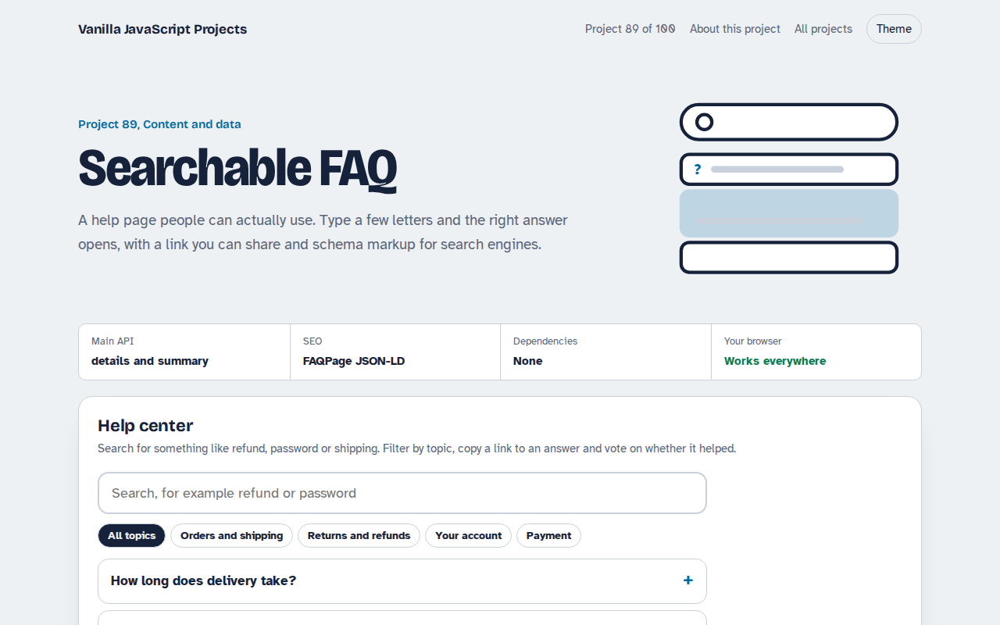 |
| 090 | [Before and After Slider](https://mmrahmanbappi.github.io/vanilla-javascript-projects/11-content-data/090-before-after-slider/) | A draggable slider that compares two images, like before and after a photo edit | [Demo](https://mmrahmanbappi.github.io/vanilla-javascript-projects/11-content-data/090-before-after-slider/demo.html) | 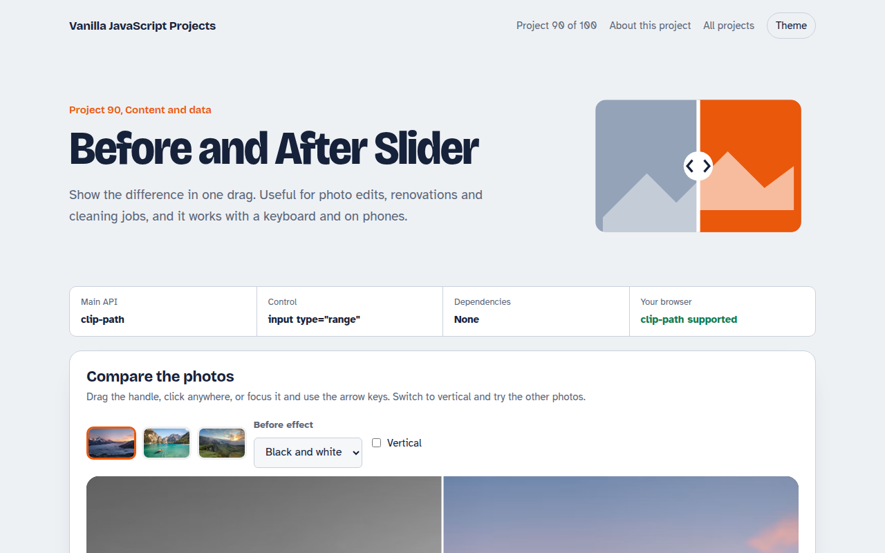 |
| 091 | [Meta Tag Generator](https://mmrahmanbappi.github.io/vanilla-javascript-projects/12-seo-site-tools/091-meta-tag-generator/) | A form that writes your title, description and social tags with live search and share previews | [Demo](https://mmrahmanbappi.github.io/vanilla-javascript-projects/12-seo-site-tools/091-meta-tag-generator/demo.html) | 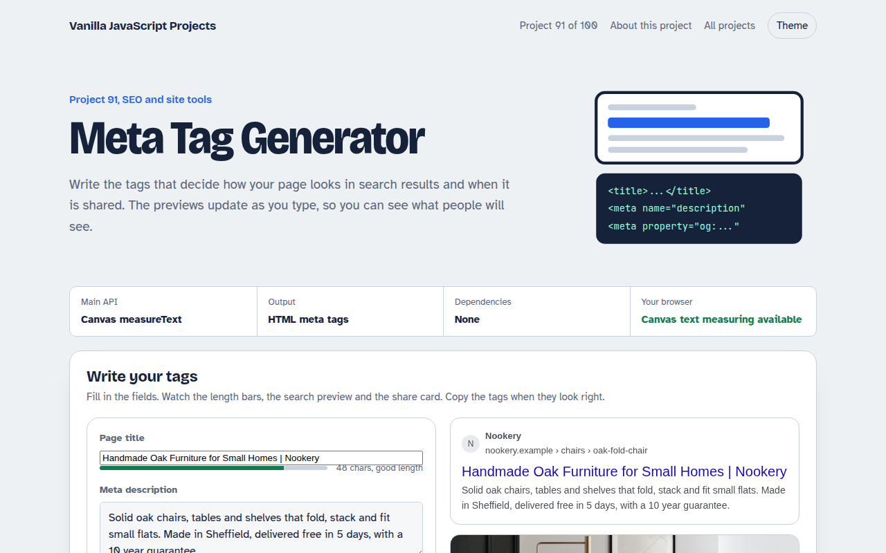 |
| 092 | [OG Image Maker](https://mmrahmanbappi.github.io/vanilla-javascript-projects/12-seo-site-tools/092-og-image-maker/) | A canvas tool that makes 1200 by 630 share images with your title and brand | [Demo](https://mmrahmanbappi.github.io/vanilla-javascript-projects/12-seo-site-tools/092-og-image-maker/demo.html) |  |
| 093 | [Schema JSON-LD Builder](https://mmrahmanbappi.github.io/vanilla-javascript-projects/12-seo-site-tools/093-schema-json-ld-builder/) | A form that writes structured data for businesses, products, articles, events and FAQs | [Demo](https://mmrahmanbappi.github.io/vanilla-javascript-projects/12-seo-site-tools/093-schema-json-ld-builder/demo.html) | 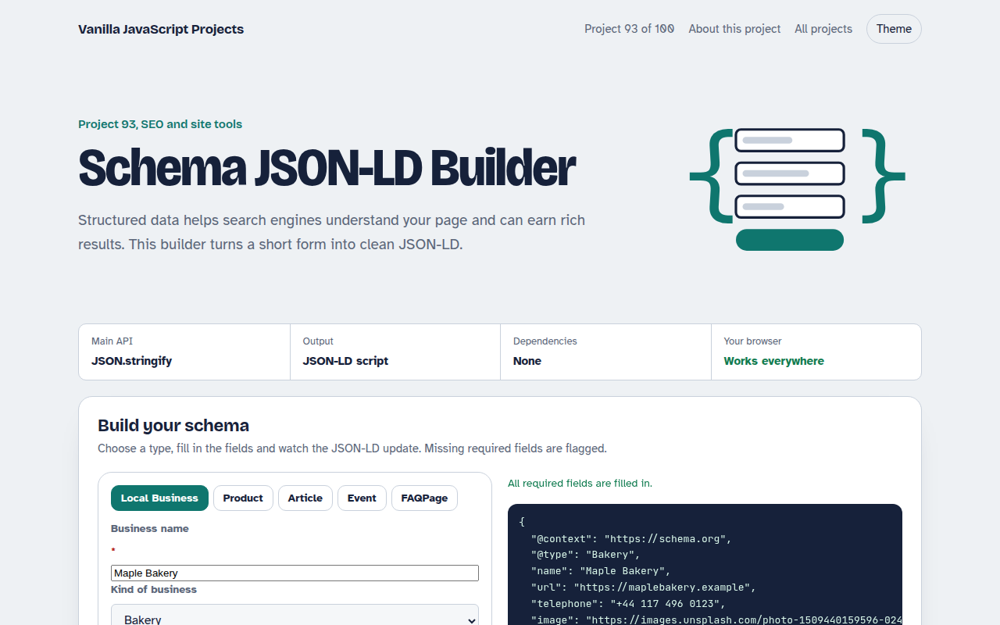 |
| 094 | [Favicon Generator](https://mmrahmanbappi.github.io/vanilla-javascript-projects/12-seo-site-tools/094-favicon-generator/) | A tool that makes every favicon size and a web manifest from a letter or an image | [Demo](https://mmrahmanbappi.github.io/vanilla-javascript-projects/12-seo-site-tools/094-favicon-generator/demo.html) |  |
| 095 | [Responsive Image Maker](https://mmrahmanbappi.github.io/vanilla-javascript-projects/12-seo-site-tools/095-responsive-image-maker/) | A tool that resizes one photo into several sizes and writes the srcset code | [Demo](https://mmrahmanbappi.github.io/vanilla-javascript-projects/12-seo-site-tools/095-responsive-image-maker/demo.html) |  |
| 096 | [Sitemap Generator](https://mmrahmanbappi.github.io/vanilla-javascript-projects/12-seo-site-tools/096-sitemap-generator/) | A tool that turns a list of pages into sitemap.xml and robots.txt | [Demo](https://mmrahmanbappi.github.io/vanilla-javascript-projects/12-seo-site-tools/096-sitemap-generator/demo.html) | 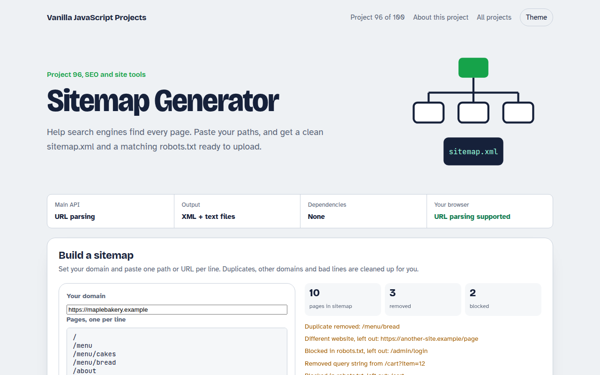 |
| 097 | [Accessibility Checker](https://mmrahmanbappi.github.io/vanilla-javascript-projects/12-seo-site-tools/097-accessibility-checker/) | A checker that finds missing alt text, low contrast, heading gaps and unlabeled fields | [Demo](https://mmrahmanbappi.github.io/vanilla-javascript-projects/12-seo-site-tools/097-accessibility-checker/demo.html) | 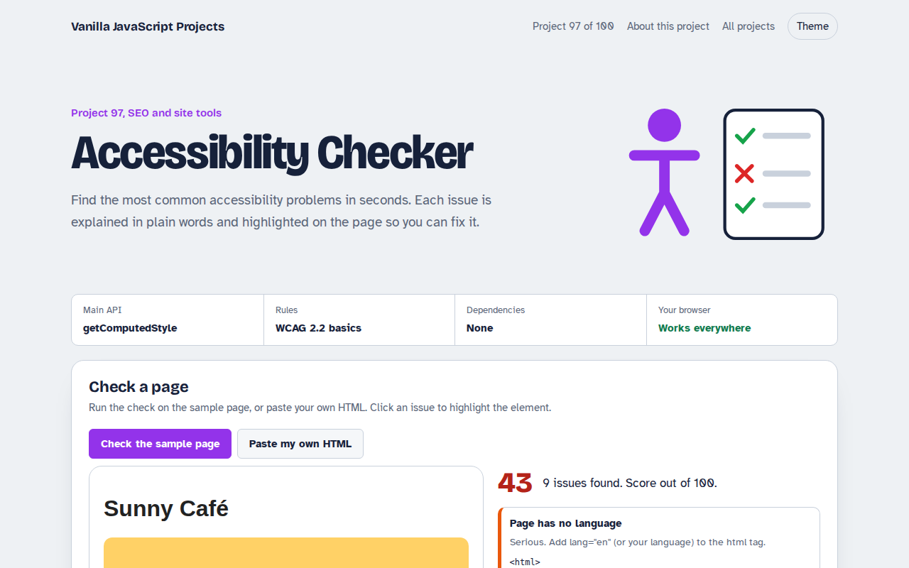 |
| 098 | [Spam-proof Contact Form](https://mmrahmanbappi.github.io/vanilla-javascript-projects/12-seo-site-tools/098-spam-proof-contact-form/) | A contact form that blocks bots with a honeypot, a timing check and simple content rules | [Demo](https://mmrahmanbappi.github.io/vanilla-javascript-projects/12-seo-site-tools/098-spam-proof-contact-form/demo.html) |  |
| 099 | [Privacy Analytics Lite](https://mmrahmanbappi.github.io/vanilla-javascript-projects/12-seo-site-tools/099-privacy-analytics-lite/) | A cookie free visit counter with a small dashboard of pages, sources and devices | [Demo](https://mmrahmanbappi.github.io/vanilla-javascript-projects/12-seo-site-tools/099-privacy-analytics-lite/demo.html) | 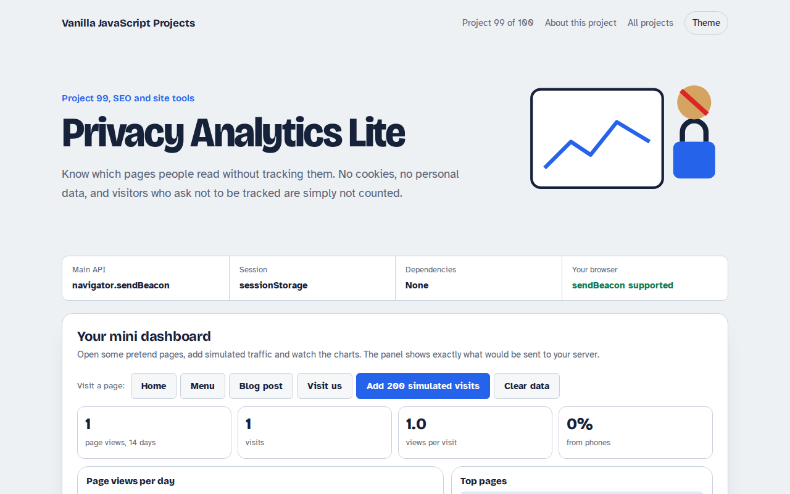 |
| 100 | [Page SEO Audit](https://mmrahmanbappi.github.io/vanilla-javascript-projects/12-seo-site-tools/100-page-seo-audit/) | An on-page SEO checker that scores a page and lists what to fix | [Demo](https://mmrahmanbappi.github.io/vanilla-javascript-projects/12-seo-site-tools/100-page-seo-audit/demo.html) |  |

## Categories

- 1. AI in the Browser (live)
- 2. Modern UI (live)
- 3. PWA and Offline (live)
- 4. Security and Auth (live)
- 5. Media and Real Time (live)
- 6. Hardware and Performance (live)
- 7. Developer Tools (live)
- 8. Website Sections (live)
- 9. Forms and Input (live)
- 10. E-commerce and Business (live)
- 11. Content and Data (live)
- 12. SEO and Site Tools (live)

## How to use a project

1. Open the project folder and download `demo.html`.
2. Serve it with `npx serve .` or `python -m http.server`, since camera, microphone and AI features do not run from `file://`.
3. Change the text and colors, then upload it anywhere: GitHub Pages, Netlify, Vercel or your own server.

## License

MIT. Use these projects in personal and commercial work. Project 007 uses the RMBG 1.4 model, which is for non-commercial use only. Projects 035 and 039 include a small `server.js` for syncing across devices. A star on the repo helps more people find them.
